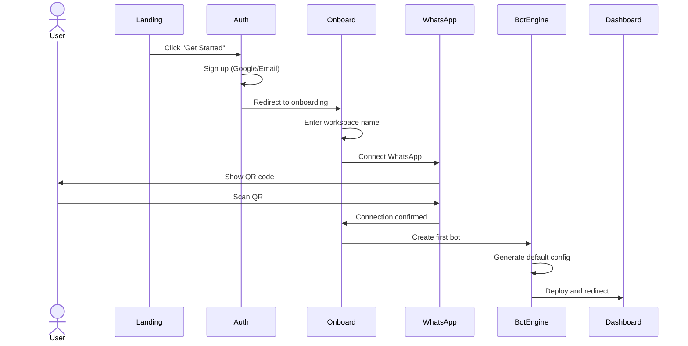
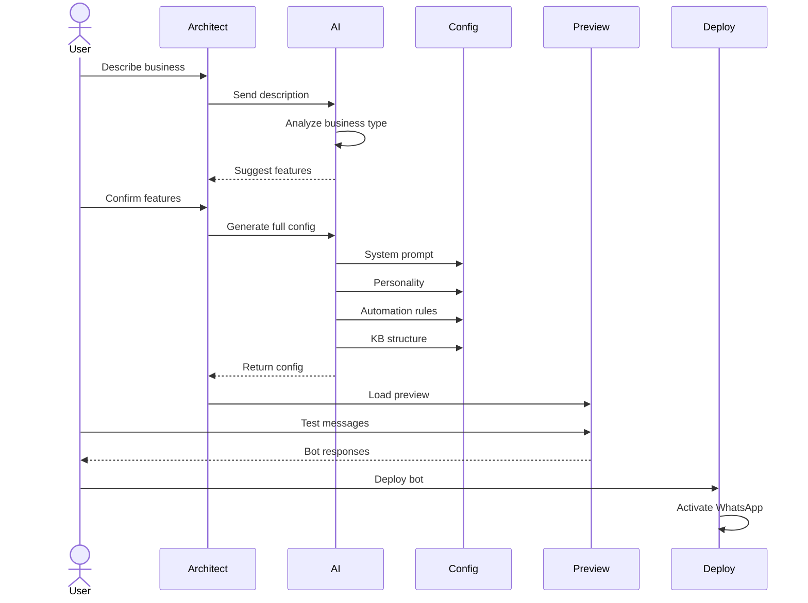
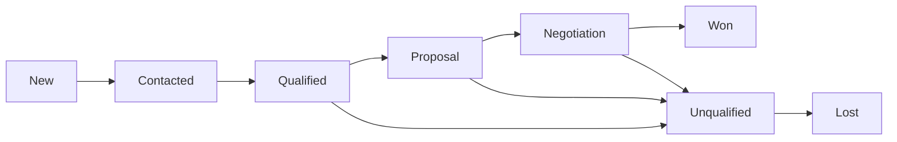
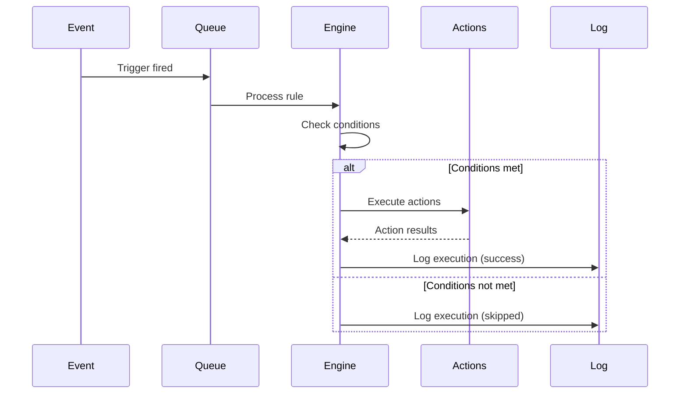

# 05 — User Flows

---

## Executive Summary

This document defines every major user flow in SoftwBot AI with step-by-step descriptions, Mermaid sequence diagrams, entry/exit points, error states, validation rules, and API calls. These flows are the source of truth for UX design and E2E testing.

---

## Purpose

User flows translate requirements into actionable interaction sequences. They ensure every edge case is accounted for before development begins.

---

## Flow 1: Onboarding

**Entry Point:** User clicks "Get Started" on landing page  
**Exit Point:** First bot is deployed and connected to WhatsApp  
**Goal:** Get user from sign-up to live bot in under 10 minutes

### Steps

| Step | Action | Screen | Validation | API Call |
|------|--------|--------|------------|----------|
| 1 | Click "Get Started" | Landing page | — | — |
| 2 | Sign up with Google/Email | Clerk auth | Valid email, password strength | `POST /auth/signup` |
| 3 | Verify email (if email signup) | Verification page | Valid token | `GET /auth/verify` |
| 4 | Enter name and workspace name | Onboarding wizard step 1 | Name 2-50 chars, workspace 3-30 chars | `POST /workspaces` |
| 5 | Choose use case (or skip) | Onboarding wizard step 2 | Valid selection or skip | — |
| 6 | Connect WhatsApp (or skip) | QR code page | Valid QR scan | `GET /bots/:id/whatsapp/qr` |
| 7 | Create first bot (or use Bot Architect) | Bot creation | — | `POST /bots` |
| 8 | Deploy bot | Confirmation screen | Bot config valid | `POST /bots/:id/activate` |
| 9 | Redirect to dashboard | Dashboard overview | — | `GET /dashboard` |

### Mermaid Diagram



### Error States

| Error | Handling |
|-------|----------|
| QR code expired | Auto-refresh QR after 60 seconds, show refresh button |
| Email verification failed | Resend verification email, show error |
| Workspace name taken | Suggest alternatives with number suffix |
| WhatsApp connection failed | Show retry button, suggest checking phone internet |
| Bot creation failed | Save draft, allow retry |

### Acceptance Criteria

- [ ] User can complete entire flow in < 10 minutes
- [ ] Each step has clear progress indicator
- [ ] User can skip optional steps and return later
- [ ] All errors show clear, actionable messages
- [ ] Flow works on mobile and desktop

---

## Flow 2: Bot Creation via Bot Architect

**Entry Point:** User clicks "Bot Architect" in dashboard  
**Exit Point:** Bot is configured and deployed  
**Goal:** Generate complete bot from natural language business description

### Steps

| Step | Action | Screen | Input | Output |
|------|--------|--------|-------|--------|
| 1 | Open Bot Architect | Chat interface | — | Welcome message from AI |
| 2 | Describe business | Text input | 10-2000 char description | — |
| 3 | AI analyzes description | Loading state | — | Business analysis |
| 4 | Review suggested features | Feature checklist | User confirms/edits | Selected features |
| 5 | AI generates configuration | Loading with progress | — | Full bot config |
| 6 | Review generated prompt | Prompt preview | — | System prompt |
| 7 | Review personality | Personality card | — | Tone, style, greeting |
| 8 | Review automation rules | Rules list | — | Welcome, handoff rules |
| 9 | Review knowledge base suggestion | KB structure | — | Categories, FAQ topics |
| 10 | Edit any component | Inline editors | User modifications | Updated config |
| 11 | Test in preview | Chat preview | Test messages | Bot responses |
| 12 | Deploy | Confirmation | — | Live bot |

### Mermaid Diagram



### Generated Components

The Bot Architect generates:

1. **System Prompt** — Complete instructions for the AI
2. **Personality Profile** — Tone, style, greeting, farewell
3. **Automation Rules** — Welcome, follow-up, handoff triggers
4. **Knowledge Base Structure** — Suggested categories and FAQ topics
5. **Model Recommendation** — Best model with cost/reasoning
6. **Business Hours** — Inferred from business type
7. **Human Handoff Rules** — Escalation triggers
8. **Lead Capture** — Qualification questions
9. **Conversation Flow** — Main path, branches, fallbacks
10. **Welcome/Offline Messages** — Pre-configured templates

### Error States

| Error | Handling |
|-------|----------|
| AI generation fails | Fall back to template-based generation for described industry |
| Description too vague | Ask clarifying questions: "What products/services do you offer?" |
| Description too niche | Use closest match + manual customization |
| Preview responses poor | Allow manual prompt editing with AI suggestions |

---

## Flow 3: Knowledge Base Management

**Entry Point:** User navigates to Knowledge Base page  
**Exit Point:** Documents are processed and searchable  
**Goal:** Upload, process, and test knowledge base documents

### Steps

| Step | Action | Validation | API Call |
|------|--------|------------|----------|
| 1 | Navigate to Knowledge Base | Bot selected | — |
| 2 | Click "Upload Files" | — | — |
| 3 | Select/drag files | File type: PDF, DOCX, TXT, MD, CSV; Max 50MB each | — |
| 4 | Confirm upload | File count within plan limits | `POST /knowledge/:kid/files` |
| 5 | Processing begins | — | Background job triggered |
| 6 | Monitor progress | Status: uploading → processing → chunking → embedding → ready | `GET /knowledge/:kid/files` |
| 7 | Test search | Query input | `POST /knowledge/:kid/search` |
| 8 | Review search results | Results with relevance scores | — |
| 9 | Configure chunk settings (optional) | Chunk size 100-2000, overlap 0-200 | `PATCH /knowledge/:kid` |

### Error States

| Error | Handling |
|-------|----------|
| Unsupported file type | Show accepted formats, reject with clear message |
| File too large | Show max size, suggest splitting |
| Parsing failed | Show error, suggest file re-export |
| Embedding failed | Retry with different model, alert if persistent |
| Search returns poor results | Suggest re-chunking, adding more documents |

---

## Flow 4: Conversation Management

**Entry Point:** New message received on WhatsApp  
**Exit Point:** Conversation resolved or archived  
**Goal:** Handle customer conversations efficiently

### Steps

| Step | Action | Actor | API Call |
|------|--------|-------|----------|
| 1 | WhatsApp message received | System | `POST /webhook/whatsapp` |
| 2 | Message queued for processing | System | BullMQ job created |
| 3 | AI generates response | AI Agent | `POST /bots/:id/respond` |
| 4 | Response sent via WhatsApp | System | whatsapp-web.js send |
| 5 | Conversation appears in inbox | System | WebSocket broadcast |
| 6 | Agent monitors conversation | Human | Dashboard view |
| 7 | Human takes over (if needed) | Human | `POST /conversations/:id/handoff` |
| 8 | Human sends response | Human | `POST /conversations/:id/messages` |
| 9 | Agent resolves conversation | Human | `POST /conversations/:id/resolve` |
| 10 | Conversation archived | System | `PATCH /conversations/:id` |

### Conversation States

```
Active → Pending → Resolved → Archived
  ↑         ↓
  └── Human Handoff
```

### Error States

| Error | Handling |
|-------|----------|
| AI confidence < threshold | Auto-escalate to human |
| WhatsApp send failed | Retry 3x, then queue for later |
| Human agent offline | Set status to pending, notify when online |
| Message too long | Split into multiple messages |

---

## Flow 5: Lead Management

**Entry Point:** Lead captured from conversation  
**Exit Point:** Lead converted or marked as lost  
**Goal:** Qualify, nurture, and convert leads

### Lead Pipeline Stages



### Lead Qualification Flow

1. AI asks qualification questions during conversation
2. Responses scored automatically (budget, timeline, intent)
3. Score exceeds threshold → Lead created with status "Qualified"
4. Auto-assigned based on rules (round-robin, territory, availability)
5. Follow-up automation triggered

---

## Flow 6: Automation Setup

**Entry Point:** User creates automation rule  
**Exit Point:** Rule is active and executing  
**Goal:** Set up event-driven automation

### Rule Builder Steps

| Step | Action | Options |
|------|--------|---------|
| 1 | Choose trigger | Message received, new contact, time-based, webhook |
| 2 | Set conditions | Contact field, message content, sentiment, time |
| 3 | Define actions | Send message, update contact, assign, handoff, webhook |
| 4 | Configure delays | Immediate, wait N minutes/hours |
| 5 | Test rule | Simulation mode with test data |
| 6 | Enable rule | Toggle switch |

### Execution Flow



---

## Flow 7: Broadcast Campaign

**Entry Point:** User creates broadcast  
**Exit Point:** Messages delivered to recipients  
**Goal:** Send bulk messages to targeted audience

### Steps

| Step | Action | Details |
|------|--------|---------|
| 1 | Name campaign | Text input |
| 2 | Build audience | Filter by tags, lead status, custom fields, conversation status |
| 3 | Compose message | Text editor with variable insertion ({{name}}, etc.) |
| 4 | Attach media (optional) | Image, video, document |
| 5 | Preview | Show sample messages |
| 6 | Schedule | Send now or schedule for later |
| 7 | Confirm | Review audience count, message preview |
| 8 | Sending | Queue-based sending with rate limiting |
| 9 | Monitor | Delivery status, read receipts |
| 10 | Review results | Analytics dashboard |

### Rate Limiting

- WhatsApp limit: ~100 messages/second
- SoftwBot default: 50 messages/second (safety margin)
- Batch sending with 2-second delays between batches
- Failed messages retried 3x with exponential backoff

---

## Flow 8: Analytics Review

**Entry Point:** User clicks Analytics in dashboard  
**Exit Point:** User understands bot performance  
**Goal:** Provide actionable insights

### Dashboard Sections

1. **Overview** — Key metrics cards (conversations, messages, leads, satisfaction)
2. **Conversation Analytics** — Volume chart, response time, resolution rate
3. **Bot Performance** — Accuracy, fallback rate, model usage, token consumption
4. **Lead Analytics** — Pipeline value, conversion rate, source breakdown
5. **Export** — PDF or CSV report generation

---

## Flow 9: Team Management

**Entry Point:** Owner invites team member  
**Exit Point:** Member has appropriate access  
**Goal:** Manage team access and permissions

### Invitation Flow

1. Owner clicks "Invite Member"
2. Enters email address
3. Selects role (Admin, Member, Viewer)
4. Customizes permissions (optional)
5. Invitation email sent
6. Invited user accepts link
7. Account created (if new) or linked (if existing)
8. Redirected to workspace with assigned role

### Role Permissions

| Action | Owner | Admin | Member | Viewer |
|--------|-------|-------|--------|--------|
| Manage billing | ✅ | ❌ | ❌ | ❌ |
| Delete workspace | ✅ | ❌ | ❌ | ❌ |
| Manage team | ✅ | ✅ | ❌ | ❌ |
| Manage bots | ✅ | ✅ | ✅ | ❌ |
| View conversations | ✅ | ✅ | ✅ | ✅ |
| Respond to conversations | ✅ | ✅ | ✅ | ❌ |
| View analytics | ✅ | ✅ | ✅ | ✅ |
| Export data | ✅ | ✅ | ❌ | ❌ |

---

## Flow 10: Billing Management

**Entry Point:** User navigates to Billing  
**Exit Point:** Subscription updated  
**Goal:** Manage subscription and payments

### Upgrade Flow

1. User views current plan and usage
2. Clicks "Upgrade" on target plan
3. Stripe Checkout opens
4. User enters payment method
5. Subscription created/updated
6. Feature limits updated immediately
7. Confirmation shown
8. Invoice emailed

### Downgrade Flow

1. User clicks "Downgrade"
2. Confirmation dialog warns about feature loss
3. Current plan remains active until end of billing period
4. At period end, plan downgrades
5. Data exceeding new limits is preserved but read-only

### Cancellation Flow

1. User clicks "Cancel Subscription"
2. Retention offer shown (discount, pause)
3. If confirmed, subscription marked for cancellation
4. Remains active until end of billing period
5. Data retained for 30 days after cancellation
6. After 30 days, data permanently deleted

---

## Developer Notes

- All flows should be implemented with proper loading states
- Every API call should have a timeout and retry strategy
- WebSocket connections for real-time features (conversations, notifications)
- All form inputs validated client-side AND server-side
- Optimistic updates for better UX where appropriate

## Edge Cases

- User disconnects WhatsApp mid-conversation → Queue messages, reconnect
- AI generates inappropriate content → Content filter catches, fallback message
- User tries to exceed plan limits → Show upgrade prompt, graceful degradation
- Multiple team members respond to same conversation → Lock mechanism, real-time sync
- Stripe webhook delayed → Poll for subscription status updates

## Future Improvements

- Multi-step onboarding with progress saving
- Bot Architect voice input (describe business by speaking)
- Knowledge base auto-sync (detect document changes)
- Conversation routing based on agent skills
- Smart lead scoring based on conversation sentiment
