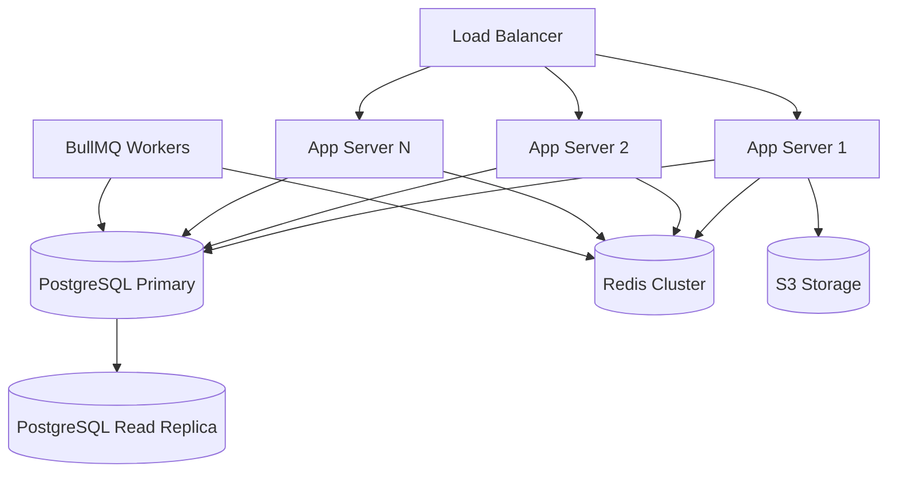

# 07 — Non-Functional Requirements

---

## Executive Summary

This document defines all non-functional requirements (NFRs) for SoftwBot AI, covering performance, scalability, availability, security, accessibility, internationalization, browser support, mobile responsiveness, SEO, maintainability, monitoring, data retention, and backup. Each NFR has a measurable target and validation method.

---

## Purpose

NFRs define HOW the system performs, not WHAT it does. They are the quality attributes that determine whether the product meets professional standards.

---

## Performance Requirements

| ID | Category | Requirement | Target | Measurement | Priority |
|----|----------|------------|--------|-------------|----------|
| NFR-001 | Frontend | Page load time (LCP) | < 2.0 seconds | Lighthouse | P0 |
| NFR-002 | Frontend | First Input Delay | < 100ms | Core Web Vitals | P0 |
| NFR-003 | Frontend | Cumulative Layout Shift | < 0.1 | Core Web Vitals | P0 |
| NFR-004 | Frontend | Time to Interactive | < 3.0 seconds | Lighthouse | P0 |
| NFR-005 | Frontend | JavaScript bundle size | < 250KB gzipped | Webpack analysis | P0 |
| NFR-006 | API | Response time (p50) | < 100ms | APM (Sentry) | P0 |
| NFR-007 | API | Response time (p95) | < 200ms | APM (Sentry) | P0 |
| NFR-008 | API | Response time (p99) | < 500ms | APM (Sentry) | P1 |
| NFR-009 | AI | First token latency | < 2 seconds | Application logs | P0 |
| NFR-010 | AI | Complete response time | < 5 seconds | Application logs | P0 |
| NFR-011 | Database | Query time (p95) | < 50ms | pg_stat_statements | P0 |
| NFR-012 | Database | Connection pool utilization | < 70% | PgBouncer stats | P0 |
| NFR-013 | WebSocket | Message latency | < 100ms | Connection monitoring | P0 |
| NFR-014 | Search | Vector search response | < 200ms | Application logs | P0 |
| NFR-015 | Upload | File upload (50MB) | < 30 seconds | Client timing | P1 |

---

## Scalability Requirements

| ID | Requirement | Target | Strategy | Priority |
|----|------------|--------|----------|----------|
| NFR-016 | Concurrent WhatsApp connections | 10,000+ | Horizontal scaling, connection pooling | P0 |
| NFR-017 | Messages per hour | 100,000+ | BullMQ queue, worker scaling | P0 |
| NFR-018 | Concurrent dashboard users | 1,000+ | Stateless servers, CDN | P0 |
| NFR-019 | Knowledge base documents | 100,000+ | pgvector HNSW index, partitioning | P1 |
| NFR-020 | Embeddings stored | 10M+ vectors | pgvector with IVFFlat/HNSW index | P1 |
| NFR-021 | Concurrent bot instances | 10,000+ | Process per bot, worker pools | P0 |
| NFR-022 | Data storage | 10TB+ | S3 + PostgreSQL partitioning | P2 |

### Scaling Strategy



---

## Availability Requirements

| ID | Requirement | Target | Measurement | Priority |
|----|------------|--------|-------------|----------|
| NFR-023 | System uptime | 99.9% (8.76h downtime/year) | Uptime monitoring | P0 |
| NFR-024 | Recovery Time Objective (RTO) | < 1 hour | DR testing | P0 |
| NFR-025 | Recovery Point Objective (RPO) | < 5 minutes | Backup verification | P0 |
| NFR-026 | Health check endpoint | Every 30 seconds | Load balancer | P0 |
| NFR-027 | Graceful degradation | Core features work during partial outage | Architecture review | P0 |
| NFR-028 | Failover time | < 30 seconds | Automated failover | P1 |

### Health Check Response

```json
{
  "status": "healthy",
  "version": "1.0.0",
  "uptime": 86400,
  "checks": {
    "database": { "status": "healthy", "latencyMs": 12 },
    "redis": { "status": "healthy", "latencyMs": 3 },
    "whatsapp": { "status": "healthy", "connections": 150 },
    "ai": { "status": "healthy", "provider": "openrouter" }
  }
}
```

---

## Security Requirements

| ID | Requirement | Target | Standard | Priority |
|----|------------|--------|----------|----------|
| NFR-029 | Encryption at rest | AES-256 | Industry standard | P0 |
| NFR-030 | Encryption in transit | TLS 1.3 | OWASP | P0 |
| NFR-031 | OWASP Top 10 | All mitigated | OWASP 2021 | P0 |
| NFR-032 | GDPR compliance | Full compliance | EU regulation | P0 |
| NFR-033 | CCPA compliance | Full compliance | CA regulation | P1 |
| NFR-034 | Penetration testing | Quarterly | Third-party audit | P1 |
| NFR-035 | Dependency vulnerability scanning | Every build | npm audit / Snyk | P0 |
| NFR-036 | Secret scanning | Every commit | GitGuardian / gitleaks | P0 |
| NFR-037 | Rate limiting | Per-endpoint configured | OWASP | P0 |
| NFR-038 | Input validation | All entry points | Zod schemas | P0 |

---

## Accessibility Requirements

| ID | Requirement | Target | Standard | Priority |
|----|------------|--------|----------|----------|
| NFR-039 | WCAG compliance | Level AA | WCAG 2.1 | P0 |
| NFR-040 | Keyboard navigation | All interactive elements | WCAG 2.1.1 | P0 |
| NFR-041 | Screen reader support | All content readable | WCAG 1.3.1 | P0 |
| NFR-042 | Color contrast ratio | ≥ 4.5:1 text, ≥ 3:1 large text | WCAG 1.4.3 | P0 |
| NFR-043 | Focus indicators | Visible on all focusable elements | WCAG 2.4.7 | P0 |
| NFR-044 | ARIA labels | All interactive elements labeled | WCAG 4.1.2 | P0 |
| NFR-045 | Reduced motion | Respect prefers-reduced-motion | WCAG 2.3.3 | P1 |
| NFR-046 | Error identification | Errors announced to screen readers | WCAG 3.3.1 | P0 |

---

## Internationalization Requirements

| ID | Requirement | Target | Priority |
|----|------------|--------|----------|
| NFR-047 | Bot multi-language | Bots respond in user's language | P0 |
| NFR-048 | UI language support | English (MVP), Hindi, Arabic, Spanish | P1 |
| NFR-049 | RTL support | Full RTL layout support | P1 |
| NFR-050 | Date formatting | Locale-aware date/time display | P0 |
| NFR-051 | Number formatting | Locale-aware number/currency display | P1 |
| NFR-052 | Timezone handling | All times stored as UTC, displayed in user timezone | P0 |

---

## Browser & Device Requirements

| ID | Requirement | Target | Priority |
|----|------------|--------|----------|
| NFR-053 | Chrome | Latest 2 versions | P0 |
| NFR-054 | Firefox | Latest 2 versions | P0 |
| NFR-055 | Safari | Latest 2 versions | P0 |
| NFR-056 | Edge | Latest 2 versions | P1 |
| NFR-057 | Mobile iOS | Safari iOS 15+ | P0 |
| NFR-058 | Mobile Android | Chrome Android 12+ | P0 |
| NFR-059 | Screen resolution | 320px to 2560px | P0 |

---

## Responsive Design Breakpoints

| Breakpoint | Width | Target |
|-----------|-------|--------|
| Mobile | < 640px | Phones |
| Tablet | 640px - 1024px | Tablets, small laptops |
| Desktop | 1024px - 1440px | Standard laptops, desktops |
| Wide | > 1440px | Large monitors |

---

## SEO Requirements

| ID | Requirement | Target | Priority |
|----|------------|--------|----------|
| NFR-060 | Meta tags | Title, description, OG tags on all pages | P1 |
| NFR-061 | Open Graph | OG image, title, description for social sharing | P1 |
| NFR-062 | Structured data | JSON-LD for organization and product | P2 |
| NFR-063 | Sitemap | Auto-generated sitemap.xml | P1 |
| NFR-064 | Robots.txt | Proper crawl directives | P1 |
| NFR-065 | Canonical URLs | Self-referencing canonicals | P1 |
| NFR-066 | Page speed | Lighthouse SEO score ≥ 90 | P1 |

---

## Maintainability Requirements

| ID | Requirement | Target | Priority |
|----|------------|--------|----------|
| NFR-067 | Code coverage | > 80% (unit + integration) | P0 |
| NFR-068 | TypeScript strict mode | Enabled, no `any` types | P0 |
| NFR-069 | Linting | Zero ESLint errors | P0 |
| NFR-070 | Code review | All PRs reviewed before merge | P0 |
| NFR-071 | Documentation | All public APIs documented | P0 |
| NFR-072 | CI/CD pipeline | Automated lint, test, build, deploy | P0 |
| NFR-073 | Database migrations | All schema changes via Drizzle Kit | P0 |

---

## Monitoring & Observability Requirements

| ID | Requirement | Target | Tool | Priority |
|----|------------|--------|------|----------|
| NFR-074 | Error tracking | All errors captured with context | Sentry | P0 |
| NFR-075 | Performance monitoring | Page load, API latency tracked | Sentry / Vercel Analytics | P0 |
| NFR-076 | Uptime monitoring | External uptime checks every 60s | BetterStack / UptimeRobot | P0 |
| NFR-077 | Log aggregation | Structured JSON logs, searchable | Axiom / Datadog | P1 |
| NFR-078 | Alerting | Critical alerts within 5 minutes | PagerDuty / Slack | P0 |
| NFR-079 | Dashboard for ops | Key metrics real-time dashboard | Custom / Grafana | P1 |

---

## Data Retention Requirements

| Data Type | Retention Period | Deletion Method | Priority |
|-----------|-----------------|-----------------|----------|
| Active conversations | Indefinite (while bot active) | — | P0 |
| Resolved conversations | 12 months | Soft delete, then hard delete | P0 |
| Messages | 12 months | Soft delete, then hard delete | P0 |
| Contact data | Until user deletion | Hard delete on account deletion | P0 |
| Lead data | 12 months after last activity | Soft delete | P1 |
| Knowledge base files | Until deleted by user | Hard delete | P0 |
| Analytics data | 24 months | Aggregation then deletion | P1 |
| Audit logs | 24 months | Archive then delete | P1 |
| Notification history | 90 days | Hard delete | P2 |
| Session data | 30 days | Automatic expiry | P0 |

---

## Backup Requirements

| ID | Requirement | Target | Priority |
|----|------------|--------|----------|
| NFR-080 | Database automated backup | Every 6 hours | P0 |
| NFR-081 | Backup retention | 30 days | P0 |
| NFR-082 | Point-in-time recovery | Within 5 minutes RPO | P0 |
| NFR-083 | Backup testing | Monthly restore test | P1 |
| NFR-084 | S3 versioning | Enabled for all buckets | P0 |
| NFR-085 | Cross-region backup | Weekly snapshot to secondary region | P2 |

---

## Rate Limiting Requirements

| Scope | Limit | Window | Priority |
|-------|-------|--------|----------|
| API (authenticated) | 100 requests | per minute | P0 |
| API (unauthenticated) | 20 requests | per minute | P0 |
| Bot Architect | 10 sessions | per hour | P0 |
| File upload | 10 files | per minute | P0 |
| Broadcast send | 1 campaign | per 5 minutes | P1 |
| Password reset | 3 attempts | per hour | P0 |
| WhatsApp messages | 100 messages | per second (WhatsApp limit) | P0 |

---

## Developer Notes

- NFRs should be validated in every sprint review
- Performance targets apply to p95 unless stated otherwise
- Security NFRs are non-negotiable — no shortcuts
- Accessibility is a legal requirement in many jurisdictions
- Backup strategy should be tested monthly with actual restore

## Future Improvements

- SOC 2 Type II certification
- ISO 27001 certification
- HIPAA compliance for healthcare customers
- Multi-region deployment for global performance
- CDN edge caching for static assets
- Real-time performance dashboard
- Automated load testing in CI/CD
