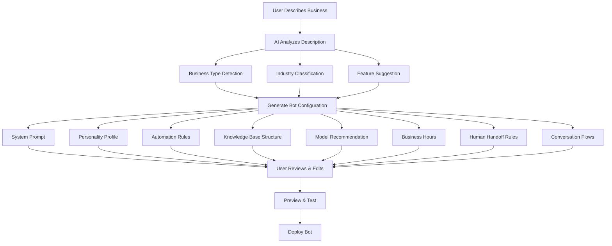

# 11 — Bot Architect

---

## Executive Summary

The Bot Architect is SoftwBot AI's flagship feature — an AI agent that transforms natural language business descriptions into complete, production-ready WhatsApp bot configurations. This document details its architecture, conversation flow, generation pipeline, editing capabilities, and deployment process.

---

## Purpose

Bot Architect eliminates the need for technical expertise in chatbot creation. Users describe their business in any language, and the AI generates everything needed for a working WhatsApp bot.

---

## How It Works

### High-Level Flow



### Conversation Interface

The Bot Architect uses a chat interface where the AI guides the user through bot creation:

```
┌─────────────────────────────────────────────────┐
│ Bot Architect                          Step 1/5  │
├────────────────────────────┬────────────────────┤
│                            │ Generated Config   │
│ 🤖 Hi! I'm your Bot       │ ┌────────────────┐ │
│    Architect. Tell me      │ │ System Prompt   │ │
│    about your business     │ │ [Generated...]  │ │
│    and I'll create a       │ └────────────────┘ │
│    perfect WhatsApp bot    │ ┌────────────────┐ │
│    for you.                │ │ Personality     │ │
│                            │ │ [Generated...]  │ │
│ 👤 I own a pizza           │ └────────────────┘ │
│    restaurant in Austin.   │ ┌────────────────┐ │
│    We're open 11am-10pm.   │ │ Automations     │ │
│    We deliver within       │ │ [Generated...]  │ │
│    5 miles. Our best       │ └────────────────┘ │
│    sellers are Margherita  │                    │
│    and BBQ Chicken.        │ [Deploy Bot]       │
│                            │                    │
├────────────────────────────┴────────────────────┤
│ [Type your message...              ] [Send]     │
└─────────────────────────────────────────────────┘
```

---

## Business Analysis Pipeline

### Step 1: Business Type Detection

The AI identifies the business type from the description:

| Input Pattern | Detected Type | Example |
|--------------|---------------|---------|
| "restaurant", "food", "menu", "deliver" | Restaurant | "I own a pizza place" |
| "shop", "store", "sell", "product", "ecommerce" | E-commerce | "I sell clothes online" |
| "property", "real estate", "house", "apartment" | Real Estate | "I'm a real estate agent" |
| "clinic", "doctor", "health", "appointment" | Healthcare | "We run a dental clinic" |
| "school", "education", "course", "student" | Education | "I run a coaching center" |
| "service", "repair", "fix" | Service Business | "I run a plumbing service" |
| "agency", "marketing", "client" | Agency | "We're a digital agency" |
| Other | Custom | Fallback to general template |

### Step 2: Feature Suggestion

Based on business type, AI suggests relevant features:

| Business Type | Suggested Features |
|--------------|-------------------|
| Restaurant | Order taking, reservation booking, menu sharing, delivery tracking, review collection |
| E-commerce | Product catalog, order tracking, returns, size guide, recommendations |
| Real Estate | Property matching, viewing scheduling, lead qualification, neighborhood info |
| Healthcare | Appointment booking, reminders, insurance info, prescription refills |
| Education | Course info, enrollment, schedule, homework help |
| Service | Booking, quotes, service area, emergency line |
| Agency | Client onboarding, project updates, invoicing |

### Step 3: Configuration Generation

For each component, the AI generates production-ready content:

#### System Prompt Generation

The system prompt follows this structure:

```
[Role Definition]
You are [Bot Name], a [role] for [Business Name].

[Business Context]
[Business description, location, hours, key offerings]

[Capabilities]
You can help customers with:
1. [Capability 1]
2. [Capability 2]
...

[Knowledge Integration]
When customers ask about [topics], use the knowledge base to provide accurate information.
Always cite sources when providing specific information.

[Response Guidelines]
- Be [tone] and [style]
- Keep responses [length guideline]
- When you don't know something, [fallback behavior]
- For [escalation scenarios], hand off to a human agent

[Conversation Flow]
When a customer first messages you:
1. Greet them warmly
2. Ask how you can help
3. [Business-specific flow]

[Constraints]
- Never [constraint 1]
- Always [constraint 2]
- If [situation], [action]
```

#### Personality Profile Generation

```json
{
  "tone": "friendly",
  "style": "warm and enthusiastic about food",
  "greeting": "Hey there! 🍕 Welcome to {{business_name}}! I'm your ordering assistant. What can I get for you today?",
  "farewell": "Thanks for ordering with us! Your food will be ready soon. Enjoy! 🎉",
  "error_response": "Hmm, I'm not sure I understood that. Could you rephrase? I can help with orders, menu questions, or reservations!",
  "escalation_response": "Let me connect you with our team who can help with that right away!",
  "language": "en",
  "emoji_usage": "moderate"
}
```

#### Automation Rules Generation

```json
[
  {
    "name": "Welcome Message",
    "trigger": { "type": "first_message" },
    "conditions": [],
    "actions": [
      { "type": "send_message", "content": "{{personality.greeting}}" }
    ]
  },
  {
    "name": "Business Hours Check",
    "trigger": { "type": "message_received" },
    "conditions": [
      { "field": "current_time", "operator": "outside_hours", "value": "{{business_hours}}" }
    ],
    "actions": [
      { "type": "send_message", "content": "Thanks for reaching out! Our business hours are {{business_hours}}. We'll get back to you first thing in the morning! 🌙" }
    ]
  },
  {
    "name": "Complaint Handoff",
    "trigger": { "type": "message_received" },
    "conditions": [
      { "field": "sentiment", "operator": "equals", "value": "negative" },
      { "field": "keywords", "operator": "contains", "value": ["complaint", "refund", "unhappy", "terrible"] }
    ],
    "actions": [
      { "type": "send_message", "content": "I'm sorry to hear that. Let me connect you with a team member who can help resolve this for you." },
      { "type": "human_handoff", "priority": "high" }
    ]
  }
]
```

#### Knowledge Base Structure

```json
{
  "suggested_categories": [
    {
      "name": "Menu & Products",
      "description": "Menu items, prices, ingredients, specials",
      "suggested_documents": ["Menu PDF", "Daily specials", "Allergen info"]
    },
    {
      "name": "Business Information",
      "description": "Hours, location, contact, delivery area",
      "suggested_documents": ["About us page", "Contact info", "Delivery policy"]
    },
    {
      "name": "Ordering & Delivery",
      "description": "How to order, delivery zones, payment methods",
      "suggested_documents": ["Ordering guide", "Delivery FAQ", "Payment options"]
    },
    {
      "name": "FAQ",
      "description": "Common customer questions",
      "suggested_documents": ["Top 20 customer questions and answers"]
    }
  ],
  "faq_topics": [
    "What are your hours?",
    "Do you deliver?",
    "What's on the menu?",
    "Do you have vegetarian options?",
    "How do I place an order?",
    "What payment methods do you accept?"
  ]
}
```

#### Model Recommendation

```json
{
  "recommended_model": "openai/gpt-4o-mini",
  "reasoning": "Cost-effective for high-volume restaurant conversations. Fast response times suitable for order-taking. Good multilingual support.",
  "estimated_cost_per_message": "$0.000075",
  "estimated_monthly_cost": "$7.50 for 100K messages",
  "alternatives": [
    {
      "model": "openai/gpt-4o",
      "reasoning": "Higher quality for complex menu questions",
      "cost_per_message": "$0.00125"
    },
    {
      "model": "anthropic/claude-3.5-haiku",
      "reasoning": "Fastest response time, good for high-volume",
      "cost_per_message": "$0.0004"
    }
  ]
}
```

---

## Multi-Language Support

Bot Architect processes business descriptions in any language:

| Language | Example Input | Generated Output Language |
|----------|--------------|--------------------------|
| English | "I own a pizza restaurant" | English bot |
| Hindi | "मेरा रेस्तरां है" | Hindi bot |
| Spanish | "Tengo una tienda de ropa" | Spanish bot |
| Arabic | "أملك مطعمًا" | Arabic bot (RTL) |
| Any | Auto-detect | Responds in input language |

---

## Editing Interface

After generation, users can edit any component:

| Component | Edit Method | Preview |
|-----------|------------|---------|
| System Prompt | Text editor with syntax highlighting | Token counter, diff view |
| Personality | Form fields with suggestions | Sample conversation |
| Automation Rules | Visual rule builder | Test with sample data |
| Knowledge Base | File upload interface | Search test |
| Model | Dropdown with cost comparison | Performance info |
| Business Hours | Day-by-day schedule editor | Timezone indicator |
| Handoff Rules | Condition builder | Escalation test |

---

## Error Handling

| Error | Fallback Strategy |
|-------|-------------------|
| AI generation fails | Use template-based generation for detected industry |
| Description too vague | Ask clarifying questions: "What products/services do you offer?" |
| Description in unsupported language | Fall back to English with translation notice |
| Generation takes > 30 seconds | Show progress, allow continued editing |
| Partial generation failure | Generate available components, mark others as "needs manual setup" |

---

## Example Walkthroughs

### Restaurant (Raj's Pizza Place)

**Input:** "I own a pizza restaurant in Austin called Pizza Palace. We're open 11am-10pm daily. We deliver within 5 miles. Best sellers are Margherita and BBQ Chicken pizza. We take orders via WhatsApp."

**Generated Bot:**
- Name: "Pizza Palace Ordering Assistant"
- Personality: Warm, food-enthusiastic, helpful
- Greeting: "Hey there! 🍕 Welcome to Pizza Palace! Ready to order? I can help you with our menu, place an order, or answer any questions!"
- Features: Order taking, menu browsing, delivery area check, hours inquiry
- Model: GPT-4o-mini (cost-effective for order volume)
- Automation: Welcome message, after-hours reply, complaint handoff
- Knowledge: Menu, hours, delivery policy, FAQ

---

## Developer Notes

- Bot Architect uses Claude 3.5 Sonnet for generation (best at structured output)
- Streaming responses for real-time generation feel
- Generated config stored as JSON, fully editable
- Each generated component has a `confidence` score
- Bot Architect sessions expire after 24 hours of inactivity
- Rate limit: 10 Bot Architect sessions per workspace per hour

## Future Improvements

- Voice input for business description
- Image input (upload business card/flyer → extract info)
- Multi-location support
- Competitor analysis integration
- A/B test generated configurations
- Community-shared templates
