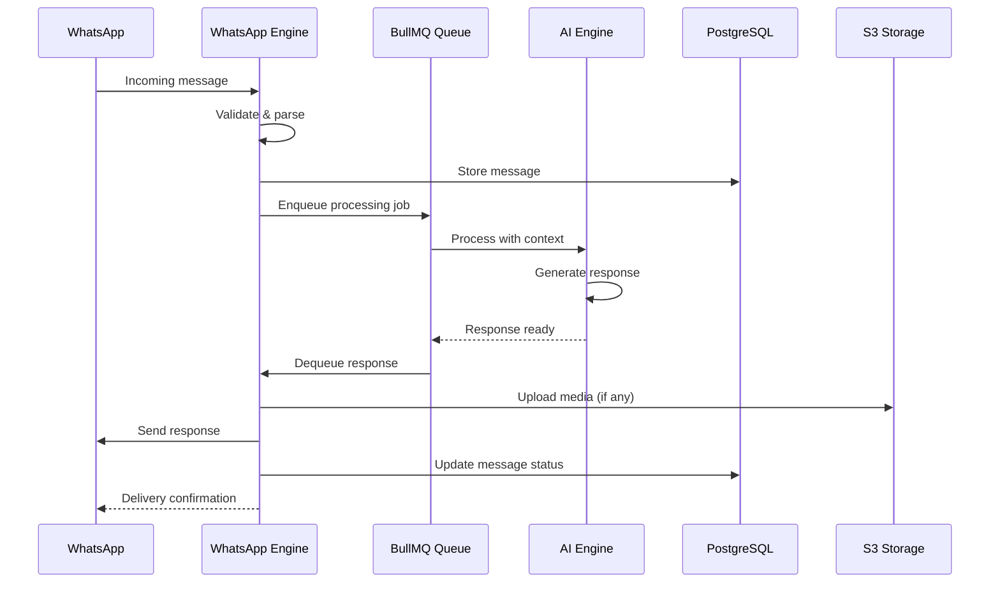
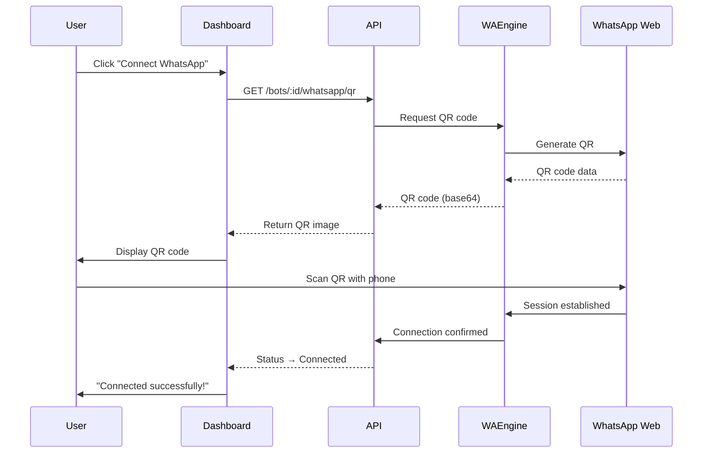
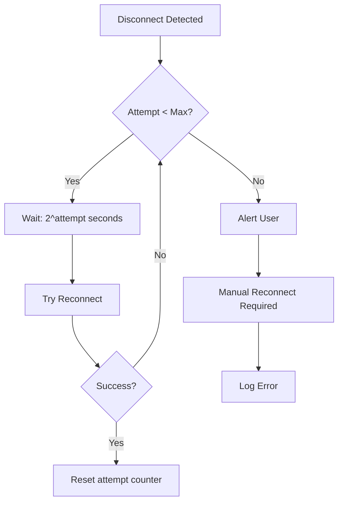
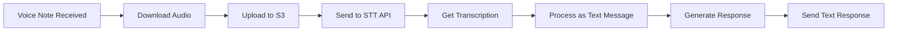
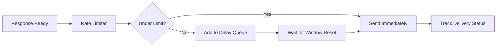
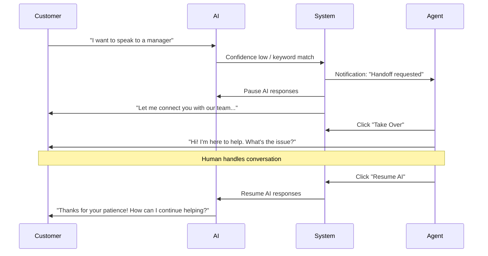

# 12 — WhatsApp Engine

---

## Executive Summary

This document details the WhatsApp integration architecture built on whatsapp-web.js, covering session management, message processing, media handling, rate limiting, human takeover, reconnect strategy, and compliance with WhatsApp Business Policy.

---

## Purpose

The WhatsApp Engine is the core communication layer. It manages all interactions between the AI bots and WhatsApp users, ensuring reliable message delivery, session persistence, and compliance.

---

## Architecture Overview



---

## QR Login Flow



### QR Code Details
- Format: PNG base64, 256x256px
- Auto-refresh every 60 seconds
- Max 5 refresh attempts before error
- Displayed in WhatsAppQRCode component

---

## Session Management

### Session Lifecycle

```
Disconnected → QR Pending → Connecting → Connected → Active
                                                      ↓
                                              Disconnected (error)
                                                      ↓
                                              Reconnecting (auto)
```

### Session Storage

| Data | Storage | Retention |
|------|---------|-----------|
| Session auth data | PostgreSQL (JSONB) | Until manually disconnected |
| Phone number | PostgreSQL | Permanent |
| Device info | PostgreSQL | Permanent |
| Connection health | Redis | Real-time |

### Session Restore

On server restart:
1. Load session data from PostgreSQL
2. Initialize whatsapp-web.js with stored auth
3. Validate session with WhatsApp servers
4. If valid → auto-connect
5. If invalid → generate new QR, notify user

---

## Reconnect Strategy



### Configuration
- Base delay: 1 second
- Max delay: 120 seconds (capped)
- Max attempts: 10
- Jitter: ±20% random
- Alert threshold: 3 failed attempts

---

## Message Processing Pipeline

### Incoming Message Flow

1. **Receive** — whatsapp-web.js emits message event
2. **Validate** — Check message type, size, content
3. **Store** — Save to `messages` table
4. **Queue** — Add to BullMQ `message-processing` queue
5. **Context** — Gather conversation history, knowledge base context
6. **AI Process** — Send to AI engine with full context
7. **Generate** — AI generates response
8. **Post-process** — Validate response, apply content filters
9. **Queue Response** — Add to `message-sending` queue
10. **Send** — Send via whatsapp-web.js
11. **Track** — Update delivery status

### Message Types Supported

| Type | Incoming | Outgoing | Notes |
|------|----------|----------|-------|
| Text | ✅ | ✅ | Max 4096 characters |
| Image | ✅ | ✅ | Max 5MB, auto-resize |
| Video | ✅ | ✅ | Max 16MB, auto-compress |
| Document | ✅ | ✅ | Max 50MB, stored in S3 |
| Audio | ✅ | ✅ | Max 16MB |
| Voice Note | ✅ | ❌ | Transcribed via STT API |
| Sticker | ✅ | ❌ | Stored but not regenerated |
| Location | ✅ | ❌ | Parsed and stored |
| Contact | ✅ | ❌ | Parsed and stored |
| Reaction | ✅ | ❌ | Tracked for sentiment |

---

## Voice Note Processing



- Supported formats: OGG, MP3, WAV, M4A
- Max duration: 5 minutes
- STT Provider: OpenAI Whisper API
- Language auto-detection
- Transcription stored with original audio

---

## Typing Indicator

- Shown when AI is processing a response
- Activated immediately when message is queued
- Auto-hidden after 30 seconds or when response is sent
- If AI takes > 30 seconds, typing indicator pauses and resumes

---

## Rate Limiting

### WhatsApp Limits
| Limit | Value | Window |
|-------|-------|--------|
| Messages per second | 100 | Per second |
| Messages per batch | 256 | Per batch |
| Broadcast per day | 256 recipients | Per day |
| Media upload size | 64MB | Per file |

### SoftwBot Rate Limiting
| Limit | Value | Strategy |
|-------|-------|----------|
| Outbound per bot | 50 msg/sec | Queue-based with delay |
| Broadcast sending | 10 msg/sec | Conservative (safety margin) |
| API calls to WhatsApp | 100/sec | Token bucket algorithm |

### Rate Limit Queue



---

## Human Takeover

### Trigger Mechanisms

| Trigger | Type | Description |
|---------|------|-------------|
| Keyword | Automatic | Message contains handoff keywords (e.g., "speak to human") |
| Sentiment | Automatic | Negative sentiment score > threshold |
| Confidence | Automatic | AI confidence < threshold (e.g., < 50%) |
| Manual | User-initiated | Agent clicks "Take Over" in dashboard |
| Rule-based | Automation | Automation rule triggers handoff |

### Handoff Flow



### Handoff Rules Configuration

```json
{
  "keywords": ["human", "agent", "manager", "complaint", "refund", "speak to someone"],
  "sentiment_threshold": -0.5,
  "confidence_threshold": 50,
  "max_ai_failures": 3,
  "escalation_timeout_seconds": 120,
  "notification_channels": ["dashboard", "email"],
  "auto_resolve_after_minutes": 480
}
```

---

## Broadcast Implementation

### Sending Flow

1. User creates broadcast campaign
2. Audience filter applied to contacts
3. Messages queued with per-recipient personalization
4. Rate-limited sending (10 msg/sec)
5. Delivery status tracked per recipient
6. Failed messages retried 3x
7. Final report generated

### Compliance Rules
- Opt-out list respected (contacts who replied "STOP")
- Business hours respected per recipient timezone
- No duplicate messages within 24 hours
- Template messages required for marketing content

---

## Error Handling

| Error | Code | Handling |
|-------|------|----------|
| Session invalidated | WA-001 | Trigger re-login flow, notify user |
| Rate limited | WA-002 | Queue messages, retry after window |
| Message not delivered | WA-003 | Retry 3x, then mark as failed |
| Media upload failed | WA-004 | Compress and retry, fallback to text |
| Phone disconnected | WA-005 | Auto-reconnect with backoff |
| Number blocked | WA-006 | Pause bot, alert user |
| Session corrupted | WA-007 | Clear session, require re-login |

---

## Security

- Session data encrypted at rest (AES-256)
- Phone numbers masked in logs
- WhatsApp Business Policy compliance checks
- No message content stored beyond retention period
- Anti-spam: duplicate message detection, opt-out enforcement

---

## Developer Notes

- whatsapp-web.js runs in a headless browser (Puppeteer)
- Each bot gets its own browser instance
- Memory limit: 512MB per browser instance
- Monitor memory usage, restart instances if > 400MB
- Session data serialized as JSONB in PostgreSQL
- Queue concurrency: 10 workers for message processing

## Future Improvements

- Official WhatsApp Business API support (as supplementary channel)
- WhatsApp Business Platform catalog integration
- Interactive messages (buttons, lists)
- Template message management
- Multi-device support improvements
- Message scheduling
- Read receipt tracking
