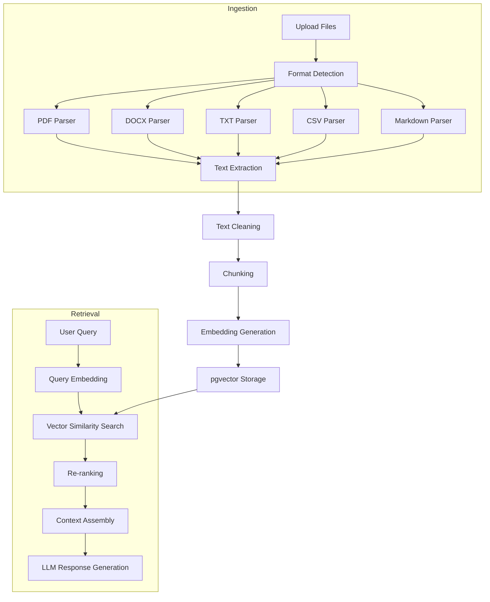
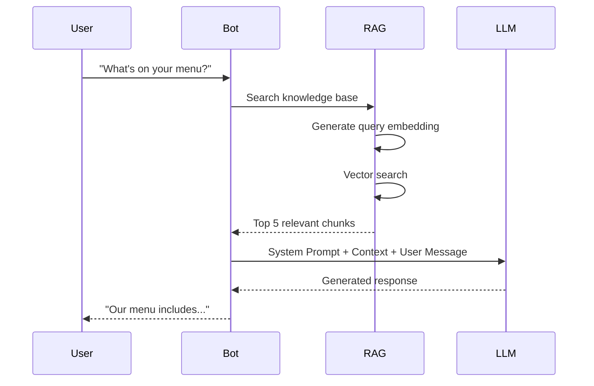

# 13 — RAG (Retrieval-Augmented Generation)

---

## Executive Summary

This document details the RAG pipeline for SoftwBot AI's knowledge base, covering document ingestion, text processing, chunking strategies, embedding generation, vector storage, semantic search, context injection, conversation memory, and web crawling.

---

## Purpose

RAG enables bots to answer questions accurately using uploaded business documents, rather than relying solely on the LLM's training data.

---

## Architecture Overview



---

## Document Ingestion

### Supported Formats

| Format | Parser | Max Size | Notes |
|--------|--------|----------|-------|
| PDF | pdf-parse / pdfjs-dist | 50MB | Text, tables, images with alt text |
| DOCX | mammoth | 50MB | Headings, paragraphs, tables, lists |
| TXT | native | 10MB | Plain text |
| Markdown | marked | 10MB | Structure-aware parsing |
| CSV | papaparse | 20MB | Row-based and column-based chunking |
| URL | cheerio + fetch | N/A | HTML content extraction |

### PDF Processing

1. Extract text using pdf-parse
2. Detect and extract tables
3. Process images with alt text (if available)
4. Preserve heading hierarchy
5. Handle multi-column layouts
6. Detect page breaks for page-number metadata

### DOCX Processing

1. Convert to HTML using mammoth
2. Parse heading levels (H1-H6)
3. Extract tables as structured data
4. Preserve list hierarchy
5. Handle embedded images

### CSV Processing

- **Row mode:** Each row becomes a chunk (good for product catalogs)
- **Column mode:** Columns grouped into chunks (good for structured data)
- Auto-detect delimiter and encoding

---

## Text Processing

### Cleaning Pipeline

1. Remove excess whitespace and newlines
2. Remove special characters and encoding artifacts
3. Normalize Unicode characters
4. Remove headers/footers (repeated text)
5. Detect and remove boilerplate (navigation, disclaimers)
6. Normalize abbreviations
7. Fix common OCR errors (if scanned PDF)

### Language Detection

- Detect primary language of each document
- Store language metadata for language-aware retrieval
- Support multilingual knowledge bases

---

## Chunking Strategies

### Strategy Selection

| Content Type | Recommended Strategy | Chunk Size | Overlap |
|-------------|---------------------|------------|---------|
| Narrative text | Recursive character | 500 tokens | 50 tokens |
| Technical docs | Semantic (paragraph) | 300 tokens | 30 tokens |
| FAQ | Question-answer pairs | Variable | 0 |
| Product catalog | Row-based | 1 row | 0 |
| Conversational | Fixed-size | 256 tokens | 25 tokens |

### Recursive Character Splitting (Default)

```
1. Try to split on paragraph breaks (\n\n)
2. If chunk too large, split on sentence boundaries (. ! ?)
3. If still too large, split on word boundaries (space)
4. If still too large, split on character boundaries
```

### Semantic Chunking

1. Split document into paragraphs
2. Group paragraphs by topic similarity
3. Merge small paragraphs until target size
4. Split large paragraphs at natural boundaries
5. Preserve metadata (section, heading) across chunks

### Chunk Metadata

Each chunk stores:
```json
{
  "content": "The chunk text content",
  "chunk_index": 5,
  "token_count": 245,
  "metadata": {
    "source_file": "menu.pdf",
    "page_number": 3,
    "section": "Main Menu",
    "heading": "Pizza Options",
    "language": "en"
  }
}
```

---

## Embedding Generation

### Model Selection

| Model | Dimensions | Cost per 1M tokens | Speed | Quality |
|-------|-----------|-------------------|-------|---------|
| OpenAI text-embedding-3-small | 1536 | $0.02 | Fast | Good |
| OpenAI text-embedding-3-large | 3072 | $0.13 | Medium | Best |
| Voyage AI voyage-3 | 1024 | $0.06 | Fast | Good |

**Default:** text-embedding-3-small (best cost/quality ratio)

### Generation Process

1. Extract text from chunks
2. Batch chunks (max 100 per batch for API limits)
3. Generate embeddings via API
4. Store embeddings in pgvector column
5. Create HNSW index for fast retrieval

### pgvector Configuration

```sql
-- Enable pgvector
CREATE EXTENSION IF NOT EXISTS vector;

-- HNSW index for fast approximate nearest neighbor search
CREATE INDEX ON knowledge_chunks 
  USING hnsw (embedding vector_cosine_ops)
  WITH (m = 16, ef_construction = 64);
```

---

## Vector Search

### Similarity Metrics

| Metric | Use Case | Formula |
|--------|----------|---------|
| Cosine similarity | Default, most common | cos(A, B) |
| Inner product | Normalized vectors | A · B |
| L2 distance | Euclidean distance | ∥A - B∥² |

**Default:** Cosine similarity

### Search Process

1. Generate query embedding
2. Run vector similarity search
3. Apply metadata filters (file, language, date)
4. Return top-K results (default K=5)
5. Filter by score threshold (default 0.7)
6. Re-rank results (optional)

### Hybrid Search

Combine vector search with keyword search:

```
Final Score = α × Vector_Score + (1 - α) × BM25_Score
```

Where α = 0.7 (vector-heavy by default)

### Query Examples

```sql
-- Basic vector search
SELECT content, 1 - (embedding <=> $1) as similarity
FROM knowledge_chunks
WHERE knowledge_base_id = $2
ORDER BY embedding <=> $1
LIMIT 5;

-- Filtered search
SELECT content, 1 - (embedding <=> $1) as similarity
FROM knowledge_chunks
WHERE knowledge_base_id = $2
  AND metadata->>'language' = 'en'
ORDER BY embedding <=> $1
LIMIT 5;
```

---

## Context Injection

### How Context Reaches the LLM



### Context Assembly

The context is injected into the system prompt:

```
You are a helpful assistant for [Business Name].

Use the following context to answer the customer's question.
If the context doesn't contain the answer, say you don't know
rather than making something up.

CONTEXT:
[Chunk 1] (Source: menu.pdf, Page 3)
Margherita Pizza - $12.99
Fresh mozzarella, tomato sauce, basil on hand-tossed dough.

[Chunk 2] (Source: menu.pdf, Page 3)  
BBQ Chicken Pizza - $14.99
Grilled chicken, BBQ sauce, red onion, cilantro.

[Chunk 3] (Source: specials.pdf)
Weekend Special: Buy 2 pizzas, get 1 free (Friday-Sunday only)

CUSTOMER QUESTION: What pizzas do you have?
```

### Token Budget Management

- System prompt: ~500 tokens
- Knowledge context: ~1500 tokens (3 chunks × 500)
- Conversation history: ~1000 tokens (last 5 messages)
- User message: ~100 tokens
- Response buffer: ~500 tokens
- **Total budget:** ~3600 tokens (fits in GPT-4o-mini's context)

### Citation Tracking

Responses include source attribution:

```
"Based on our menu, we have two signature pizzas:
1. Margherita Pizza ($12.99) - Fresh mozzarella and basil
2. BBQ Chicken Pizza ($14.99) - Grilled chicken with BBQ sauce
Sources: menu.pdf"
```

---

## Conversation Memory

### Short-Term Memory

- Current conversation context (last N messages)
- Configurable window size (default: 20 messages)
- Important facts extracted and stored per conversation
- Token-efficient summarization for long conversations

### Long-Term Memory

- Cross-conversation facts about contacts
- Extracted entities (name, preferences, past orders)
- Conversation summaries stored in contact record
- Retrieved per contact for personalized responses

### Memory Retrieval Process

1. Extract key facts from current message
2. Search long-term memory for related facts
3. Include relevant memories in context
4. Update memories with new information
5. Decay old memories (reduce relevance over time)

---

## Web Crawling

### Crawl Process

1. Validate URL
2. Fetch page content
3. Extract text (strip HTML, navigation, footers)
4. Parse internal links
5. Respect robots.txt
6. Crawl depth limit (default: 2)
7. Process each page through ingestion pipeline

### Configuration

```json
{
  "url": "https://example.com",
  "depth": 2,
  "scope": "same-domain",
  "exclude_patterns": ["/admin/*", "/login/*"],
  "include_patterns": ["/products/*", "/about/*"],
  "max_pages": 100,
  "respect_robots": true,
  "rate_limit_ms": 1000
}
```

### Change Detection

- Store hash of crawled content
- Re-crawl on schedule (configurable)
- Diff detection for changed content
- Re-embed changed chunks only

---

## Performance Optimization

| Optimization | Description | Impact |
|-------------|-------------|--------|
| Embedding caching | Cache embeddings for repeated text | 50% fewer API calls |
| Query result caching | Cache search results for repeated queries | Faster response |
| Batch embedding | Process multiple chunks in one API call | 3x faster ingestion |
| HNSW index | Approximate nearest neighbor index | 100x faster search |
| Connection pooling | Reuse database connections | Reduced latency |

---

## Developer Notes

- Embedding generation is the most expensive operation — batch aggressively
- pgvector HNSW index is preferred over IVFFlat for datasets < 10M vectors
- Monitor embedding API costs — they scale with document volume
- Chunk overlap prevents context loss at boundaries
- Knowledge base processing is async (queued via BullMQ)

## Future Improvements

- Hybrid search (vector + BM25) with configurable weights
- Re-ranking model (Cohere Rerank)
- Multi-vector embeddings (per-section embeddings)
- Automatic chunk size optimization
- Knowledge base quality scoring
- Incremental embedding updates
- Graph-based knowledge representation
