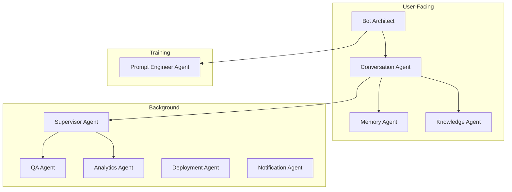

# 14 — AI Agents

---

## Executive Summary

SoftwBot AI uses a multi-agent architecture where 10 specialized AI agents handle different aspects of the platform. This document details each agent's responsibilities, inputs, outputs, system prompts, tools, limitations, error handling, and fallback strategies.

---

## Purpose

Specialized agents ensure each task is handled by the optimal AI model with appropriate prompts, rather than a single monolithic AI trying to do everything.

---

## Agent Orchestration



---

## Agent 1: Bot Architect

### Responsibilities
- Understand business descriptions in natural language
- Detect business type and industry
- Generate complete bot configurations
- Recommend AI models and settings
- Suggest knowledge base structure

### Inputs
- Business description (10-2000 characters, any language)
- Optional: industry preference, feature preferences
- Optional: existing bot config for modification

### Outputs
```typescript
interface BotArchitectOutput {
  botName: string;
  systemPrompt: string;
  personality: {
    tone: 'formal' | 'casual' | 'friendly' | 'professional' | 'humorous';
    style: 'concise' | 'detailed' | 'empathetic' | 'direct';
    greeting: string;
    farewell: string;
  };
  automationRules: AutomationRule[];
  knowledgeBaseStructure: {
    categories: KBCategory[];
    faqTopics: string[];
  };
  modelRecommendation: {
    model: string;
    reasoning: string;
    estimatedCostPerMessage: number;
  };
  businessHours: BusinessHours;
  humanHandoffRules: HandoffRules;
  conversationFlows: ConversationFlow[];
  welcomeMessage: string;
  offlineMessage: string;
}
```

### Memory
- Conversation history with user during session
- Previous generated configs (for refinement)

### Tools
- Industry database lookup
- Feature template library
- Prompt template library
- Cost calculator

### System Prompt
```
You are Bot Architect, an expert AI assistant that helps businesses create
WhatsApp chatbots. You understand business needs from natural language
descriptions and generate complete, production-ready bot configurations.

When a user describes their business:
1. Identify the business type and industry
2. Understand their key offerings and processes
3. Suggest relevant features
4. Generate a complete bot configuration

Always respond in the same language the user writes in.
Be conversational and ask clarifying questions when needed.
Generate practical, ready-to-use configurations.
```

### Model
- **Primary:** Claude 3.5 Sonnet (best at structured generation)
- **Fallback:** GPT-4o (if Claude unavailable)
- **Temperature:** 0.7
- **Max tokens:** 4096

### Limitations
- May not understand very niche industries
- Generated prompts may need fine-tuning for edge cases
- Language quality varies by language (English is best)
- Cannot validate generated config against real business data

### Error Handling
| Error | Fallback |
|-------|----------|
| Generation timeout | Use template-based generation |
| API unavailable | Queue session, retry when available |
| Vague description | Ask clarifying questions |
| Unsupported language | Generate in English, note translation needed |

### Fallback Strategy
Pre-built templates for 20+ business types that can be customized manually.

---

## Agent 2: Prompt Engineer

### Responsibilities
- Optimize system prompts for quality and efficiency
- Improve prompt clarity and effectiveness
- Reduce token usage while maintaining quality
- Generate prompt variations for A/B testing

### Inputs
- Raw system prompt
- Bot configuration
- Knowledge base content summary
- Performance metrics (if existing bot)

### Outputs
- Optimized system prompt
- Token count comparison
- Quality improvement score
- Suggested variations

### Model
- **Primary:** GPT-4o (best at prompt engineering)
- **Temperature:** 0.3 (more deterministic)

### Limitations
- May over-optimize and lose original intent
- Cannot test prompt quality in production
- Improvement may be marginal for already-good prompts

---

## Agent 3: Knowledge Agent

### Responsibilities
- Process uploaded documents (parse, clean, chunk)
- Generate embeddings for vector storage
- Retrieve relevant context for queries
- Manage knowledge base lifecycle

### Inputs
- Documents (files, URLs, text)
- Search queries
- Configuration (chunk size, overlap, model)

### Outputs
- Processed chunks with metadata
- Embeddings (stored in pgvector)
- Search results with relevance scores
- Processing status and statistics

### Tools
- File parsers (PDF, DOCX, TXT, CSV, Markdown)
- Text splitter
- Embedding generator (OpenAI text-embedding-3-small)
- Vector search (pgvector)
- Web crawler (cheerio + fetch)

### Model
- **Chunking logic:** Deterministic (no LLM needed)
- **Embedding:** text-embedding-3-small
- **Query expansion (optional):** GPT-4o-mini

### Limitations
- Quality depends on source document quality
- May miss context in complex layouts (multi-column, tables)
- Embedding cost scales with document volume

---

## Agent 4: Conversation Agent

### Responsibilities
- Handle real-time WhatsApp conversations
- Generate contextual, personality-consistent responses
- Integrate knowledge base context
- Detect when to hand off to humans
- Capture lead information

### Inputs
- User message
- Conversation history (last N messages)
- Knowledge base context (retrieved chunks)
- Bot personality configuration
- Business rules and automation
- Contact information

### Outputs
```typescript
interface ConversationResponse {
  content: string;
  confidence: number; // 0-1
  sentiment: 'positive' | 'neutral' | 'negative';
  intent: string;
  actions: Action[];
  knowledgeSources: KnowledgeSource[];
  tokenUsage: { prompt: number; completion: number };
}
```

### Tools
- Knowledge search (pgvector)
- Memory retrieval
- Lead capture
- Human handoff trigger
- Action execution

### Model
- **Configurable per bot** (user's choice)
- **Default:** GPT-4o-mini (cost-efficient)
- **Temperature:** Per bot config (default 0.7)

### System Prompt Structure
```
[Base Personality] from bot config
[Business Context] from bot description
[Knowledge Integration] instructions
[Response Guidelines] from bot config
[Handoff Rules] from bot config
[Conversation History] last N messages
[Knowledge Context] retrieved chunks
[User Message] current message
```

### Limitations
- May hallucinate if knowledge base is insufficient
- Context window limits conversation depth
- Response quality depends on prompt quality
- Cannot handle truly novel situations

### Error Handling
| Error | Fallback |
|-------|----------|
| Low confidence (<50%) | Auto-escalate to human |
| Knowledge not found | "I don't have that information. Let me connect you with someone who can help." |
| API timeout | "I'm sorry, I'm having trouble right now. Please try again." |
| Content filter triggered | Generic safe response |

---

## Agent 5: Memory Agent

### Responsibilities
- Extract important facts from conversations
- Store and retrieve long-term memories
- Summarize conversation history
- Manage memory relevance and decay

### Inputs
- Conversation messages
- Extracted facts
- Memory queries

### Outputs
- Relevant memories for context
- Updated fact store
- Conversation summaries

### Model
- **Primary:** GPT-4o-mini (cost-efficient for extraction)
- **Temperature:** 0.2 (deterministic extraction)

### Memory Types
| Type | Storage | TTL | Example |
|------|---------|-----|---------|
| Conversation summary | conversation table | Session | "Customer asked about pizza delivery" |
| Contact fact | contacts.metadata | Permanent | "Customer prefers vegetarian" |
| Interaction pattern | contacts.metadata | 90 days | "Orders every Friday evening" |

### Limitations
- May extract irrelevant facts
- Memory quality depends on conversation quality
- Stale memories may provide incorrect context

---

## Agent 6: Supervisor Agent

### Responsibilities
- Monitor all active conversations
- Detect quality issues and anomalies
- Ensure response quality standards
- Trigger alerts for escalation needs

### Inputs
- Active conversations (real-time stream)
- Bot performance metrics
- Error logs
- Quality baselines

### Outputs
- Quality scores per conversation
- Anomaly alerts
- Performance reports
- Improvement suggestions

### Model
- **Primary:** Claude 3.5 Sonnet (best at analysis)
- **Temperature:** 0.3

### Monitoring Rules
- Response time > 10 seconds → alert
- AI confidence < 50% for 3+ messages → escalate
- Negative sentiment trend → alert
- Same question asked 3+ times → flag for KB improvement

### Limitations
- May generate false positives
- Resource-intensive (monitors all conversations)
- Cannot auto-fix issues, only alerts

---

## Agent 7: QA Agent

### Responsibilities
- Test bot responses before deployment
- Validate quality against test scenarios
- Generate test cases from bot configuration
- Detect potential issues

### Inputs
- Bot configuration
- Knowledge base content
- Test scenarios (manual or auto-generated)

### Outputs
- Test results with pass/fail
- Quality score (0-100)
- Identified issues with severity
- Improvement recommendations

### Model
- **Primary:** GPT-4o (best at evaluation)
- **Temperature:** 0.1 (very deterministic)

### Test Categories
1. **Knowledge accuracy** — Does bot answer correctly from KB?
2. **Personality consistency** — Does bot maintain configured tone?
3. **Handoff triggers** — Does bot escalate appropriately?
4. **Edge cases** — How does bot handle unusual inputs?
5. **Safety** — Does bot avoid harmful/inappropriate responses?

---

## Agent 8: Deployment Agent

### Responsibilities
- Validate bot configuration before deployment
- Execute deployment steps
- Run health checks post-deployment
- Handle rollback if issues detected

### Inputs
- Bot configuration
- Deployment target (WhatsApp session)
- Health check criteria

### Outputs
- Deployment status
- Health check results
- Rollback triggers

### Deployment Steps
1. Validate configuration (all required fields, valid model)
2. Test AI response generation
3. Validate WhatsApp connection
4. Update bot status to "activating"
5. Enable message processing
6. Run health check (send test message, verify response)
7. Update status to "active" or rollback to "error"

---

## Agent 9: Analytics Agent

### Responsibilities
- Aggregate conversation and performance data
- Generate insight reports
- Detect trends and anomalies
- Provide actionable recommendations

### Inputs
- Conversation data (messages, timestamps, outcomes)
- Bot metrics (response time, confidence, fallback rate)
- Lead data (capture rate, conversion)
- User engagement data

### Outputs
- Insight reports (daily, weekly, monthly)
- Trend analysis
- Anomaly detection results
- Optimization recommendations

### Model
- **Primary:** Claude 3.5 Sonnet (best at analysis)
- **Temperature:** 0.3

---

## Agent 10: Notification Agent

### Responsibilities
- Generate notification content
- Route notifications to appropriate channels
- Manage notification preferences
- Handle delivery and tracking

### Inputs
- Notification events (new message, lead, error, etc.)
- User preferences
- Notification rules

### Outputs
- Notification content (in-app, email, push)
- Delivery status
- Notification history

### Model
- **Primary:** GPT-4o-mini (for content generation)
- **Temperature:** 0.5

---

## Developer Notes

- Each agent runs in its own processing context
- Agent failures should not cascade (isolation)
- All agent outputs are logged for debugging
- Model selection should be configurable per agent
- Agent performance is tracked via metrics (latency, success rate, cost)

## Future Improvements

- Agent self-improvement based on feedback
- Custom agent creation by users
- Agent marketplace for community-contributed agents
- Multi-agent collaboration for complex tasks
- Agent explainability (why did it make this decision?)
