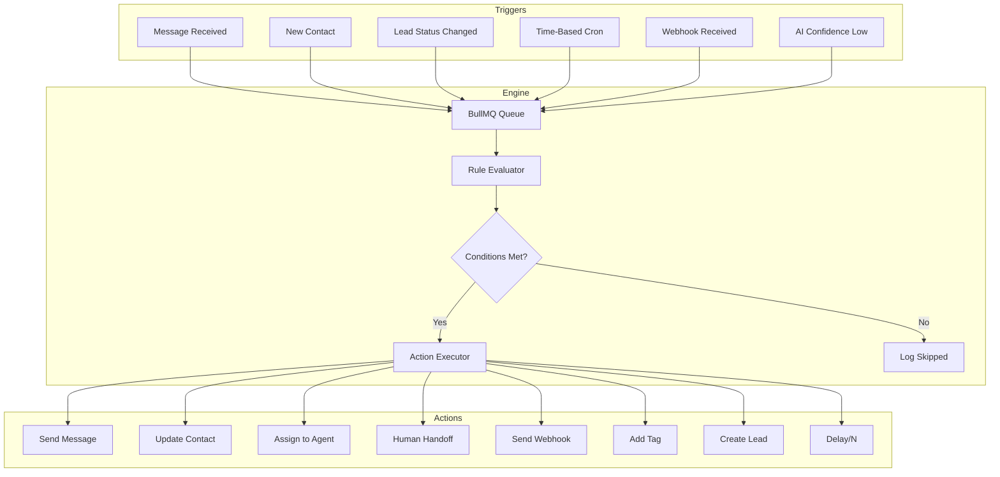
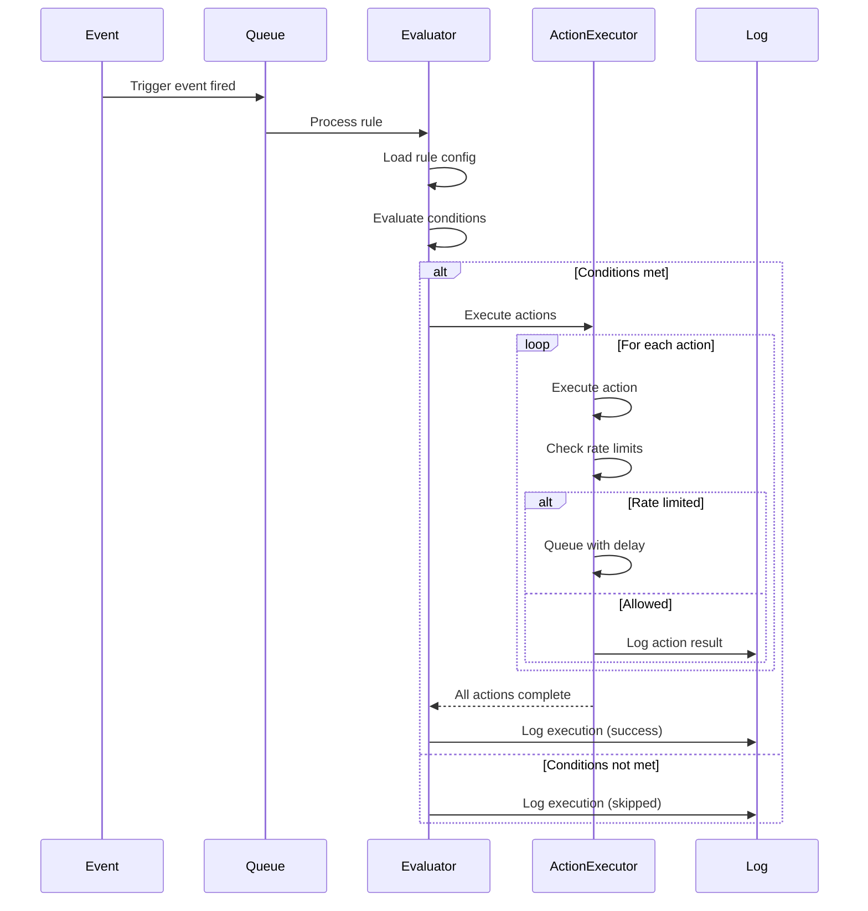

# 16 — Automation Engine

---

## Executive Summary

This document defines the automation engine architecture, including trigger types, condition evaluation, action execution, scheduling, A/B testing, and analytics. The engine enables event-driven automation rules that respond to WhatsApp messages, contact changes, and time-based events.

---

## Purpose

The automation engine eliminates repetitive manual tasks by defining rules that execute automatically when triggered.

---

## Architecture Overview



---

## Trigger Types

| Trigger | Description | Config Fields |
|---------|-------------|---------------|
| `message_received` | Any message from a contact | `bot_id`, `scope` (all/group/dm) |
| `keyword_match` | Message contains specific keyword | `keywords[]`, `match_type` (exact/contains/regex) |
| `new_contact` | First message from new contact | `bot_id` |
| `lead_status_changed` | Lead moves between pipeline stages | `from_status`, `to_status` |
| `time_based` | Cron schedule | `cron_expression`, `timezone` |
| `webhook_received` | External webhook call | `webhook_path`, `method` |
| `confidence_below` | AI response confidence below threshold | `threshold` (0-100) |
| `conversation_started` | Conversation begins | `bot_id` |
| `conversation_ended` | Conversation resolved/archived | `bot_id` |
| `sentiment_negative` | Negative sentiment detected | `threshold` (-1 to 0) |
| `file_uploaded` | Contact sends a file | `file_types[]` |
| `idle_timeout` | No response for N minutes | `timeout_minutes` |

---

## Condition Types

| Condition | Operators | Fields |
|-----------|-----------|--------|
| Contact attribute | equals, not_equals, contains, starts_with, greater_than, less_than | `name`, `email`, `phone`, `lead_score`, `custom_fields.*` |
| Message content | contains, not_contains, equals, matches_regex, word_count_gt | — |
| Sentiment | equals, greater_than, less_than | `positive`, `neutral`, `negative` |
| Lead score | greater_than, less_than, between | score value |
| Conversation | equals, greater_than | `message_count`, `status`, `duration_minutes` |
| Time | between, before, after, day_of_week_in | time values |
| Tag | has_tag, not_has_tag | tag name |
| Bot | equals | `model_used`, `bot_id` |

### Condition Evaluation

Conditions are evaluated as:
- **AND logic** between conditions in the same rule
- **OR logic** available within a single condition (multiple values)

```json
{
  "conditions": [
    { "field": "message.content", "operator": "contains", "value": ["order", "purchase"] },
    { "field": "contact.lead_score", "operator": "greater_than", "value": 50 }
  ],
  "logic": "and"
}
```

---

## Action Types

| Action | Config | Rate Limit |
|--------|--------|-----------|
| `send_message` | `content`, `media_url?`, `variables?` | 1 per 2 sec per contact |
| `send_email` | `to`, `subject`, `body`, `template?` | 1 per 5 sec |
| `send_webhook` | `url`, `method`, `headers?`, `body` | 1 per execution |
| `update_contact` | `fields` (key-value pairs) | Unlimited |
| `add_tag` | `tags[]` | Unlimited |
| `remove_tag` | `tags[]` | Unlimited |
| `assign_agent` | `user_id` or `round_robin` or `least_load` | Unlimited |
| `human_handoff` | `priority`, `message?` | Unlimited |
| `create_lead` | `value?`, `source?`, `assigned_to?` | Unlimited |
| `update_lead` | `status?`, `value?`, `notes?` | Unlimited |
| `delay` | `duration_ms` (1s to 7d) | N/A |
| `conditional_branch` | `branches[]` with conditions | N/A |
| `log_event` | `event_name`, `data?` | Unlimited |

---

## Automation Builder UI

### Visual Flow

```
┌──────────────────────────────────────────────┐
│ Trigger: [Message Received ▼]               │
├──────────────────────────────────────────────┤
│ IF                                           │
│   Message contains ["order", "buy"]          │
│ AND                                          │
│   Contact lead_score > 0                     │
├──────────────────────────────────────────────┤
│ THEN                                         │
│   1. Send Message: "Thanks for your order!"  │
│   2. Wait: 5 minutes                         │
│   3. Send Message: "How was your experience?"│
│   4. Add Tag: "purchased"                    │
├──────────────────────────────────────────────┤
│ [Add Condition]  [Add Action]                │
│ [Test Rule]      [Save & Enable]             │
└──────────────────────────────────────────────┘
```

### Rule Builder Components

1. **Trigger Selector** — Dropdown with all trigger types
2. **Condition Builder** — Add rows with field/operator/value
3. **Action Builder** — Add rows with action type and config
4. **Delay Node** — Wait N minutes/hours between actions
5. **Branch Node** — If/else conditions within actions
6. **Test Mode** — Simulate trigger with sample data

---

## Rule Execution Engine

### Execution Flow



### Concurrency

- Max concurrent rule evaluations: 50 per worker
- Max concurrent action executions: 100 per worker
- Worker count: Configurable (default: 4)
- Priority queues: Critical (handoff) > Normal > Low (analytics)

### Retry Logic

| Action Type | Max Retries | Backoff | Dead Letter |
|------------|-------------|---------|-------------|
| Send message | 3 | Exponential (1s, 2s, 4s) | Yes |
| Send webhook | 3 | Exponential (5s, 10s, 20s) | Yes |
| Update contact | 2 | Linear (1s) | No |
| Human handoff | 1 | Immediate | Yes |

---

## Automation Templates

| Template | Trigger | Actions |
|----------|---------|---------|
| Welcome Message | New contact | Send greeting, add tag "new" |
| Follow-up Reminder | idle_timeout (24h) | Send follow-up message |
| Lead Qualification | keyword_match "interested" | Ask qualifying questions |
| Complaint Escalation | sentiment_negative | Handoff to agent, set priority high |
| Order Confirmation | keyword_match "ordered" | Send confirmation, create lead |
| Review Request | conversation_ended (after 24h) | Send review request |
| Re-engagement | idle_timeout (7d) | Send "We miss you" message |
| Business Hours Reply | time_based (outside hours) | Send offline message |

---

## Scheduling

### Cron Expression Support

```json
{
  "trigger": "time_based",
  "cron": "0 9 * * 1-5",
  "timezone": "America/New_York",
  "description": "Every weekday at 9am"
}
```

### Business Hours Awareness

Rules can respect bot's configured business hours:
- Actions paused outside business hours
- Queued actions resume when hours begin
- Configurable per-rule: `respect_business_hours: true`

---

## Analytics

| Metric | Description |
|--------|-------------|
| Total executions | How many times rule fired |
| Success rate | % of successful executions |
| Condition match rate | % of triggers that matched conditions |
| Average execution time | Time from trigger to action complete |
| Actions executed | Total individual actions run |
| Actions failed | Failed action count |
| Cost | AI API cost for rule actions |

---

## Error Handling

| Error | Handling |
|-------|----------|
| Action fails | Retry per action type config |
| All retries exhausted | Log error, alert if critical rule |
| Condition evaluation error | Log error, skip execution |
| Queue full | Backpressure: reject new jobs, alert |
| Dead letter queue | Manual review required |
| Infinite loop detection | Max chain depth: 5 rules |

---

## Developer Notes

- Rules are stored in `automation_rules` table with JSONB configs
- Execution history stored in `automation_executions` table
- Queue processing uses BullMQ with Redis
- Rule evaluation is idempotent (safe to retry)
- Maximum 100 active rules per bot

## Future Improvements

- Visual flow editor (drag-and-drop)
- Multi-step branching logic
- A/B test rule variants
- Machine learning-based trigger optimization
- Cross-bot automation rules
- API-triggered automations
