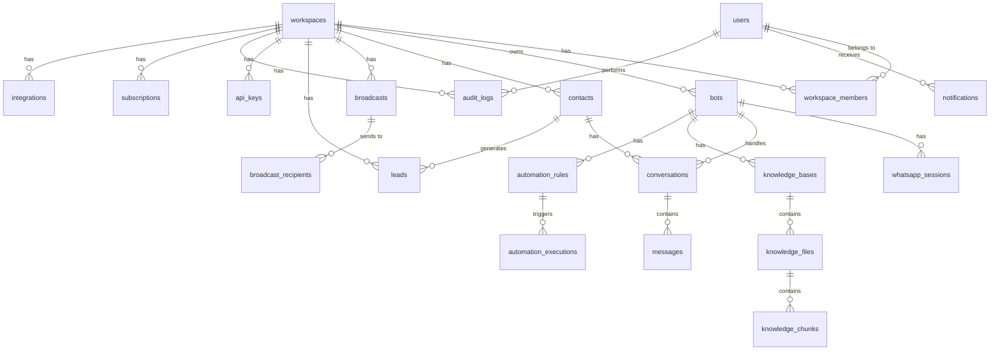

# 17 — Database

---

## Executive Summary

This document defines the complete PostgreSQL database schema for SoftwBot AI, including all tables, columns, relationships, indexes, constraints, enums, Drizzle ORM mappings, pgvector configuration, and optimization strategies.

---

## Purpose

The database schema is the foundation of the data layer. Every table, column, and index is specified here to ensure consistent implementation.

---

## Entity Relationship Diagram



---

## Tables

### 1. users

| Column | Type | Constraints | Description |
|--------|------|-------------|-------------|
| id | uuid | PK, gen_random_uuid() | Unique identifier |
| clerk_id | text | UNIQUE, NOT NULL | Clerk authentication ID |
| email | text | UNIQUE, NOT NULL | User email address |
| name | text | | Display name |
| avatar_url | text | | Profile picture URL |
| phone | text | | Phone number |
| timezone | text | DEFAULT 'UTC' | User timezone |
| language | text | DEFAULT 'en' | Preferred language |
| created_at | timestamp | NOT NULL, DEFAULT now() | Account creation |
| updated_at | timestamp | NOT NULL, DEFAULT now() | Last update |
| last_login_at | timestamp | | Last login timestamp |
| is_active | boolean | DEFAULT true | Account active status |
| metadata | jsonb | DEFAULT '{}' | Additional data |

**Indexes:**
```sql
CREATE UNIQUE INDEX idx_users_clerk_id ON users(clerk_id);
CREATE UNIQUE INDEX idx_users_email ON users(email);
```

---

### 2. workspaces

| Column | Type | Constraints | Description |
|--------|------|-------------|-------------|
| id | uuid | PK, gen_random_uuid() | Unique identifier |
| name | text | NOT NULL | Workspace name |
| slug | text | UNIQUE, NOT NULL | URL-friendly identifier |
| owner_id | uuid | FK → users.id, NOT NULL | Workspace owner |
| logo_url | text | | Workspace logo |
| settings | jsonb | DEFAULT '{}' | Workspace settings |
| plan | enum | DEFAULT 'free' | Subscription plan |
| trial_ends_at | timestamp | | Trial expiration |
| created_at | timestamp | NOT NULL, DEFAULT now() | Creation time |
| updated_at | timestamp | NOT NULL, DEFAULT now() | Last update |

**Indexes:**
```sql
CREATE UNIQUE INDEX idx_workspaces_slug ON workspaces(slug);
CREATE INDEX idx_workspaces_owner ON workspaces(owner_id);
```

---

### 3. workspace_members

| Column | Type | Constraints | Description |
|--------|------|-------------|-------------|
| id | uuid | PK | Unique identifier |
| workspace_id | uuid | FK → workspaces.id, NOT NULL | Workspace |
| user_id | uuid | FK → users.id, NOT NULL | Member user |
| role | enum | NOT NULL, DEFAULT 'member' | Owner/Admin/Member/Viewer |
| permissions | jsonb | DEFAULT '{}' | Custom permissions |
| invited_at | timestamp | DEFAULT now() | Invitation sent |
| joined_at | timestamp | | Acceptance time |
| is_active | boolean | DEFAULT true | Active membership |

**Constraints:**
```sql
CREATE UNIQUE INDEX idx_workspace_members_unique ON workspace_members(workspace_id, user_id);
```

---

### 4. bots

| Column | Type | Constraints | Description |
|--------|------|-------------|-------------|
| id | uuid | PK | Unique identifier |
| workspace_id | uuid | FK → workspaces.id, NOT NULL | Parent workspace |
| name | text | NOT NULL | Bot display name |
| description | text | | Bot description |
| avatar_url | text | | Bot avatar |
| status | enum | NOT NULL, DEFAULT 'draft' | draft/active/paused/error |
| model | text | NOT NULL, DEFAULT 'openai/gpt-4o-mini' | AI model ID |
| temperature | decimal(3,2) | DEFAULT 0.7 | Response creativity |
| max_tokens | integer | DEFAULT 1000 | Max response length |
| system_prompt | text | NOT NULL | System prompt |
| personality | jsonb | DEFAULT '{}' | Tone, style, greeting, farewell |
| business_hours | jsonb | DEFAULT '{}' | Operating hours config |
| human_handoff_rules | jsonb | DEFAULT '{}' | Escalation rules |
| settings | jsonb | DEFAULT '{}' | Additional settings |
| welcome_message | text | | First-contact message |
| offline_message | text | | After-hours message |
| fallback_message | text | | Default fallback |
| max_context_messages | integer | DEFAULT 20 | Conversation context window |
| response_delay_ms | integer | DEFAULT 1000 | Artificial delay |
| created_at | timestamp | NOT NULL, DEFAULT now() | Creation time |
| updated_at | timestamp | NOT NULL, DEFAULT now() | Last update |
| last_active_at | timestamp | | Last conversation |
| total_conversations | integer | DEFAULT 0 | Conversation counter |
| total_messages | integer | DEFAULT 0 | Message counter |

**Indexes:**
```sql
CREATE INDEX idx_bots_workspace ON bots(workspace_id);
CREATE INDEX idx_bots_status ON bots(status);
CREATE INDEX idx_bots_active ON bots(workspace_id) WHERE status = 'active';
```

---

### 5. whatsapp_sessions

| Column | Type | Constraints | Description |
|--------|------|-------------|-------------|
| id | uuid | PK | Unique identifier |
| bot_id | uuid | FK → bots.id, UNIQUE, NOT NULL | Associated bot |
| phone_number | text | | Connected phone number |
| phone_number_id | text | | WhatsApp Business ID |
| session_data | jsonb | | Serialized session auth |
| status | enum | DEFAULT 'disconnected' | Connection status |
| last_connected_at | timestamp | | Last successful connection |
| last_message_at | timestamp | | Last message processed |
| reconnect_attempts | integer | DEFAULT 0 | Current retry count |
| max_reconnect_attempts | integer | DEFAULT 10 | Max retries |
| error_message | text | | Last error |
| device_info | jsonb | | Connected device info |
| created_at | timestamp | DEFAULT now() | Creation time |
| updated_at | timestamp | DEFAULT now() | Last update |

---

### 6. conversations

| Column | Type | Constraints | Description |
|--------|------|-------------|-------------|
| id | uuid | PK | Unique identifier |
| bot_id | uuid | FK → bots.id, NOT NULL | Bot handling conversation |
| contact_id | uuid | FK → contacts.id, NOT NULL | Contact participant |
| status | enum | DEFAULT 'active' | active/pending/resolved/archived |
| channel | text | DEFAULT 'whatsapp' | Communication channel |
| is_ai_active | boolean | DEFAULT true | AI responding |
| human_agent_id | uuid | FK → users.id, nullable | Assigned human agent |
| tags | text[] | DEFAULT '{}' | Conversation tags |
| priority | enum | DEFAULT 'medium' | low/medium/high/urgent |
| started_at | timestamp | DEFAULT now() | Conversation start |
| last_message_at | timestamp | | Last message time |
| resolved_at | timestamp | | Resolution time |
| message_count | integer | DEFAULT 0 | Total messages |
| ai_confidence_avg | decimal(5,2) | | Average AI confidence |
| sentiment_score | decimal(5,2) | | Overall sentiment |
| custom_fields | jsonb | DEFAULT '{}' | Custom data |
| created_at | timestamp | DEFAULT now() | Record creation |
| updated_at | timestamp | DEFAULT now() | Last update |

**Indexes:**
```sql
CREATE INDEX idx_conversations_bot ON conversations(bot_id);
CREATE INDEX idx_conversations_contact ON conversations(contact_id);
CREATE INDEX idx_conversations_status ON conversations(status);
CREATE INDEX idx_conversations_active ON conversations(bot_id, status) WHERE status = 'active';
CREATE INDEX idx_conversations_last_message ON conversations(last_message_at DESC);
```

---

### 7. messages

| Column | Type | Constraints | Description |
|--------|------|-------------|-------------|
| id | uuid | PK | Unique identifier |
| conversation_id | uuid | FK → conversations.id, NOT NULL | Parent conversation |
| sender_type | enum | NOT NULL | user/ai/human_agent/system |
| sender_id | uuid | | User or agent ID |
| content | text | NOT NULL | Message text |
| content_type | enum | DEFAULT 'text' | text/image/video/audio/document/location/sticker |
| media_url | text | | Media file URL |
| media_metadata | jsonb | | File size, mime type, dimensions |
| is_read | boolean | DEFAULT false | Read status |
| is_delivered | boolean | DEFAULT false | Delivery status |
| whatsapp_message_id | text | | WhatsApp message ID |
| whatsapp_status | enum | DEFAULT 'sent' | sent/delivered/read/failed |
| ai_model_used | text | | AI model that generated response |
| ai_tokens_used | integer | | Token count |
| ai_confidence | decimal(5,2) | | AI confidence score |
| ai_latency_ms | integer | | Response generation time |
| knowledge_sources | jsonb | DEFAULT '[]' | Retrieved knowledge chunks |
| internal_note | boolean | DEFAULT false | Team-only note |
| edited_at | timestamp | | Edit timestamp |
| deleted_at | timestamp | | Soft delete time |
| created_at | timestamp | DEFAULT now() | Message time |

**Indexes:**
```sql
CREATE INDEX idx_messages_conversation ON messages(conversation_id);
CREATE INDEX idx_messages_created ON messages(conversation_id, created_at DESC);
CREATE INDEX idx_messages_sender ON messages(sender_type);
CREATE INDEX idx_messages_whatsapp_id ON messages(whatsapp_message_id);
```

**Partitioning (for scale):**
```sql
-- Partition messages by month for performance
CREATE TABLE messages (
    -- ... columns ...
) PARTITION BY RANGE (created_at);

CREATE TABLE messages_2026_01 PARTITION OF messages
    FOR VALUES FROM ('2026-01-01') TO ('2026-02-01');
```

---

### 8. contacts

| Column | Type | Constraints | Description |
|--------|------|-------------|-------------|
| id | uuid | PK | Unique identifier |
| workspace_id | uuid | FK → workspaces.id, NOT NULL | Parent workspace |
| phone_number | text | NOT NULL | WhatsApp phone number |
| name | text | | Contact name |
| email | text | | Email address |
| avatar_url | text | | Profile picture |
| tags | text[] | DEFAULT '{}' | Contact tags |
| lead_score | integer | DEFAULT 0 | Lead score (0-100) |
| lead_status | enum | DEFAULT 'new' | new/qualified/unqualified/converted/lost |
| source | text | | How they found us |
| first_seen_at | timestamp | DEFAULT now() | First interaction |
| last_seen_at | timestamp | | Last interaction |
| total_conversations | integer | DEFAULT 0 | Conversation count |
| total_messages | integer | DEFAULT 0 | Message count |
| custom_fields | jsonb | DEFAULT '{}' | Custom data |
| metadata | jsonb | DEFAULT '{}' | Additional data |
| created_at | timestamp | DEFAULT now() | Record creation |
| updated_at | timestamp | DEFAULT now() | Last update |

**Constraints:**
```sql
CREATE UNIQUE INDEX idx_contacts_workspace_phone ON contacts(workspace_id, phone_number);
CREATE INDEX idx_contacts_workspace ON contacts(workspace_id);
CREATE INDEX idx_contacts_lead_status ON contacts(lead_status);
```

---

### 9. knowledge_bases

| Column | Type | Constraints | Description |
|--------|------|-------------|-------------|
| id | uuid | PK | Unique identifier |
| bot_id | uuid | FK → bots.id, NOT NULL | Associated bot |
| name | text | NOT NULL | Knowledge base name |
| description | text | | Description |
| status | enum | DEFAULT 'processing' | processing/ready/error |
| file_count | integer | DEFAULT 0 | Total files |
| total_chunks | integer | DEFAULT 0 | Total chunks |
| embedding_model | text | DEFAULT 'text-embedding-3-small' | Embedding model |
| embedding_dimensions | integer | DEFAULT 1536 | Vector dimensions |
| chunk_size | integer | DEFAULT 500 | Tokens per chunk |
| chunk_overlap | integer | DEFAULT 50 | Overlap tokens |
| settings | jsonb | DEFAULT '{}' | Additional settings |
| storage_used_bytes | bigint | DEFAULT 0 | Storage used |
| created_at | timestamp | DEFAULT now() | Creation time |
| updated_at | timestamp | DEFAULT now() | Last update |
| last_synced_at | timestamp | | Last sync time |

---

### 10. knowledge_files

| Column | Type | Constraints | Description |
|--------|------|-------------|-------------|
| id | uuid | PK | Unique identifier |
| knowledge_base_id | uuid | FK → knowledge_bases.id, NOT NULL | Parent KB |
| name | text | NOT NULL | File name |
| file_type | enum | NOT NULL | pdf/docx/txt/md/csv/url |
| file_url | text | | S3 file URL |
| file_size | integer | | File size in bytes |
| status | enum | DEFAULT 'uploading' | uploading/processing/chunking/embedding/ready/error |
| error_message | text | | Processing error |
| chunk_count | integer | DEFAULT 0 | Chunks created |
| metadata | jsonb | DEFAULT '{}' | File metadata |
| created_at | timestamp | DEFAULT now() | Upload time |
| updated_at | timestamp | DEFAULT now() | Last update |
| processed_at | timestamp | | Processing complete |

---

### 11. knowledge_chunks

| Column | Type | Constraints | Description |
|--------|------|-------------|-------------|
| id | uuid | PK | Unique identifier |
| knowledge_file_id | uuid | FK → knowledge_files.id, NOT NULL | Source file |
| knowledge_base_id | uuid | FK → knowledge_bases.id, NOT NULL | Parent KB |
| content | text | NOT NULL | Chunk text content |
| embedding | vector(1536) | | pgvector embedding |
| chunk_index | integer | NOT NULL | Order within file |
| token_count | integer | | Approximate tokens |
| metadata | jsonb | DEFAULT '{}' | Page, section, heading |

**Indexes:**
```sql
CREATE INDEX idx_chunks_kb ON knowledge_chunks(knowledge_base_id);
CREATE INDEX idx_chunks_file ON knowledge_chunks(knowledge_file_id);
-- HNSW index for fast vector similarity search
CREATE INDEX idx_chunks_embedding ON knowledge_chunks
    USING hnsw (embedding vector_cosine_ops)
    WITH (m = 16, ef_construction = 64);
```

---

### 12-22. Remaining Tables

Tables for automation_rules, automation_executions, broadcasts, broadcast_recipients, leads, lead_activities, notifications, subscriptions, api_keys, audit_logs, and integrations follow similar patterns. See [02-prd.md](./02-prd.md) for complete column specifications.

---

## Drizzle ORM Schema

```typescript
import { pgTable, uuid, text, timestamp, integer, decimal, boolean, jsonb, pgEnum } from 'drizzle-orm/pg-core';
import { vector } from 'drizzle-orm/pgvector';

export const botStatusEnum = pgEnum('bot_status', ['draft', 'active', 'paused', 'error']);
export const messageSenderEnum = pgEnum('sender_type', ['user', 'ai', 'human_agent', 'system']);
export const conversationStatusEnum = pgEnum('conv_status', ['active', 'pending', 'resolved', 'archived']);

export const users = pgTable('users', {
  id: uuid('id').primaryKey().defaultRandom(),
  clerkId: text('clerk_id').unique().notNull(),
  email: text('email').unique().notNull(),
  name: text('name'),
  createdAt: timestamp('created_at').defaultNow().notNull(),
  updatedAt: timestamp('updated_at').defaultNow().notNull(),
});

export const bots = pgTable('bots', {
  id: uuid('id').primaryKey().defaultRandom(),
  workspaceId: uuid('workspace_id').references(() => workspaces.id).notNull(),
  name: text('name').notNull(),
  status: botStatusEnum('status').default('draft').notNull(),
  model: text('model').default('openai/gpt-4o-mini').notNull(),
  systemPrompt: text('system_prompt').notNull(),
  createdAt: timestamp('created_at').defaultNow().notNull(),
});
```

---

## Optimization Notes

| Strategy | Table | Benefit |
|----------|-------|---------|
| Partitioning | messages | Faster queries on recent data |
| HNSW index | knowledge_chunks | 100x faster vector search |
| Partial index | bots (active only) | Faster bot lookups |
| Composite index | conversations (bot, status) | Faster inbox queries |
| GIN index | contacts (tags) | Faster tag-based filtering |
| Connection pooling | All | PgBouncer for connection reuse |
| Read replicas | All | Separate read/write workloads |

---

## Developer Notes

- Use Drizzle Kit for all migrations — never modify production DB directly
- All timestamps stored as UTC
- All IDs are UUIDs (generated by PostgreSQL)
- Soft delete for user data (deleted_at pattern)
- JSONB for flexible metadata fields
- pgvector extension required for embeddings

## Future Improvements

- Table partitioning for messages (by month)
- Read replica for analytics queries
- Automated vacuum and analyze scheduling
- Connection pool monitoring dashboard
- Database performance profiling
