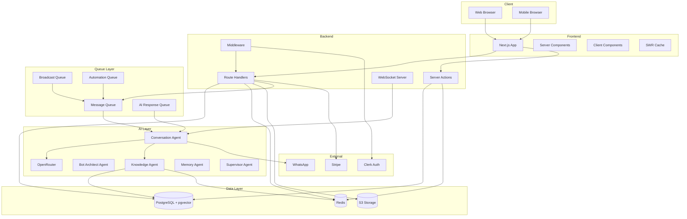
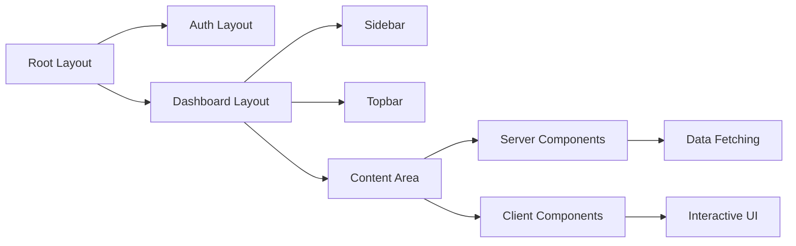
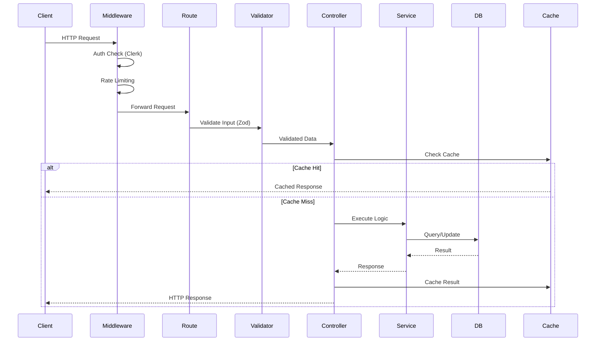
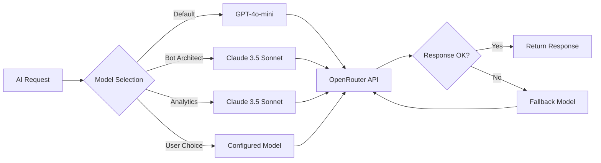
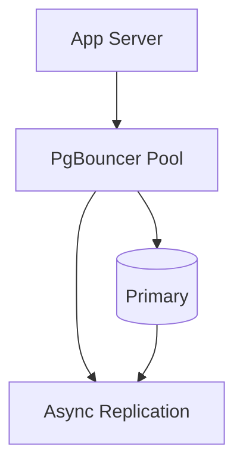
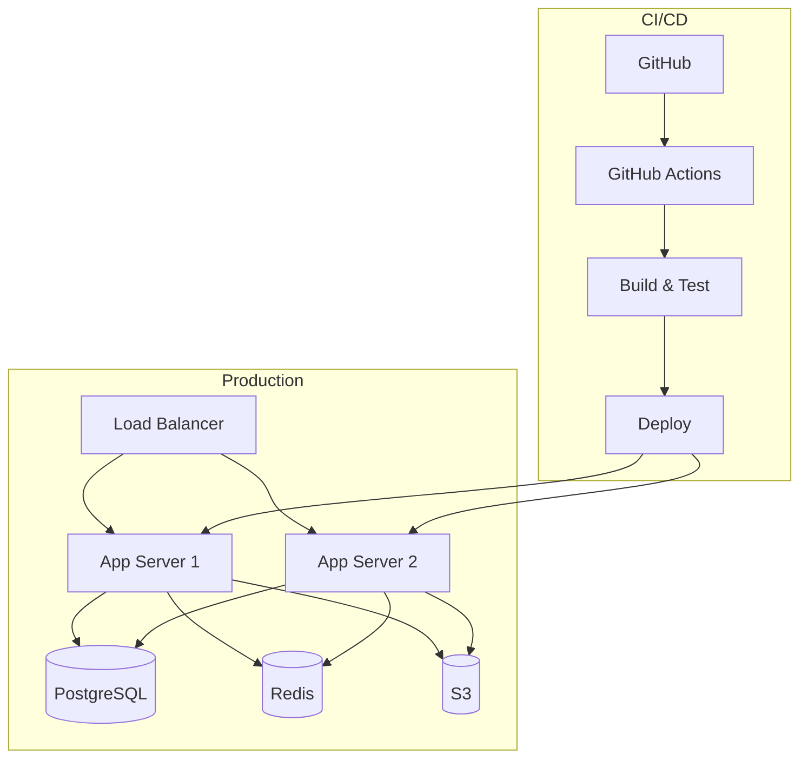

# 20 — Architecture

---

## Executive Summary

This document defines the complete system architecture for SoftwBot AI, covering frontend, backend, AI layer, database, storage, queues, caching, deployment, scalability, monitoring, and microservices readiness.

---

## Purpose

Architecture documentation ensures all engineers understand the system design and make consistent technical decisions.

---

## High-Level Architecture



---

## Frontend Architecture

### Component Strategy



### Data Fetching Patterns

| Pattern | Use Case | Implementation |
|---------|----------|----------------|
| Server Component | Initial page data | Direct DB queries in RSC |
| Server Action | Mutations (create, update, delete) | `"use server"` functions |
| Route Handler | API endpoints | `GET/POST/PATCH/DELETE` |
| SWR | Real-time client data | `useSWR` with polling/WebSocket |

### State Management

| State | Solution | Examples |
|-------|----------|---------|
| Server state | Server Components + SWR | Bot data, conversations |
| UI state | React `useState`/`useReducer` | Modal open, sidebar collapsed |
| Form state | React Hook Form + Zod | All forms |
| Global state | Zustand (if needed) | Workspace context |

---

## Backend Architecture

### Request Pipeline



### Server Actions vs Route Handlers

| Criteria | Server Actions | Route Handlers |
|----------|---------------|----------------|
| Used by | Next.js forms, mutations | API consumers, external clients |
| Auth | Automatic (Clerk session) | Bearer token / API key |
| Validation | Zod schema | Zod schema |
| Response | JSON | JSON |
| Error handling | Next.js error boundary | HTTP status codes |

---

## AI Layer Architecture

### OpenRouter Integration



### Model Fallback Chain

```
Primary Model → GPT-4o-mini → Claude 3.5 Haiku → DeepSeek Chat
```

If primary model fails, try next in chain.

### AI Response Caching

- Cache responses for identical queries within same conversation
- TTL: 5 minutes
- Key: `{bot_id}:{conversation_id}:{message_hash}`
- Hit rate target: 15% reduction in API calls

---

## Database Layer

### Connection Management



### Query Strategy

| Operation | Target | Reason |
|-----------|--------|--------|
| Reads | Read replica | Reduce load on primary |
| Writes | Primary | Source of truth |
| Transactions | Primary | Consistency |
| Vector search | Primary (or replica) | Low latency required |

---

## Queue Architecture

| Queue | Purpose | Concurrency | Priority |
|-------|---------|-------------|----------|
| `message-processing` | Process incoming WhatsApp messages | 10 | High |
| `ai-response` | Generate AI responses | 5 | High |
| `message-sending` | Send outbound messages | 10 | High |
| `broadcast` | Send broadcast campaigns | 2 | Low |
| `automation` | Execute automation rules | 5 | Medium |
| `media-processing` | Process uploaded media | 3 | Low |
| `knowledge-processing` | Process KB documents | 2 | Low |
| `email-notification` | Send email notifications | 2 | Low |

---

## Caching Strategy

| Data | Cache Location | TTL | Invalidation |
|------|---------------|-----|-------------|
| User session | Redis | 7 days | On logout |
| Bot config | Redis | 5 min | On update |
| Knowledge search results | Redis | 5 min | On KB update |
| Dashboard metrics | Redis | 1 min | On data change |
| API responses | Redis | 30s | On mutation |
| Static assets | CDN | 1 year | Cache busting |

---

## Scalability Strategy

### Horizontal Scaling

- App servers are stateless → scale horizontally
- Redis for shared state (sessions, queues)
- PostgreSQL read replicas for read scaling
- pgvector indexes for search scaling

### Database Partitioning

```sql
-- Messages table partitioned by month
CREATE TABLE messages_2026_07 PARTITION OF messages
    FOR VALUES FROM ('2026-07-01') TO ('2026-08-01');
```

### WebSocket Scaling

- Use Redis pub/sub for WebSocket message distribution
- Sticky sessions via load balancer
- Connection limit per server: 1,000

---

## Monitoring & Observability

| Layer | Tool | Purpose |
|-------|------|---------|
| Error tracking | Sentry | Capture and alert on errors |
| Performance | Sentry Performance | Page load, API latency |
| Uptime | BetterStack | External health checks |
| Logs | Axiom | Structured log aggregation |
| Metrics | Custom dashboard | Business and system metrics |
| Alerts | Slack/PagerDuty | Critical issue notifications |

### Key Metrics to Monitor

| Metric | Alert Threshold |
|--------|----------------|
| API p95 latency | > 500ms |
| Error rate | > 1% |
| Queue lag | > 1000 jobs |
| DB connection pool | > 80% |
| Memory usage | > 80% |
| WhatsApp disconnects | > 5/hour |
| AI API failures | > 5% |

---

## Deployment Architecture



---

## Microservices Readiness

### Current Monolith Boundaries

| Module | Extraction Candidate | Priority |
|--------|---------------------|----------|
| WhatsApp Engine | High (resource-intensive) | Phase 2 |
| AI Processing | High (independent scaling) | Phase 2 |
| Knowledge Base | Medium | Phase 3 |
| Analytics | Medium | Phase 3 |
| Billing | Low (Stripe handles most) | Phase 4 |

### Service Communication (Future)

- Event bus via Redis Streams
- gRPC for synchronous inter-service calls
- REST for external APIs

---

## Developer Notes

- Architecture should be reviewed quarterly
- All new features must consider scalability impact
- Database schema changes require migration review
- Performance testing required before major releases

## Future Improvements

- GraphQL Federation for API gateway
- Kubernetes deployment option
- Multi-region deployment
- Edge computing for AI inference
- Event sourcing for critical workflows
