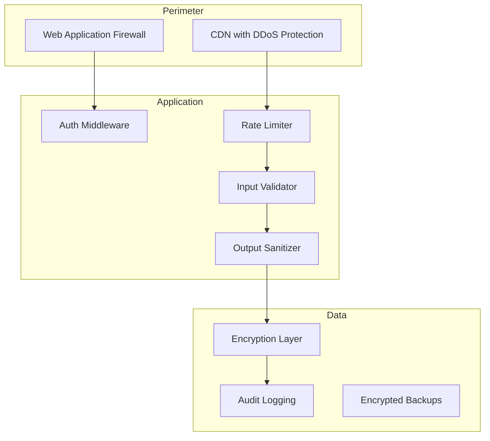

# 21 — Security

---

## Executive Summary

This document defines the complete security architecture for SoftwBot AI, covering authentication, authorization, encryption, secrets management, input validation, injection prevention, API security, infrastructure security, monitoring, compliance, and incident response.

---

## Purpose

Security is a foundational requirement. Every component must follow these standards to protect user data and maintain trust.

---

## Security Architecture



---

## Authentication Security

### Clerk Integration

| Control | Implementation |
|---------|---------------|
| JWT validation | Verify on every request via middleware |
| Token refresh | Automatic via Clerk SDK |
| Session management | Server-side session with secure cookies |
| Password policy | Min 8 chars, uppercase, lowercase, number, special char |
| MFA | TOTP-based (Google Authenticator, Authy) |
| OAuth | Google, GitHub via Clerk |
| Account lockout | 5 failed attempts → 15 min lockout |
| Password reset | Time-limited token (1 hour expiry) |

### JWT Token Structure

```json
{
  "sub": "user_123",
  "email": "user@example.com",
  "org_id": "org_456",
  "iat": 1721126400,
  "exp": 1721130000,
  "metadata": {
    "role": "admin",
    "workspace_ids": ["ws_789"]
  }
}
```

---

## Authorization Security

### RBAC Matrix

| Action | Owner | Admin | Member | Viewer |
|--------|-------|-------|--------|--------|
| Manage billing | ✅ | ❌ | ❌ | ❌ |
| Delete workspace | ✅ | ❌ | ❌ | ❌ |
| Manage team | ✅ | ✅ | ❌ | ❌ |
| Manage bots | ✅ | ✅ | ✅ | ❌ |
| View conversations | ✅ | ✅ | ✅ | ✅ |
| Respond to messages | ✅ | ✅ | ✅ | ❌ |
| View analytics | ✅ | ✅ | ✅ | ✅ |
| Export data | ✅ | ✅ | ❌ | ❌ |

### Workspace Isolation

- All queries scoped by `workspace_id`
- No cross-workspace data access
- API keys scoped to workspace
- Admin access requires owner approval

---

## Data Protection

| Layer | Method | Details |
|-------|--------|---------|
| At rest | AES-256 | PostgreSQL TDE, S3 SSE |
| In transit | TLS 1.3 | All connections |
| Backups | AES-256 | Encrypted at rest |
| Secrets | Encrypted | Environment variables only |
| PII | Masked in logs | Phone, email, name |
| Messages | Retention-limited | Auto-delete after 12 months |

---

## API Security

### Rate Limiting

| Scope | Limit | Window |
|-------|-------|--------|
| Global (authenticated) | 100 req/min | Rolling window |
| Global (unauthenticated) | 20 req/min | Rolling window |
| Per endpoint | Varies | See API docs |
| Per IP (unauthenticated) | 10 req/min | Sliding window |

### Input Validation

- All inputs validated with Zod schemas
- Server-side validation on every request
- Client-side validation for UX (not security)
- Reject unexpected fields
- Max payload sizes enforced

### CORS Configuration

```typescript
{
  origin: ['https://app.softwbot.ai', 'https://softwbot.ai'],
  methods: ['GET', 'POST', 'PATCH', 'DELETE'],
  credentials: true,
  maxAge: 86400
}
```

---

## Injection Prevention

| Attack | Prevention |
|--------|-----------|
| SQL Injection | Drizzle ORM (parameterized queries) |
| XSS | React auto-escaping + CSP headers |
| CSRF | SameSite cookies + CSRF token |
| Command Injection | No shell execution with user input |
| Path Traversal | Validate file paths, use S3 for storage |
| Prompt Injection | System prompt guardrails, input sanitization |

---

## Security Headers

```typescript
// next.config.ts
const securityHeaders = [
  { key: 'Content-Security-Policy', value: "default-src 'self'; script-src 'self' 'unsafe-eval'" },
  { key: 'Strict-Transport-Security', value: 'max-age=63072000; includeSubDomains; preload' },
  { key: 'X-Content-Type-Options', value: 'nosniff' },
  { key: 'X-Frame-Options', value: 'DENY' },
  { key: 'Referrer-Policy', value: 'strict-origin-when-cross-origin' },
  { key: 'Permissions-Policy', value: 'camera=(), microphone=(), geolocation=()' },
];
```

---

## WhatsApp Security

- Session data encrypted in database
- Phone numbers masked in all logs
- No message content stored beyond retention period
- Anti-spam: duplicate detection, opt-out enforcement
- WhatsApp Business Policy compliance checks

---

## AI Security

| Threat | Mitigation |
|--------|-----------|
| Prompt injection | System prompt guardrails, input sanitization |
| Jailbreak | Role-based restrictions, output filtering |
| PII leakage | Never include customer PII in AI prompts |
| Content generation | Output content filter, human review for edge cases |
| Cost abuse | Token limits per bot, per conversation, per day |

---

## Audit Logging

All critical operations logged:

| Event | Details Logged |
|-------|---------------|
| Login/logout | User ID, IP, timestamp, device |
| Bot create/update/delete | User ID, bot ID, changes |
| Message send | Bot ID, conversation ID, content type |
| Settings change | User ID, setting, old/new value |
| Team management | Action, target user, role change |
| Billing change | Plan, payment, timestamp |
| API key use | Key ID, endpoint, timestamp |

---

## Compliance

### GDPR Compliance

| Requirement | Implementation |
|------------|---------------|
| Consent | Cookie consent banner |
| Data access | Export endpoint (JSON/CSV) |
| Right to erasure | Account deletion with 30-day grace |
| Data portability | Full data export |
| Data processing | DPA available |
| Privacy policy | Public page |

### CCPA Compliance

| Requirement | Implementation |
|------------|---------------|
| Notice | Privacy policy at signup |
| Opt-out | Data deletion endpoint |
| Disclosure | Data export feature |

---

## Incident Response

| Severity | Description | Response Time | Example |
|----------|------------|---------------|---------|
| P0 Critical | System down, data breach | 15 minutes | DB compromise, auth bypass |
| P1 High | Major feature broken, data leak risk | 1 hour | Bot sending wrong messages |
| P2 Medium | Feature degraded, security concern | 4 hours | Slow response times |
| P3 Low | Minor issue, cosmetic | 24 hours | UI bug, minor error |

---

## Developer Notes

- Never commit secrets to git
- Use environment variables for all configuration
- Validate inputs server-side with Zod
- Log security events with context
- Run `npm audit` before every deployment
- OWASP dependency check in CI/CD

## Future Improvements

- SOC 2 Type II certification
- ISO 27001 certification
- Bug bounty program
- Web application firewall (WAF)
- DDoS protection (Cloudflare)
- Penetration testing (quarterly)
