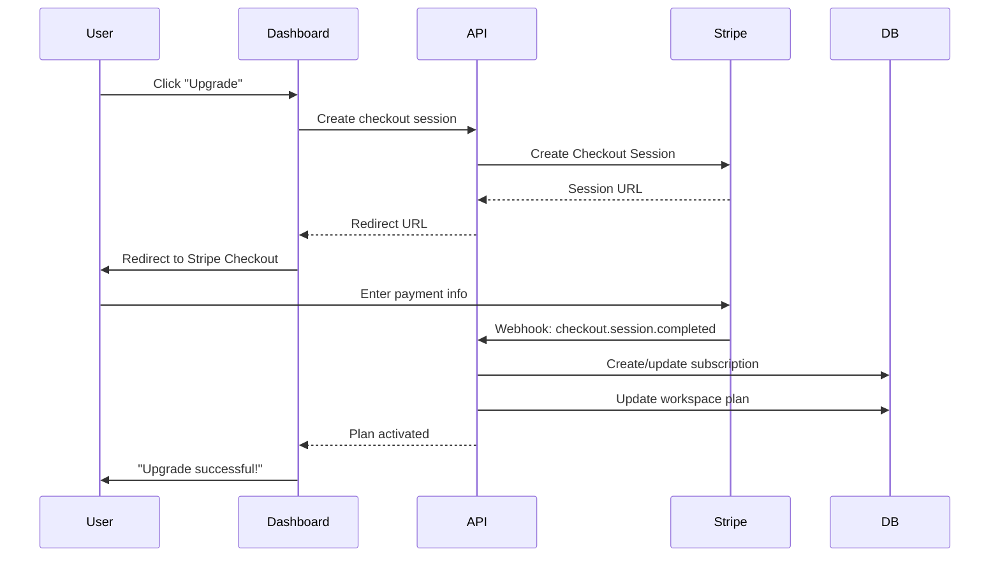
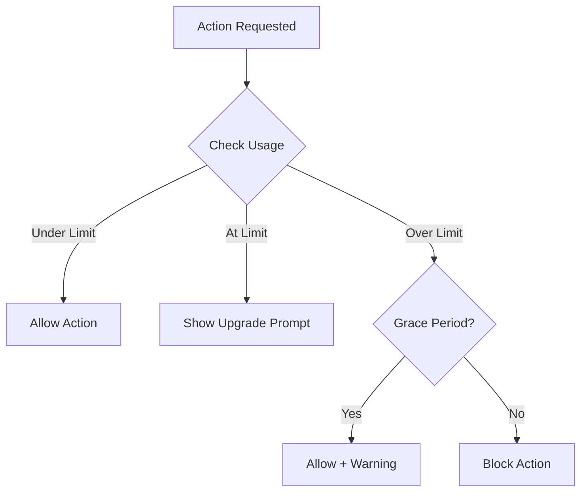

# 24 — Subscriptions & Billing

---

## Executive Summary

This document defines the subscription management system, including Stripe integration, pricing plans, usage metering, billing flows, and feature enforcement.

---

## Purpose

Billing is the revenue engine. This document ensures reliable subscription management, accurate usage tracking, and seamless payment processing.

---

## Subscription Architecture



---

## Pricing Plans

### Plan Comparison

| Feature | Free | Starter ($29/mo) | Pro ($79/mo) | Enterprise |
|---------|------|-------------------|-------------|------------|
| Bots | 1 | 3 | 10 | Unlimited |
| Messages/month | 100 | 2,000 | 10,000 | Custom |
| Knowledge base chunks | 100 | 5,000 | 25,000 | Unlimited |
| Team members | 1 | 3 | 10 | Unlimited |
| Automation rules | 0 | 1 | Unlimited | Unlimited |
| Broadcast campaigns | 0 | 1/month | Unlimited | Unlimited |
| Analytics | Basic | Advanced | Full | Custom |
| API access | ❌ | ❌ | ✅ | ✅ |
| Human handoff | ❌ | ✅ | ✅ | ✅ |
| A/B testing | ❌ | ❌ | ✅ | ✅ |
| CRM integrations | ❌ | ❌ | ✅ | ✅ |
| White-label | ❌ | ❌ | ❌ | ✅ |
| SSO/SAML | ❌ | ❌ | ❌ | ✅ |
| Audit logs | ❌ | ❌ | ❌ | ✅ |
| SLA | ❌ | ❌ | 99.9% | 99.99% |
| Support | Community | Email | Priority | Dedicated |
| Storage | 100MB | 1GB | 5GB | Custom |

### Overage Pricing

| Resource | Price |
|----------|-------|
| Messages over limit | $0.01 per message |
| Knowledge base storage over limit | $0.10 per GB/month |
| File storage over limit | $0.05 per GB/month |

---

## Stripe Integration

### Product & Price Setup

| Plan | Stripe Product | Monthly Price ID | Annual Price ID |
|------|---------------|------------------|-----------------|
| Starter | prod_starter | price_starter_monthly | price_starter_annual |
| Pro | prod_pro | price_pro_monthly | price_pro_annual |
| Enterprise | Custom | Manual | Manual |

### Webhook Events

| Event | Action |
|-------|--------|
| `checkout.session.completed` | Activate subscription |
| `invoice.paid` | Update billing period |
| `invoice.payment_failed` | Alert user, retry payment |
| `customer.subscription.updated` | Sync plan changes |
| `customer.subscription.deleted` | Downgrade to free |

---

## Usage Metering

### Counters Tracked

| Counter | Reset | Counted |
|---------|-------|---------|
| Messages | Monthly | Incoming + outgoing |
| Knowledge base chunks | — | Total chunks across all KBs |
| Storage | — | Total file size in S3 |
| API calls | Daily | API key requests |

### Usage Check Flow



### Usage Alerts

| Threshold | Action |
|-----------|--------|
| 50% | Email: "You've used 50% of your monthly messages" |
| 80% | Email + in-app warning: "80% used, consider upgrading" |
| 100% | Email + in-app: "Limit reached. Upgrade or wait for reset." |
| 110% | Block new actions, show upgrade CTA |

---

## Billing Flows

### Upgrade

1. User selects target plan
2. Stripe Checkout session created
3. User enters payment info
4. Payment successful → webhook fires
5. Subscription created/updated
6. Feature limits applied immediately
7. Confirmation email sent
8. Receipt available in billing page

### Downgrade

1. User clicks "Downgrade"
2. Confirmation dialog warns about feature loss
3. Current plan remains active until period end
4. At period end → plan downgrades
5. Data exceeding limits preserved but read-only
6. User can upgrade again to regain access

### Cancellation

1. User clicks "Cancel Subscription"
2. Retention offer shown (10% discount for 3 months)
3. If confirmed → subscription marked for cancellation
4. Remains active until period end
5. Data retained for 30 days after cancellation
6. After 30 days → all data permanently deleted
7. Cancellation email sent with reactivation link

### Failed Payment

1. Stripe retries payment (3 attempts over 7 days)
2. Email notification on each failure
3. After all retries exhausted → subscription paused
4. Workspace downgraded to free tier
5. 7-day grace period to update payment
6. After grace period → data deletion begins

---

## Feature Enforcement

### Middleware Check

```typescript
function enforcePlanLimit(feature: string, usage: number, limit: number) {
  if (limit === -1) return true; // Unlimited
  if (usage < limit) return true;
  
  // Check grace period
  if (usage <= limit * 1.1) {
    addWarning(`You've exceeded your ${feature} limit`);
    return true;
  }
  
  throw new PlanLimitExceededError(feature, limit);
}
```

### Feature Flags by Plan

```typescript
const planFeatures = {
  free: { bots: 1, messages: 100, automations: 0, broadcast: 0 },
  starter: { bots: 3, messages: 2000, automations: 1, broadcast: 1 },
  pro: { bots: 10, messages: 10000, automations: -1, broadcast: -1 },
  enterprise: { bots: -1, messages: -1, automations: -1, broadcast: -1 },
};
```

---

## Invoice Management

- Monthly invoices generated by Stripe
- Downloadable from billing page
- Invoice history (last 12 months)
- Tax calculation by Stripe Tax
- Multi-currency support (USD, EUR, GBP, INR)

---

## Developer Notes

- Always verify Stripe webhook signatures
- Idempotent webhook processing (handle duplicate events)
- Sync subscription status on every billing page load
- Test with Stripe test keys in development
- Monitor webhook delivery in Stripe dashboard

## Future Improvements

- Usage-based pricing option
- Credits system for prepaid usage
- Team billing (per-seat pricing)
- Annual billing discounts
- Custom enterprise pricing
- Invoice PDF generation
