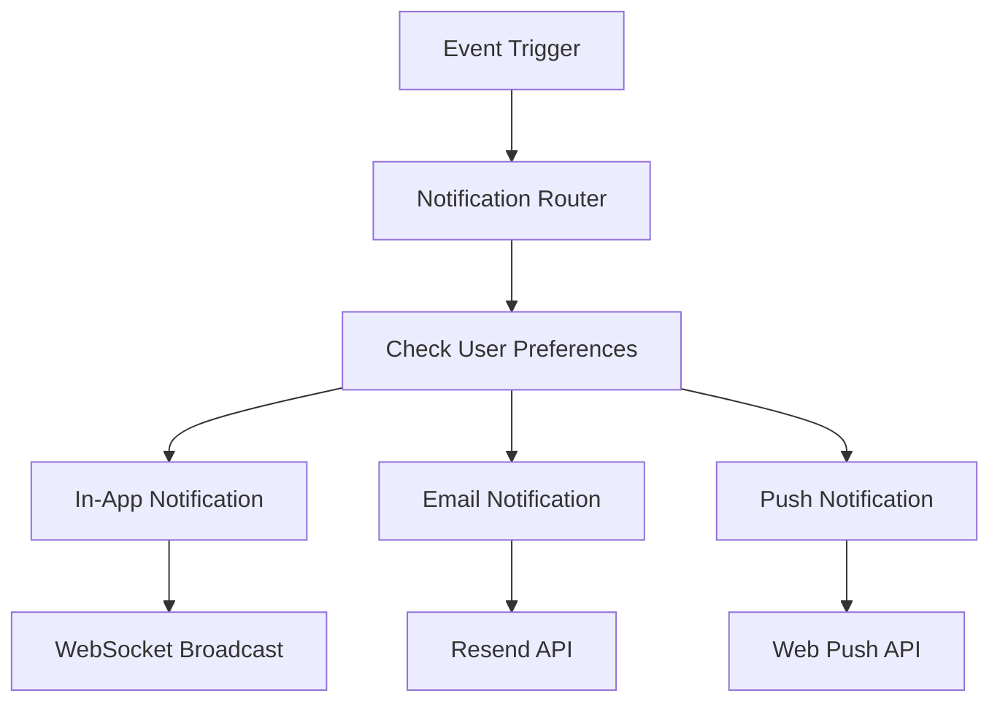

# 25 — Notifications

---

## Executive Summary

This document defines the notification system architecture, covering in-app, email, and push notification channels, preferences, templates, and delivery.

---

## Purpose

Notifications keep users informed about critical events without requiring them to monitor the dashboard constantly.

---

## Notification Architecture



---

## Notification Types

| Type | Category | Default Channels |
|------|----------|-----------------|
| New message received | Conversations | In-app |
| Human handoff requested | Conversations | In-app, Email |
| Conversation unresponsive | Conversations | In-app |
| New lead captured | Leads | In-app |
| Lead assigned to you | Leads | In-app, Email |
| Lead status changed | Leads | In-app |
| Bot error/disconnected | Bots | In-app, Email |
| Bot activated | Bots | In-app |
| Broadcast completed | Broadcasts | In-app |
| Broadcast failed | Broadcasts | In-app, Email |
| Usage 50% warning | Billing | Email |
| Usage 80% warning | Billing | In-app, Email |
| Payment failed | Billing | In-app, Email |
| Plan upgraded/downgraded | Billing | In-app, Email |
| Team member joined | Team | In-app |
| Role changed | Team | In-app, Email |
| Security alert | Security | In-app, Email |
| Weekly digest | Analytics | Email |

---

## Notification Preferences

### Per-Type Configuration

Each notification type can be configured per channel:

```json
{
  "new_message": { "inApp": true, "email": false, "push": false },
  "human_handoff": { "inApp": true, "email": true, "push": true },
  "bot_error": { "inApp": true, "email": true, "push": false }
}
```

### Global Settings

- Quiet hours: No notifications between specified hours
- Digest mode: Real-time, hourly digest, daily digest
- Mute all: Temporary mute for specified duration

---

## In-App Notifications

### Notification Center

- Bell icon in topbar with unread count badge
- Click opens notification dropdown
- Grouped by date (Today, Yesterday, Earlier)
- Each notification: icon, title, body, timestamp, read/unread
- Click navigates to relevant page
- Mark as read on click or "Mark all read" button

### Toast Notifications

- Auto-dismiss after 5 seconds
- Manual dismiss with X button
- Variants: success, error, warning, info
- Max 3 toasts visible at once
- Queue overflow: oldest dismissed

---

## Email Notifications

### Templates

| Template | Subject | Content |
|----------|---------|---------|
| Welcome | "Welcome to SoftwBot AI!" | Getting started guide |
| Weekly Digest | "Your weekly SoftwBot report" | Metrics summary |
| Usage Warning | "You've used X% of your limit" | Usage details + upgrade CTA |
| Payment Failed | "Payment failed for SoftwBot AI" | Update payment method CTA |
| Team Invite | "You've been invited to [workspace]" | Accept invitation link |
| Security Alert | "New login from [device]" | Login details |

### Email Provider

- **Primary:** Resend
- **Fallback:** SendGrid
- **Delivery tracking:** Open rate, click rate

---

## Push Notifications (Web Push)

- Browser push notifications for critical alerts
- Requires user opt-in
- Click navigates to relevant page
- Fallback to in-app if push blocked

---

## Notification Queue

- Notifications queued in Redis
- Batched delivery for email (every 5 minutes)
- Real-time for in-app (WebSocket)
- Retry failed deliveries 3x

---

## Developer Notes

- All notifications stored in `notifications` table
- WebSocket connection required for real-time in-app notifications
- Email templates stored in code (not database)
- Notification preferences cached in Redis

## Future Improvements

- SMS notifications (Twilio)
- WhatsApp notifications (to admin)
- Slack/Discord integration
- Notification analytics (open rate, engagement)
- Smart notification timing (ML-based)
