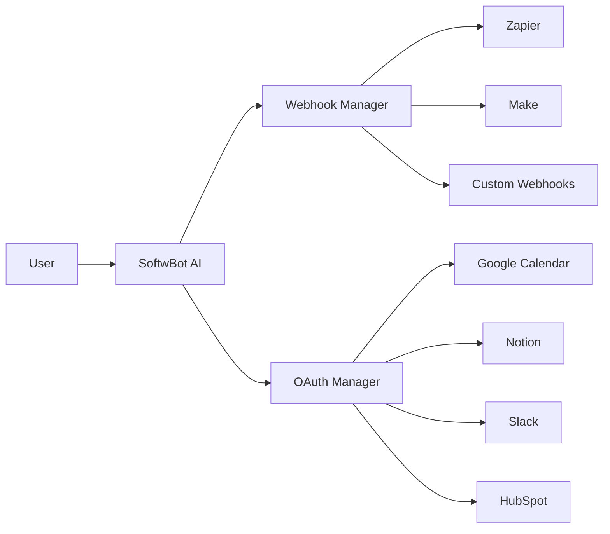

# 26 — Integrations

---

## Executive Summary

This document defines all third-party integrations supported by SoftwBot AI, including setup, data flow, and API usage.

---

## Purpose

Integrations extend SoftwBot AI's capabilities by connecting with external services users already rely on.

---

## Integration Architecture



---

## Built-in Integrations

### Google Calendar

| Aspect | Details |
|--------|---------|
| Auth | OAuth 2.0 |
| Scope | calendar.events |
| Sync | Bi-directional |
| Actions | Create event, check availability, send invite |

### Notion

| Aspect | Details |
|--------|---------|
| Auth | OAuth 2.0 |
| Actions | Create page, append to database, query database |
| Use case | Log conversations, create tasks |

### Slack

| Aspect | Details |
|--------|---------|
| Auth | OAuth 2.0 |
| Actions | Send message to channel, DM team member |
| Use case | Lead alerts, handoff notifications |

### HubSpot CRM

| Aspect | Details |
|--------|---------|
| Auth | OAuth 2.0 |
| Actions | Create/update contact, create deal, add note |
| Use case | Auto-sync leads to CRM |

### Zapier

| Aspect | Details |
|--------|---------|
| Auth | API key + Webhook |
| Triggers | New message, new lead, bot activated |
| Actions | Trigger bot message, update contact |

### Make (Integromat)

| Aspect | Details |
|--------|---------|
| Auth | Webhook |
| Triggers | Same as Zapier |
| Actions | Same as Zapier |

### Airtable

| Aspect | Details |
|--------|---------|
| Auth | API key |
| Actions | Create/update record |
| Use case | Log leads, track conversations |

---

## Custom Webhooks

### Event Types

```json
{
  "event": "conversation.created",
  "workspace_id": "ws_abc123",
  "data": {
    "conversation_id": "conv_xyz",
    "contact_phone": "+1234567890",
    "bot_id": "bot_abc"
  },
  "timestamp": "2026-01-15T10:30:00Z"
}
```

### Available Events

| Event | Description |
|-------|-------------|
| `conversation.created` | New conversation started |
| `conversation.resolved` | Conversation resolved |
| `message.received` | Message from customer |
| `lead.captured` | New lead captured |
| `lead.updated` | Lead status changed |
| `bot.activated` | Bot went live |
| `bot.error` | Bot encountered error |
| `broadcast.completed` | Broadcast finished |
| `broadcast.failed` | Broadcast failed |

### Webhook Security

- HMAC-SHA256 signature on every request
- Signature in `X-Webhook-Signature` header
- Retry on failure (3x with exponential backoff)
- Webhook logs retained for 30 days

---

## Integration Dashboard

Each integration shows:
- Connection status (connected/disconnected)
- Last sync timestamp
- Error count / last error
- Configure button (setup or re-auth)
- Disconnect button

### Setup Flow

1. User clicks "Connect" on integration card
2. OAuth flow opens in popup
3. User authorizes access
4. Callback receives tokens
5. Tokens encrypted and stored
6. Integration shows "Connected"

---

## Data Mapping

### Contact Sync

| SoftwBot Field | HubSpot Field | Notion Field |
|---------------|---------------|--------------|
| phone | phone | Phone |
| name | name | Name |
| email | email | Email |
| tags | hs_tags | Tags |
| score | hs_lead_score | Score |

---

## Developer Notes

- All integration tokens encrypted with AES-256
- OAuth refresh handled automatically
- Rate limiting per provider's limits
- Integration errors logged and surfaced in UI
- Webhook delivery guaranteed (at-least-once)

## Future Improvements

- Salesforce integration
- Pipedrive integration
- Zendesk integration
- Intercom integration
- Custom integration SDK
