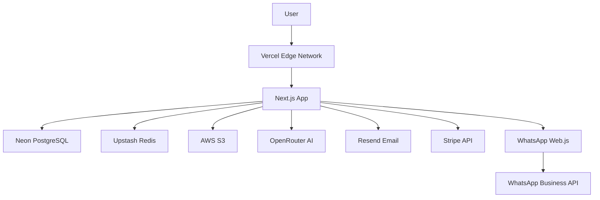

# 27 — Deployment

---

## Executive Summary

This document covers the production deployment architecture, CI/CD pipeline, infrastructure, and operational procedures.

---

## Purpose

Define how SoftwBot AI is deployed, scaled, and maintained in production.

---

## Infrastructure

### Cloud Provider

- **Primary:** Vercel (Next.js frontend + API routes)
- **Database:** Neon PostgreSQL (serverless)
- **Cache:** Upstash Redis (serverless)
- **Storage:** AWS S3
- **Background Jobs:** Upstash QStash
- **AI Gateway:** OpenRouter
- **Email:** Resend
- **Payments:** Stripe

### Infrastructure Diagram



---

## CI/CD Pipeline

### Deployment Flow

```mermaid
flowchart LR
    Push[Git Push] --> GitHub[GitHub]
    GitHub --> Vercel[Vercel Build]
    Vercel --> Tests[Run Tests]
    Tests --> Lint[Lint & Type Check]
    Lint --> Build[Production Build]
    Build --> Preview[Preview Deploy]
    Preview --> Review[Code Review]
    Review --> Main[Main Branch]
    Main --> Production[Production Deploy]
```



### Build Steps

1. Install dependencies (`npm ci`)
2. Run linter (`npm run lint`)
3. Run type check (`npm run typecheck`)
4. Run unit tests (`npm run test:unit`)
5. Run integration tests (`npm run test:integration`)
6. Build Next.js (`npm run build`)
7. Deploy to Vercel

---

## Environment Configuration

### Environment Variables

| Variable | Required | Description |
|----------|----------|-------------|
| `DATABASE_URL` | ✅ | Neon PostgreSQL connection |
| `REDIS_URL` | ✅ | Upstash Redis connection |
| `CLERK_SECRET_KEY` | ✅ | Clerk authentication |
| `OPENROUTER_API_KEY` | ✅ | OpenRouter AI gateway |
| `STRIPE_SECRET_KEY` | ✅ | Stripe payments |
| `STRIPE_WEBHOOK_SECRET` | ✅ | Stripe webhooks |
| `AWS_S3_BUCKET` | ✅ | S3 bucket name |
| `AWS_ACCESS_KEY_ID` | ✅ | AWS credentials |
| `AWS_SECRET_ACCESS_KEY` | ✅ | AWS credentials |
| `QSTASH_TOKEN` | ✅ | Upstash QStash |
| `RESEND_API_KEY` | ✅ | Resend email |
| `NEXT_PUBLIC_CLERK_PUBLISHABLE_KEY` | ✅ | Clerk client |
| `NEXT_PUBLIC_STRIPE_PUBLISHABLE_KEY` | ✅ | Stripe client |
| `APP_URL` | ✅ | Production URL |

### Environment Tiers

| Tier | Purpose | Auto-deploy |
|------|---------|-------------|
| Development | Local dev | Manual |
| Preview | PR preview | On PR |
| Staging | Pre-production | On merge to `staging` |
| Production | Live | On merge to `main` |

---

## Neon Database

### Branching Strategy

```
main (production)
├── staging (pre-production)
├── dev-xxx (feature branches)
└── migrations (schema changes)
```

### Migration Workflow

1. Create migration branch from main
2. Apply schema changes
3. Test on migration branch
4. Merge to main
5. Migration runs automatically
6. Delete migration branch

---

## Monitoring & Alerting

### Health Checks

- `/api/health` — Returns 200 OK with DB status
- `/api/health/db` — Database connection test
- `/api/health/redis` — Redis connection test
- `/api/health/whatsapp` — WhatsApp connection status

### Metrics Tracked

| Metric | Threshold | Alert |
|--------|-----------|-------|
| API latency (p95) | > 2s | Warning |
| API latency (p99) | > 5s | Critical |
| Error rate | > 1% | Warning |
| Error rate | > 5% | Critical |
| DB connections | > 80% | Warning |
| Memory usage | > 80% | Warning |

### Logging

- Structured JSON logs
- Correlation IDs for request tracing
- Log levels: debug, info, warn, error
- 30-day retention

---

## Backup & Recovery

| Data | Method | Frequency |
|------|--------|-----------|
| PostgreSQL | Neon automatic backup | Daily |
| S3 files | AWS versioning | Continuous |
| Redis | Upstash persistence | Continuous |

### RTO/RPO

- **RTO:** 1 hour
- **RPO:** 1 hour (based on Neon backup frequency)

---

## Scaling

| Component | Scaling Strategy |
|-----------|-----------------|
| Vercel | Automatic (serverless) |
| Neon | Auto-scaling compute |
| Redis | Serverless (auto) |
| S3 | Unlimited |
| Background jobs | Horizontal (QStash) |

---

## Security Checklist

- [ ] All secrets in environment variables
- [ ] HTTPS enforced everywhere
- [ ] CORS configured properly
- [ ] CSP headers set
- [ ] Rate limiting enabled
- [ ] SQL injection prevented (Drizzle ORM)
- [ ] XSS prevented (React escaping)
- [ ] CSRF tokens validated
- [ ] File upload scanning enabled
- [ ] Audit logging active

---

## Developer Notes

- Never commit secrets to git
- Use `.env.example` for documentation
- Preview deployments auto-generated for PRs
- Database migrations are zero-downtime

## Future Improvements

- Multi-region deployment
- Blue/green deployments
- Canary releases
- Feature flags (LaunchDarkly / PostHog)
- A/B testing infrastructure
