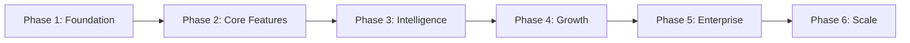
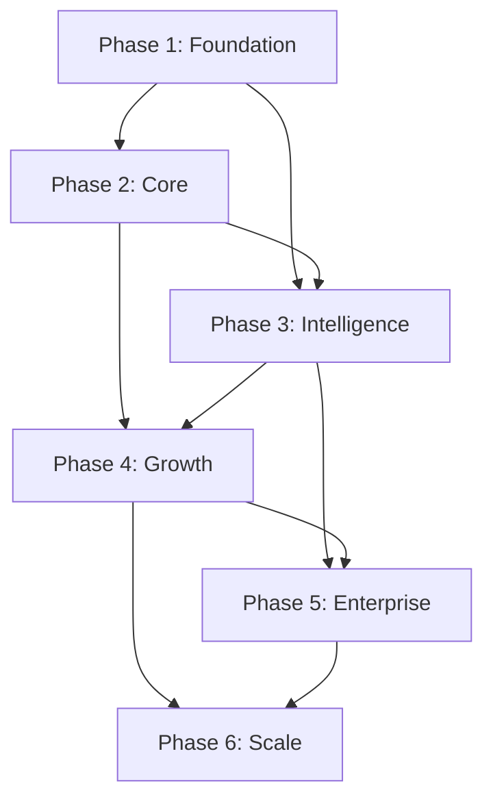

# 33 — Development Phases

---

## Executive Summary

This document defines the development phases for SoftwBot AI, with deliverables, dependencies, and success criteria for each phase.

---

## Purpose

Provide a clear roadmap for incremental development, ensuring each phase builds on the previous.

---

## Phase Structure

---

## Phase 1: Foundation

**Duration:** Weeks 1-4
**Goal:** Project setup, auth, basic dashboard

### Deliverables

| Week | Deliverable | Files |
|------|------------|-------|
| 1 | Project scaffolding | package.json, tsconfig, next.config |
| 1 | Database schema | src/lib/db/schema.ts |
| 1 | Drizzle config | drizzle.config.ts |
| 2 | Clerk authentication | src/lib/auth/*, middleware.ts |
| 2 | Workspace system | src/app/(dashboard)/layout.tsx |
| 3 | Dashboard layout | sidebar, topbar, breadcrumbs |
| 3 | Settings pages | workspace, profile, security |
| 4 | Bot CRUD | bots/list, bots/new, bots/[id] |

### Success Criteria

- [ ] User can sign up and log in
- [ ] User can create workspace
- [ ] Dashboard layout renders correctly
- [ ] Bot list/create/edit/delete works
- [ ] All pages responsive

---

## Phase 2: Core Features

**Duration:** Weeks 5-8
**Goal:** WhatsApp integration, AI conversation, knowledge base

### Deliverables

| Week | Deliverable | Files |
|------|------------|-------|
| 5 | WhatsApp client | src/lib/whatsapp/* |
| 5 | QR code flow | bots/[id]/whatsapp/* |
| 6 | Message handling | message-handler.ts |
| 6 | AI conversation | src/lib/ai/conversation.ts |
| 7 | Knowledge base | knowledge/upload, chunk, embed |
| 7 | RAG pipeline | src/lib/ai/knowledge.ts |
| 8 | Test chat | bots/[id]/test-chat |

### Success Criteria

- [ ] WhatsApp connects via QR code
- [ ] Messages received and processed
- [ ] AI responds with personality
- [ ] Knowledge base uploads and searches
- [ ] Test chat works end-to-end

---

## Phase 3: Intelligence

**Duration:** Weeks 9-12
**Goal:** Bot Architect, automation, conversations inbox

### Deliverables

| Week | Deliverable | Files |
|------|------------|-------|
| 9 | Bot Architect agent | src/lib/ai/bot-architect.ts |
| 9 | Bot Architect UI | bot-architect/* |
| 10 | Automation engine | src/lib/automation/* |
| 10 | Rule builder UI | automation/* |
| 11 | Conversations inbox | conversations/* |
| 11 | Human handoff | handoff flow |
| 12 | Contact management | contacts/* |

### Success Criteria

- [ ] Bot Architect generates working bots
- [ ] Automation rules execute correctly
- [ ] Conversations inbox shows real-time messages
- [ ] Human handoff works seamlessly
- [ ] Contacts captured and stored

---

## Phase 4: Growth

**Duration:** Weeks 13-16
**Goal:** Analytics, billing, broadcasts

### Deliverables

| Week | Deliverable | Files |
|------|------------|-------|
| 13 | Analytics dashboard | analytics/* |
| 13 | Metrics collection | src/lib/analytics/* |
| 14 | Stripe integration | src/lib/billing/* |
| 14 | Subscription plans | billing/* |
| 15 | Broadcast system | broadcast/* |
| 15 | Email notifications | src/lib/email/* |
| 16 | Lead management | leads/* |

### Success Criteria

- [ ] Analytics shows accurate data
- [ ] Billing processes payments
- [ ] Subscriptions manage correctly
- [ ] Broadcasts send successfully
- [ ] Leads captured and scored

---

## Phase 5: Enterprise

**Duration:** Weeks 17-20
**Goal:** Team features, integrations, API access

### Deliverables

| Week | Deliverable | Files |
|------|------------|-------|
| 17 | Team management | team/* |
| 17 | RBAC enforcement | src/lib/auth/rbac.ts |
| 18 | Zapier integration | integrations/zapier |
| 18 | Webhook system | integrations/webhooks |
| 19 | REST API | api/v1/* |
| 19 | API key management | settings/api-keys |
| 20 | Advanced analytics | analytics/advanced |

### Success Criteria

- [ ] Team roles work correctly
- [ ] Integrations connect and sync
- [ ] API keys authenticate
- [ ] API endpoints functional
- [ ] Advanced analytics accurate

---

## Phase 6: Scale

**Duration:** Weeks 21-24
**Goal:** Performance, security, launch prep

### Deliverables

| Week | Deliverable | Files |
|------|------------|-------|
| 21 | Performance optimization | All modules |
| 21 | Caching layer | src/lib/cache/* |
| 22 | Security audit | Security fixes |
| 22 | Load testing | tests/load/* |
| 23 | Documentation finalization | All docs |
| 23 | Beta testing | Beta program |
| 24 | Launch preparation | Marketing, support |

### Success Criteria

- [ ] p95 latency < 200ms
- [ ] Zero critical security issues
- [ ] Load test passes 1000 concurrent
- [ ] Documentation complete
- [ ] Beta feedback incorporated

---

## Phase Dependencies

---

## Developer Notes

- Each phase must complete before next begins
- Phases can overlap if dependencies are met
- Phase review required before proceeding
- Scope changes require phase re-planning

## Future Improvements

- Parallel phase execution
- Phase-specific CI/CD pipelines
- Automated phase completion checks
