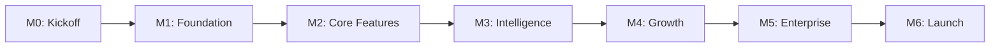

# 34 — Milestones

---

## Executive Summary

This document defines project milestones, gates, and completion criteria for SoftwBot AI development.

---

## Purpose

Milestones provide clear checkpoints for progress validation and stakeholder communication.

---

## Milestone Definitions

### M0: Project Kickoff

**Date:** Week 0
**Gate:** Planning approved

| Criteria | Status |
|----------|--------|
| Documentation complete | Pending |
| Planning files generated | Pending |
| Architecture reviewed | Pending |
| Team aligned on scope | Pending |

---

### M1: Foundation Complete

**Date:** Week 4
**Gate:** Auth + Dashboard working

| Criteria | Status |
|----------|--------|
| Authentication works | Pending |
| Workspace creation works | Pending |
| Dashboard layout renders | Pending |
| Bot CRUD functional | Pending |
| All pages responsive | Pending |
| Unit tests pass | Pending |

**Deliverables:**
- Working auth flow
- Dashboard with sidebar navigation
- Bot list/create/edit/delete
- Settings pages

---

### M2: Core Features Complete

**Date:** Week 8
**Gate:** WhatsApp + AI working

| Criteria | Status |
|----------|--------|
| WhatsApp connects | Pending |
| Messages processed | Pending |
| AI responds correctly | Pending |
| Knowledge base works | Pending |
| RAG pipeline functional | Pending |
| Integration tests pass | Pending |

**Deliverables:**
- WhatsApp QR connection
- Message send/receive
- AI conversation engine
- Knowledge base upload/search
- Test chat interface

---

### M3: Intelligence Complete

**Date:** Week 12
**Gate:** Bot Architect + Automation working

| Criteria | Status |
|----------|--------|
| Bot Architect generates bots | Pending |
| Automation rules execute | Pending |
| Conversations inbox works | Pending |
| Human handoff functional | Pending |
| Contacts captured | Pending |
| E2E tests pass | Pending |

**Deliverables:**
- Bot Architect AI agent
- Automation rule engine
- Real-time conversation inbox
- Human handoff flow
- Contact management

---

### M4: Growth Complete

**Date:** Week 16
**Gate:** Analytics + Billing working

| Criteria | Status |
|----------|--------|
| Analytics accurate | Pending |
| Billing processes payments | Pending |
| Subscriptions manage correctly | Pending |
| Broadcasts send successfully | Pending |
| Leads captured and scored | Pending |
| Performance tests pass | Pending |

**Deliverables:**
- Analytics dashboard
- Stripe integration
- Subscription management
- Broadcast campaigns
- Lead management

---

### M5: Enterprise Complete

**Date:** Week 20
**Gate:** Team + Integrations working

| Criteria | Status |
|----------|--------|
| Team roles enforce | Pending |
| Integrations connect | Pending |
| API keys authenticate | Pending |
| API endpoints functional | Pending |
| Security audit passed | Pending |
| Load tests pass | Pending |

**Deliverables:**
- Team management
- RBAC enforcement
- Zapier/webhook integrations
- REST API
- API key management

---

### M6: Launch Ready

**Date:** Week 24
**Gate:** Production deployment

| Criteria | Status |
|----------|--------|
| All tests pass | Pending |
| Documentation complete | Pending |
| Security audit clean | Pending |
| Performance targets met | Pending |
| Beta feedback incorporated | Pending |
| Support infrastructure ready | Pending |

**Deliverables:**
- Production deployment
- Monitoring active
- Support channels ready
- Marketing launch

---

## Milestone Review Process

1. **Pre-review:** Update walkthrough files
2. **Review meeting:** Demo completed work
3. **Gate check:** Verify all criteria met
4. **Approval:** Explicit sign-off required
5. **Post-review:** Plan next phase

---

## Milestone Dependencies

---

## Developer Notes

- Milestones are hard gates — no skipping
- Each milestone requires walkthrough update
- Milestone review includes demo and Q&A
- Scope changes require milestone re-planning

## Future Improvements

- Automated milestone tracking
- Milestone burndown charts
- Stakeholder notification system
