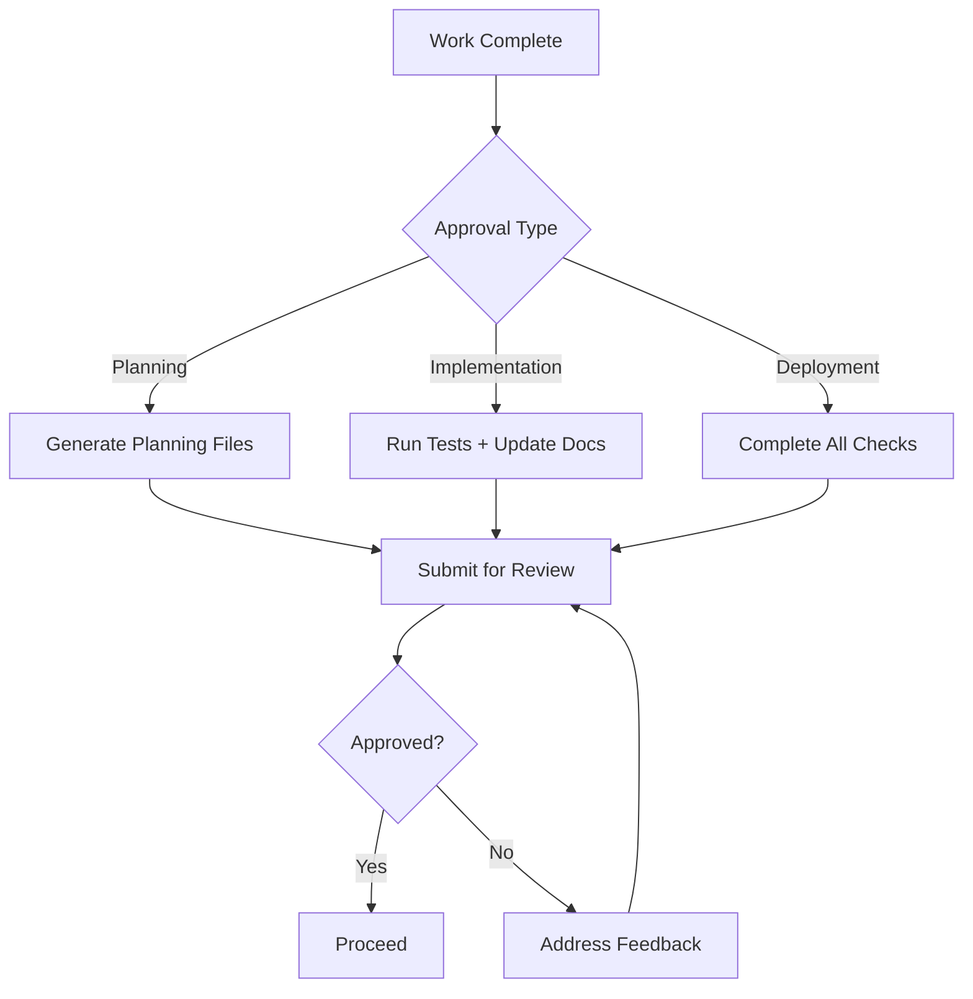

# 35 — Approval Process

---

## Executive Summary

This document defines the mandatory approval workflow for all implementation work on SoftwBot AI.

---

## Purpose

Prevent wasted effort and ensure quality by requiring explicit approval at key checkpoints.

---

## Approval Types

### Type 1: Planning Approval

**When:** Before any implementation begins
**Who:** Product owner or tech lead
**What:** Planning files in `planning/`

#### Required Planning Files

| File | Content |
|------|---------|
| implementation-plan.md | Step-by-step implementation plan |
| milestones.md | Milestone definitions |
| development-order.md | Build sequence |
| folder-plan.md | Files to create/modify |
| risk-analysis.md | Risk assessment |
| dependency-analysis.md | Dependencies |
| architecture-summary.md | Architecture impact |
| acceptance-checklist.md | Done criteria |

#### Approval Template

```markdown
## Planning Approval Request

### Feature: [Feature Name]

### Summary
[1-2 sentence description]

### Implementation Plan
[Key steps]

### Files to Create/Modify
[List]

### Risks
[Key risks]

### Dependencies
[Dependencies]

### Acceptance Criteria
[List]

### Ready for approval: YES/NO
```

---

### Type 2: Implementation Approval

**When:** After implementation complete
**Who:** Tech lead or reviewer
**What:** Working code + tests

#### Required Artifacts

| Artifact | Description |
|----------|-------------|
| Working code | All features functional |
| Unit tests | 80%+ coverage for new code |
| Type checking | Zero TypeScript errors |
| Linting | Zero ESLint errors |
| Documentation | Updated relevant docs |

#### Approval Template

```markdown
## Implementation Approval Request

### Feature: [Feature Name]

### What was implemented
[Summary]

### Files changed
[List]

### Test results
[Output]

### Documentation updated
[List]

### Ready for review: YES/NO
```

---

### Type 3: Deployment Approval

**When:** Before production deployment
**Who:** Tech lead + QA lead
**What:** Tested, reviewed, documented code

#### Required Artifacts

| Artifact | Description |
|----------|-------------|
| Code review | Approved PR |
| Test results | All tests passing |
| Security review | No critical issues |
| Performance | Meets targets |
| Documentation | Complete |

---

## Emergency Approval

For critical production issues:

1. **Immediate fix** can be deployed with single approval
2. **Post-mortem** required within 24 hours
3. **Documentation** updated within 48 hours
4. **Test** added within 1 week

### Emergency Template

```markdown
## Emergency Approval Request

### Issue: [Description]
### Severity: Critical/High
### Fix: [What was changed]
### Risk: [Low/Medium/High]
### Approver: [Name]
### Date: [Date]
```

---

## Approval Workflow



---

## Approval Rules

1. Never skip approval gates
2. Always use approval templates
3. Always document approval decisions
4. Always follow up on rejection feedback
5. Always update walkthrough after approval

---

## Developer Notes

- AI agents must wait for approval before proceeding
- Human developers may request expedited approval
- All approvals logged in decision-log.md
- Approval history retained for audit

## Future Improvements

- Automated approval routing
- Approval analytics dashboard
- Integration with project management tools
