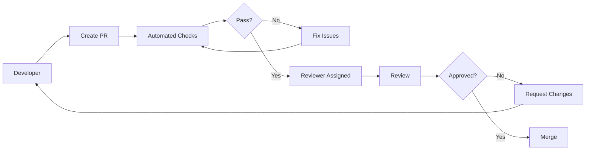

# 37 — Code Review Process

---

## Executive Summary

This document defines the code review process, standards, and checklist for SoftwBot AI.

---

## Purpose

Ensure code quality, knowledge sharing, and consistency through systematic code review.

---

## Review Process



---

## PR Requirements

### Title Format

```
feat: add bot creation flow
fix: resolve webhook delivery issue
docs: update API documentation
refactor: simplify RAG pipeline
test: add unit tests for billing
chore: update dependencies
```

### Description Template

```markdown
## Summary
[1-2 sentence description]

## Changes
- [Change 1]
- [Change 2]

## Testing
- [ ] Unit tests added/updated
- [ ] Integration tests pass
- [ ] Manual testing completed

## Documentation
- [ ] API docs updated
- [ ] Walkthrough updated
- [ ] README updated (if needed)

## Checklist
- [ ] TypeScript strict mode compliant
- [ ] No `any` types
- [ ] Error handling present
- [ ] Loading states implemented
- [ ] Empty states handled
- [ ] Mobile responsive
- [ ] Tests written
- [ ] Documentation updated
```

---

## Review Checklist

### Code Quality

- [ ] TypeScript strict mode compliant
- [ ] No `any` types (or justified)
- [ ] No `@ts-ignore` (or justified)
- [ ] No console.log in production code
- [ ] No hardcoded secrets
- [ ] No dead code
- [ ] No unused imports
- [ ] Consistent naming conventions

### Architecture

- [ ] Follows module architecture
- [ ] Follows component guidelines
- [ ] Follows API conventions
- [ ] Follows database conventions
- [ ] No circular dependencies
- [ ] Proper separation of concerns

### Functionality

- [ ] Feature works as specified
- [ ] Edge cases handled
- [ ] Error handling present
- [ ] Loading states implemented
- [ ] Empty states handled
- [ ] Accessibility considered

### Testing

- [ ] Unit tests for new code
- [ ] Integration tests for API routes
- [ ] Tests are descriptive
- [ ] Tests cover edge cases
- [ ] Tests clean up after themselves

### Performance

- [ ] No N+1 queries
- [ ] Proper indexing used
- [ ] Large datasets paginated
- [ ] Expensive operations cached
- [ ] No unnecessary re-renders

### Security

- [ ] Input validated
- [ ] Authorization checked
- [ ] Sensitive data encrypted
- [ ] No secrets in code
- [ ] Secure headers set

### Documentation

- [ ] API docs updated
- [ ] Walkthrough updated
- [ ] Code comments (if complex)
- [ ] README updated (if needed)

---

## Reviewer Guidelines

### Do

- Be constructive and specific
- Suggest improvements
- Ask questions
- Praise good work
- Focus on important issues

### Don't

- Be personal
- Nitpick style (use linter)
- Block on trivial issues
- Review without reading
- Approve without testing

---

## Review Turnaround

| Priority | Target Turnaround |
|----------|------------------|
| Critical | 4 hours |
| High | 8 hours |
| Medium | 24 hours |
| Low | 48 hours |

---

## Approval Rules

1. Minimum 1 approval required
2. All automated checks must pass
3. All critical issues resolved
4. Documentation updated
5. Tests passing

---

## Developer Notes

- Code review is mandatory for all changes
- Self- review is not sufficient
- Reviewers should test locally if needed
- Disagreements escalated to tech lead

## Future Improvements

- Automated code review tools
- Review metrics dashboard
- Review assignment automation
- AI-assisted code review
