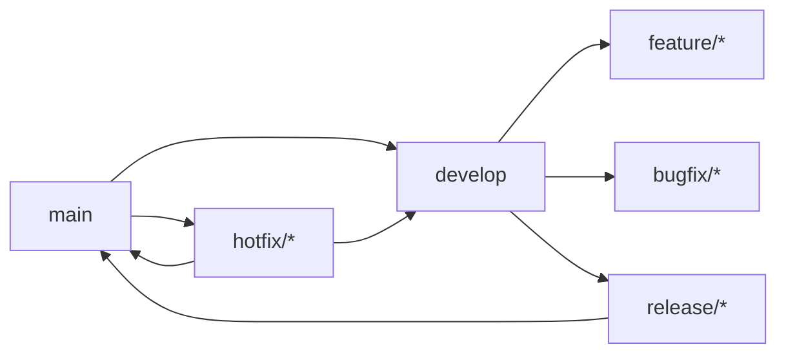

# 40 — Git Workflow

---

## Executive Summary

This document defines the Git branching strategy, commit conventions, pull request rules, and release process for SoftwBot AI.

---

## Purpose

Maintain a clean, organized Git history that supports parallel development and easy releases.

---

## Branching Strategy



### Branch Types

| Branch | Purpose | Lifetime |
|--------|---------|----------|
| `main` | Production code | Permanent |
| `develop` | Integration branch | Permanent |
| `feature/*` | New features | Temporary |
| `bugfix/*` | Bug fixes | Temporary |
| `hotfix/*` | Emergency fixes | Temporary |
| `release/*` | Release prep | Temporary |

### Branch Naming

```
feature/bot-creation-flow
feature/knowledge-base-upload
bugfix/webhook-delivery
hotfix/auth-session-expiry
release/v1.0.0
```

---

## Commit Convention

### Format

```
<type>: <description>

[optional body]

[optional footer]
```

### Types

| Type | Description | Example |
|------|------------|---------|
| `feat` | New feature | `feat: add bot creation flow` |
| `fix` | Bug fix | `fix: resolve webhook delivery issue` |
| `docs` | Documentation | `docs: update API documentation` |
| `style` | Formatting | `style: fix indentation` |
| `refactor` | Code restructuring | `refactor: simplify RAG pipeline` |
| `test` | Adding tests | `test: add unit tests for billing` |
| `chore` | Maintenance | `chore: update dependencies` |
| `perf` | Performance | `perf: optimize database queries` |
| `ci` | CI/CD | `ci: add GitHub Actions workflow` |

### Examples

```
feat: add bot creation flow

- Add bot schema validation
- Create bot API endpoint
- Add bot list UI

Closes #123
```

```
fix: resolve webhook delivery issue

The webhook was failing due to incorrect signature validation.
Fixed by using the correct HMAC algorithm.

Fixes #456
```

---

## Pull Request Rules

### PR Title Format

```
feat: add bot creation flow
fix: resolve webhook delivery issue
docs: update API documentation
```

### PR Description Template

```markdown
## Summary
[1-2 sentence description]

## Changes
- [Change 1]
- [Change 2]

## Testing
- [ ] Unit tests added/updated
- [ ] Integration tests pass
- [ ] Manual testing completed

## Documentation
- [ ] API docs updated
- [ ] Walkthrough updated

## Checklist
- [ ] TypeScript strict mode compliant
- [ ] No `any` types
- [ ] Error handling present
- [ ] Tests written
- [ ] Documentation updated
```

### PR Rules

1. One feature/fix per PR
2. PR must pass all CI checks
3. Minimum 1 approval required
4. No merge conflicts
5. Tests must pass
6. Documentation must be updated

---

## Release Process

### Release Branch

1. Create release branch from `develop`
2. Update version number
3. Update changelog
4. Final testing
5. Merge to `main`
6. Tag release
7. Merge back to `develop`

### Version Format

```
v<major>.<minor>.<patch>
```

Example: `v1.2.3`

### Changelog Format

```markdown
# Changelog

## [1.2.3] - 2026-07-16

### Added
- Bot creation flow
- Knowledge base upload

### Fixed
- Webhook delivery issue

### Changed
- Improved AI response time
```

---

## Hotfix Process

1. Create hotfix branch from `main`
2. Fix the issue
3. Add tests
4. Merge to `main`
5. Tag hotfix
6. Merge back to `develop`

---

## Git Rules

1. Never force push to `main` or `develop`
2. Never commit directly to `main`
3. Always use pull requests
4. Always write meaningful commit messages
5. Always update changelog for releases

---

## Developer Notes

- Git history should be clean and readable
- Squash commits for messy feature branches
- Use conventional commits for automation
- Tag releases for easy rollback

## Future Improvements

- Automated changelog generation
- Semantic release automation
- Git hooks for commit validation
- Branch protection rules
