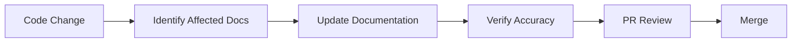

# 43 — Documentation Maintenance

---

## Executive Summary

This document defines how documentation stays synchronized with implementation in SoftwBot AI.

---

## Purpose

Ensure documentation never becomes outdated or inaccurate.

---

## Documentation Rules

### Rule 1: Code Changes → Doc Changes

Every code change must update related documentation:

| Code Change | Documentation Update |
|------------|---------------------|
| New API endpoint | 18-api.md |
| New database table | 17-database.md |
| New component | 49-component-guidelines.md |
| New AI agent | 14-ai-agents.md |
| New feature | Relevant module doc |
| Breaking change | Migration guide |

### Rule 2: Documentation is Code

Documentation follows the same quality standards:
- Version controlled
- Reviewed in PRs
- Tested (links, examples)
- linted (markdownlint)

### Rule 3: No Outdated Docs

Outdated documentation is worse than no documentation.
- Delete outdated docs immediately
- Replace with current information
- Update cross-references

---

## Documentation Sync Process



---

## Documentation Checklist

### Before PR Merge

- [ ] API docs updated (if endpoints changed)
- [ ] Database docs updated (if schema changed)
- [ ] Module docs updated (if architecture changed)
- [ ] Walkthrough updated
- [ ] All links working
- [ ] All examples current

### After Feature Complete

- [ ] Feature documentation complete
- [ ] Examples added
- [ ] Edge cases documented
- [ ] Developer notes updated
- [ ] Future improvements noted

---

## Documentation Standards

### File Format

```markdown
# [Number] — [Title]

---

## Executive Summary
[What this document covers]

## Purpose
[Why this document exists]

## [Main Content]

## Developer Notes
[Implementation guidance]

## Future Improvements
[What comes next]
```

### Link Conventions

```markdown
<!-- Internal links -->
[Database Schema](./17-database.md)
[API Reference](./18-api.md)

<!-- External links -->
[Next.js Docs](https://nextjs.org/docs)
```

### Code Example Rules

- All examples must be runnable
- Include imports
- Include types
- Show expected output
- Cover edge cases

---

## Documentation Ownership

| Document | Owner | Review Cycle |
|----------|-------|--------------|
| 00-07 (Strategy) | Product | Quarterly |
| 08-10 (UI) | Design | Monthly |
| 11-16 (AI) | AI Engineer | Monthly |
| 17-18 (Data/API) | Backend | Bi-weekly |
| 19-26 (Architecture) | Architect | Monthly |
| 27-31 (DevOps) | DevOps | Monthly |
| 32-75 (Standards) | Tech Lead | Monthly |

---

## Documentation Review

### Weekly Review

- Check for outdated information
- Verify all links work
- Review new documentation needs
- Update ownership assignments

### Monthly Review

- Comprehensive documentation audit
- Identify gaps and inconsistencies
- Plan documentation improvements
- Update documentation standards

---

## Anti-Patterns

### ❌ Don't

- Write documentation after the fact
- Skip documentation for "small" changes
- Leave placeholder documentation
- Copy-paste without updating
- Assume documentation is current

### ✅ Do

- Write documentation alongside code
- Update docs in the same PR
- Delete outdated documentation
- Verify examples work
- Keep documentation concise

---

## Developer Notes

- Documentation is part of the definition of done
- AI agents must update docs with code
- Documentation quality affects onboarding
- Good docs reduce support burden

## Future Improvements

- Automated documentation testing
- Documentation coverage metrics
- AI-assisted documentation generation
- Interactive documentation
