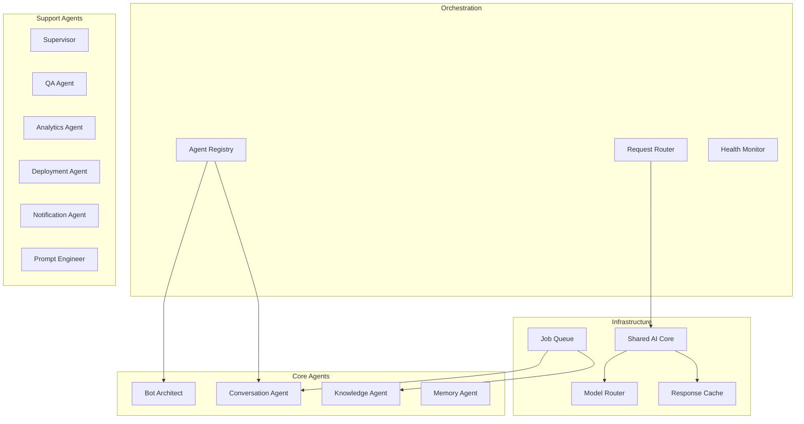
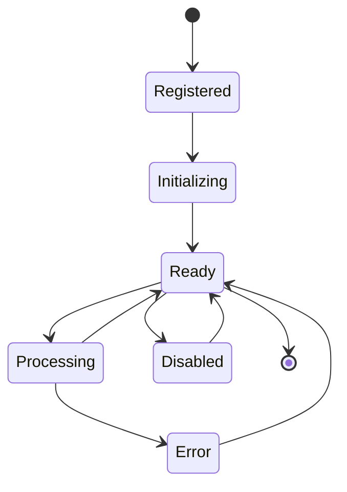
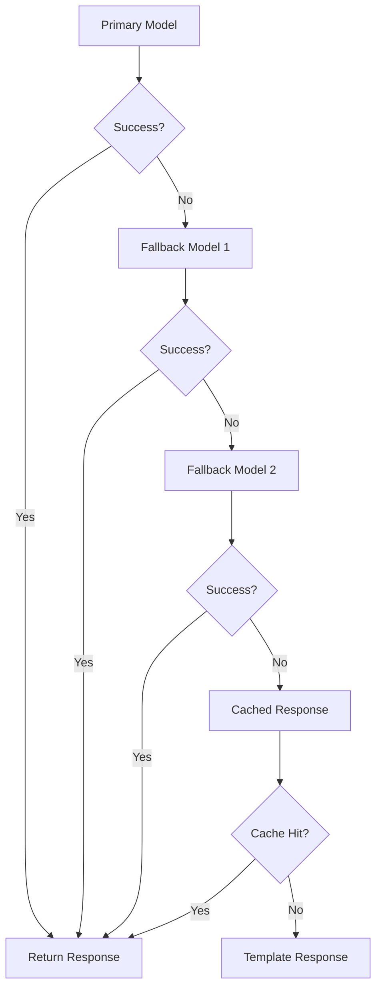

# 44 — Agent Architecture

---

## Executive Summary

This document defines the detailed architecture for SoftwBot AI's multi-agent system, covering agent lifecycle, communication, memory, tool calling, and orchestration.

---

## Purpose

Provide a comprehensive reference for building, extending, and maintaining AI agents.

---

## Agent System Overview



---

## Agent Lifecycle



### Lifecycle States

| State | Description |
|-------|------------|
| Registered | Agent registered in registry |
| Initializing | Loading config, warming up |
| Ready | Available for processing |
| Processing | Currently handling a request |
| Error | Failed, needs attention |
| Disabled | Manually disabled |

---

## Agent Communication

### Message Format

```typescript
interface AgentMessage {
  id: string;
  type: 'request' | 'response' | 'event' | 'error';
  source: string;       // Agent ID
  target: string;       // Agent ID or 'broadcast'
  payload: unknown;
  metadata: {
    timestamp: Date;
    correlationId: string;
    priority: 'low' | 'medium' | 'high';
  };
}
```

### Communication Patterns

| Pattern | Use Case | Implementation |
|---------|----------|----------------|
| Request/Response | Sync queries | Direct call |
| Event | Async notifications | Event bus |
| Broadcast | System events | Pub/sub |
| Pipeline | Multi-step processing | Chain of agents |

---

## Agent Memory

### Memory Types

| Type | Scope | TTL | Storage |
|------|-------|-----|---------|
| Working Memory | Current request | Request lifetime | In-memory |
| Conversation Memory | Per conversation | Session | Redis |
| Long-term Memory | Per contact | Permanent | PostgreSQL |
| Shared Memory | Cross-agent | Configurable | Redis |

### Memory Interface

```typescript
interface AgentMemory {
  working: Map<string, unknown>;
  conversation: ConversationMemory;
  longTerm: LongTermMemory;
  
  get(key: string): unknown;
  set(key: string, value: unknown): void;
  recall(query: string): Promise<Memory[]>;
  store(memory: Memory): Promise<void>;
  forget(criteria: ForgetCriteria): Promise<void>;
}
```

---

## Tool Calling

### Tool Interface

```typescript
interface AgentTool {
  name: string;
  description: string;
  parameters: ZodSchema;
  execute: (params: unknown, context: AgentContext) => Promise<ToolResult>;
  permissions: Permission[];
  rateLimit?: RateLimitConfig;
}
```

### Available Tools

| Tool | Agents | Description |
|------|--------|-------------|
| knowledge_search | Conversation, Bot Architect | Search KB |
| send_message | Conversation, Notification | Send WhatsApp message |
| create_lead | Conversation | Create lead |
| handoff_to_human | Conversation | Trigger handoff |
| get_bot_config | All | Get bot settings |
| update_contact | Conversation, Memory | Update contact |
| log_event | All | Log to analytics |
| web_search | Bot Architect | Search web |
| create_task | Automation | Create automation task |

---

## Prompt Versioning

### Prompt Storage

```
prompts/
├── v1/
│   ├── bot-architect.md
│   ├── conversation.md
│   └── qa-tester.md
├── v2/
│   └── conversation.md
└── current.json
```

### Version Format

```json
{
  "agentId": "conversation",
  "version": "2.1.0",
  "prompt": "...",
  "variables": ["businessContext", "knowledgeContext", "history"],
  "metadata": {
    "author": "ai-engineer",
    "createdAt": "2026-07-16",
    "performance": {
      "avgTokens": 850,
      "avgLatencyMs": 1200,
      "qualityScore": 0.92
    }
  }
}
```

---

## Agent Configuration

```typescript
interface AgentConfig {
  id: string;
  name: string;
  model: string;
  temperature: number;
  maxTokens: number;
  systemPrompt: string;
  tools: string[];
  memory: MemoryConfig;
  fallback: FallbackConfig;
  retry: RetryConfig;
  timeout: number;
  rateLimit: RateLimitConfig;
  permissions: Permission[];
}
```

---

## Health Checks

```typescript
interface HealthCheck {
  agentId: string;
  status: 'healthy' | 'degraded' | 'unhealthy';
  lastCheck: Date;
  metrics: {
    latency: number;
    errorRate: number;
    throughput: number;
  };
  issues: string[];
}
```

---

## Retry Strategy

| Attempt | Delay | Max Retries |
|---------|-------|-------------|
| 1 | Immediate | - |
| 2 | 1s | - |
| 3 | 2s | - |
| 4 | 4s | - |
| 5+ | 8s (max) | 5 |

---

## Fallback Strategy



### Fallback Chain

```
GPT-4o → Claude 3.5 Sonnet → GPT-4o-mini → DeepSeek → Template
```

---

## Human Approval

For high-risk actions:

```typescript
interface ApprovalRequest {
  agentId: string;
  action: string;
  riskLevel: 'low' | 'medium' | 'high' | 'critical';
  context: unknown;
  requestedAt: Date;
  expiresAt: Date;
}
```

### Approval Rules

| Risk Level | Approval Required |
|-----------|-------------------|
| Low | Auto-approved |
| Medium | Log for review |
| High | Human approval required |
| Critical | Multiple approvers |

---

## Developer Notes

- Agents must be isolated (failures don't cascade)
- All agent actions must be logged
- Agent performance must be monitored
- Prompt changes require versioning

## Future Improvements

- Agent self-improvement
- Multi-agent collaboration
- Agent marketplace
- Custom agent creation
- MCP protocol integration
