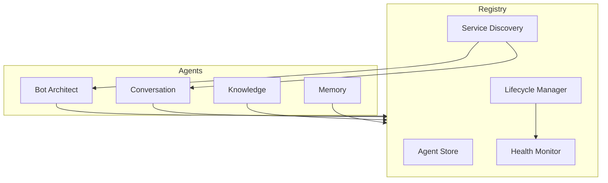

# 45 — Agent Registry

---

## Executive Summary

This document defines the agent registry system for discovering, registering, and managing AI agents in SoftwBot AI.

---

## Purpose

Provide centralized agent management, discovery, and lifecycle control.

---

## Registry Architecture



---

## Registry Interface

```typescript
interface AgentRegistry {
  register(agent: Agent): void;
  unregister(agentId: string): void;
  get(agentId: string): Agent;
  list(): Agent[];
  getByCapability(capability: string): Agent[];
  health(): HealthStatus[];
}
```

---

## Agent Registration

```typescript
interface AgentRegistration {
  id: string;
  name: string;
  version: string;
  capabilities: string[];
  model: string;
  config: AgentConfig;
  health: HealthCheckConfig;
  metadata: {
    author: string;
    description: string;
    tags: string[];
  };
}
```

### Registration Example

```typescript
registry.register({
  id: 'conversation-agent',
  name: 'Conversation Agent',
  version: '1.0.0',
  capabilities: ['chat', 'lead-capture', 'handoff'],
  model: 'openai/gpt-4o-mini',
  config: {
    temperature: 0.7,
    maxTokens: 1000,
    tools: ['knowledge_search', 'create_lead']
  },
  health: {
    endpoint: '/api/health/agents/conversation',
    interval: 30000
  }
});
```

---

## Service Discovery

### Discovery Methods

| Method | Use Case |
|--------|----------|
| By ID | Direct agent access |
| By Capability | Find agents with specific skills |
| By Model | Find agents using specific model |
| By Tag | Find agents by category |

### Discovery Example

```typescript
// Find all agents that can handle chat
const chatAgents = registry.getByCapability('chat');

// Find all agents using Claude
const claudeAgents = registry.getByModel('claude-3.5-sonnet');

// Find all production-ready agents
const prodAgents = registry.getByTag('production');
```

---

## Lifecycle Management

### Lifecycle Operations

```typescript
interface LifecycleManager {
  start(agentId: string): Promise<void>;
  stop(agentId: string): Promise<void>;
  restart(agentId: string): Promise<void>;
  disable(agentId: string): void;
  enable(agentId: string): void;
}
```

### Lifecycle Events

| Event | Description |
|-------|------------|
| agent:registered | Agent added to registry |
| agent:started | Agent initialized and ready |
| agent:stopped | Agent shut down |
| agent:error | Agent encountered error |
| agent:health:changed | Health status changed |

---

## Health Monitoring

### Health Check Config

```typescript
interface HealthCheckConfig {
  endpoint: string;
  interval: number;        // ms
  timeout: number;         // ms
  retries: number;
  thresholds: {
    latency: number;       // ms
    errorRate: number;     // percentage
  };
}
```

### Health Status

```typescript
interface HealthStatus {
  agentId: string;
  status: 'healthy' | 'degraded' | 'unhealthy';
  latency: number;
  errorRate: number;
  uptime: number;
  lastCheck: Date;
  issues: string[];
}
```

---

## Agent Communication Bus

```typescript
interface AgentBus {
  publish(event: AgentEvent): void;
  subscribe(agentId: string, handler: EventHandler): void;
  unsubscribe(agentId: string): void;
}

interface AgentEvent {
  type: string;
  source: string;
  data: unknown;
  timestamp: Date;
}
```

---

## Registry Storage

### In-Memory (Development)

```typescript
const registry = new InMemoryAgentRegistry();
```

### Persistent (Production)

```typescript
const registry = new PersistentAgentRegistry({
  storage: 'redis',
  prefix: 'agents:',
  ttl: 3600
});
```

---

## Developer Notes

- Registry must be available before agents start
- Agent IDs must be unique
- Health checks must not impact performance
- Registry changes must be logged

## Future Improvements

- Distributed registry
- Agent versioning
- A/B testing support
- Agent marketplace integration
