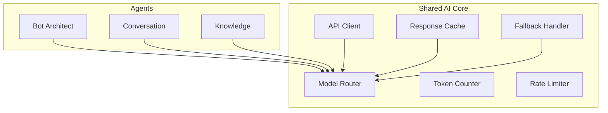

# 46 — Shared AI Core

---

## Executive Summary

This document defines the shared AI infrastructure used by all agents in SoftwBot AI.

---

## Purpose

Eliminate duplication and ensure consistency across all AI agents.

---

## Core Architecture



---

## Model Router

```typescript
interface ModelRouter {
  route(request: AIRequest): ModelConfig;
  getAvailableModels(): Model[];
  getModelCost(model: string): CostEstimate;
}

interface AIRequest {
  agentId: string;
  task: 'chat' | 'generation' | 'analysis' | 'embedding';
  priority: 'low' | 'medium' | 'high';
  maxTokens: number;
  requirements: {
    streaming?: boolean;
    jsonMode?: boolean;
    vision?: boolean;
  };
}
```

### Model Selection Rules

| Task | Primary Model | Fallback |
|------|--------------|----------|
| Chat | GPT-4o-mini | Claude 3.5 Haiku |
| Bot Architect | Claude 3.5 Sonnet | GPT-4o |
| Analytics | Claude 3.5 Sonnet | GPT-4o |
| Embedding | text-embedding-3-small | - |
| QA Testing | GPT-4o | Claude 3.5 Sonnet |

---

## API Client

```typescript
interface AIClient {
  chat(params: ChatParams): Promise<ChatResponse>;
  embed(params: EmbedParams): Promise<EmbedResponse>;
  stream(params: StreamParams): AsyncIterable<StreamChunk>;
}

interface ChatParams {
  model: string;
  messages: Message[];
  temperature?: number;
  maxTokens?: number;
  tools?: Tool[];
  responseFormat?: 'text' | 'json';
}

interface ChatResponse {
  content: string;
  usage: {
    promptTokens: number;
    completionTokens: number;
    totalTokens: number;
  };
  model: string;
  finishReason: string;
}
```

---

## Response Cache

```typescript
interface ResponseCache {
  get(key: string): Promise<CachedResponse | null>;
  set(key: string, response: ChatResponse, ttl: number): Promise<void>;
  invalidate(pattern: string): Promise<void>;
}

// Cache key format
// {agent_id}:{task}:{message_hash}
// Example: conv_agent:chat:abc123def456
```

### Cache Strategy

| Task | TTL | Invalidation |
|------|-----|-------------|
| Chat (same context) | 5 min | On KB update |
| Bot Architect | 1 hour | On model change |
| Analytics | 15 min | On data change |
| Embedding | 24 hours | Never |

---

## Token Counter

```typescript
interface TokenCounter {
  count(text: string, model: string): number;
  estimateCost(tokens: number, model: string): number;
  remaining(model: string, limit: number): number;
}
```

---

## Rate Limiter

```typescript
interface RateLimiter {
  check(model: string): Promise<boolean>;
  wait(model: string): Promise<void>;
  getRemaining(model: string): number;
}
```

### Rate Limits

| Model | RPM | TPD |
|-------|-----|-----|
| GPT-4o | 500 | 100,000 |
| GPT-4o-mini | 500 | 100,000 |
| Claude 3.5 Sonnet | 100 | 10,000 |
| DeepSeek | 100 | 10,000 |

---

## Fallback Handler

```typescript
interface FallbackHandler {
  execute<T>(
    primary: () => Promise<T>,
    fallbacks: (() => Promise<T>)[],
    options: FallbackOptions
  ): Promise<T>;
}

interface FallbackOptions {
  retries: number;
  delay: number;
  backoff: 'linear' | 'exponential';
}
```

---

## Streaming Support

```typescript
interface StreamHandler {
  onChunk(chunk: StreamChunk): void;
  onComplete(response: ChatResponse): void;
  onError(error: Error): void;
}

interface StreamChunk {
  content: string;
  finishReason?: string;
  usage?: TokenUsage;
}
```

---

## Error Handling

| Error Type | Handling |
|-----------|----------|
| Rate limit | Wait and retry |
| Timeout | Retry with next model |
| Invalid request | Log and return error |
| Auth error | Alert and disable |
| Network error | Retry with backoff |

---

## Developer Notes

- All agents must use Shared AI Core
- Never bypass the model router
- Always handle errors gracefully
- Cache frequently repeated queries

## Future Improvements

- Model performance tracking
- Cost optimization automation
- A/B testing for models
- Custom model support
