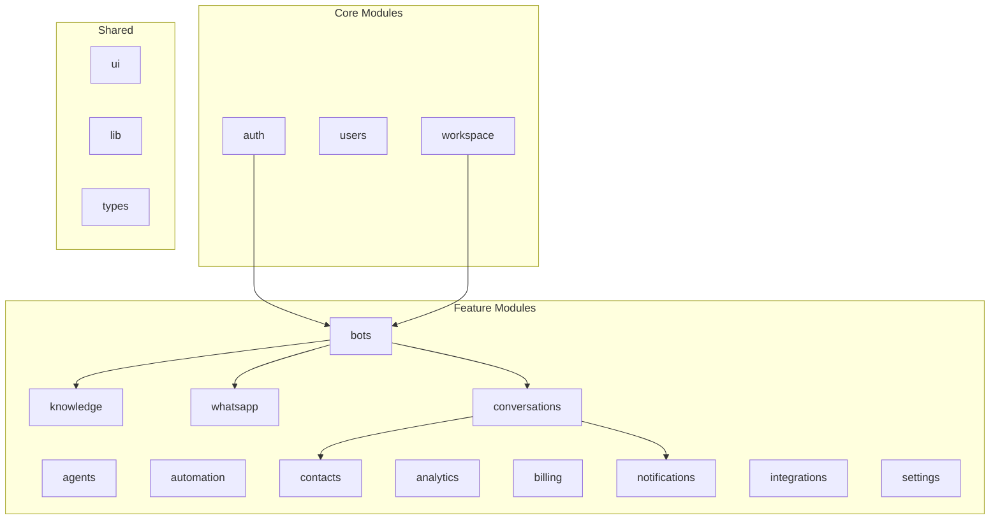

# 47 — Module Architecture

---

## Executive Summary

This document defines the feature-based module architecture for SoftwBot AI, where each major feature is an isolated, self-contained module.

---

## Purpose

Ensure clean separation of concerns, independent development, and maintainable code.

---

## Module Map



---

## Module Structure

```
src/app/modules/
├── auth/
│   ├── actions/          # Server actions
│   ├── api/              # Route handlers
│   ├── components/       # UI components
│   ├── hooks/            # React hooks
│   ├── lib/              # Business logic
│   ├── types/            # TypeScript types
│   └── validators/       # Zod schemas
│
├── bots/
│   ├── actions/
│   ├── api/
│   ├── components/
│   ├── hooks/
│   ├── lib/
│   ├── types/
│   └── validators/
│
├── shared/
│   ├── components/       # Shared UI components
│   ├── hooks/            # Shared hooks
│   ├── lib/              # Shared utilities
│   └── types/            # Shared types
```

---

## Module Responsibilities

### auth Module

| Aspect | Details |
|--------|---------|
| Responsibility | Authentication, authorization, sessions |
| Dependencies | Clerk |
| Public API | `useAuth()`, `auth()` |
| Internal | Session management, token validation |

### bots Module

| Aspect | Details |
|--------|---------|
| Responsibility | Bot CRUD, configuration, activation |
| Dependencies | auth, workspace, whatsapp |
| Public API | `useBot()`, `getBot()` |
| Internal | Bot lifecycle, model selection |

### knowledge Module

| Aspect | Details |
|--------|---------|
| Responsibility | Document upload, processing, search |
| Dependencies | bots, storage |
| Public API | `searchKnowledge()`, `uploadDocument()` |
| Internal | Chunking, embedding, vector search |

### conversations Module

| Aspect | Details |
|--------|---------|
| Responsibility | Message handling, inbox, human handoff |
| Dependencies | bots, contacts, whatsapp |
| Public API | `useConversations()`, `sendMessage()` |
| Internal | Real-time updates, AI response |

### whatsapp Module

| Aspect | Details |
|--------|---------|
| Responsibility | WhatsApp connection, message send/receive |
| Dependencies | None (external) |
| Public API | `connectWhatsApp()`, `sendMessage()` |
| Internal | Session persistence, reconnect |

### automation Module

| Aspect | Details |
|--------|---------|
| Responsibility | Rule creation, execution, scheduling |
| Dependencies | bots, conversations |
| Public API | `createRule()`, `executeRule()` |
| Internal | Trigger evaluation, action execution |

### analytics Module

| Aspect | Details |
|--------|---------|
| Responsibility | Metrics collection, reporting |
| Dependencies | conversations, contacts, bots |
| Public API | `getMetrics()`, `generateReport()` |
| Internal | Data aggregation, trend analysis |

### billing Module

| Aspect | Details |
|--------|---------|
| Responsibility | Subscriptions, payments, usage |
| Dependencies | workspace, Stripe |
| Public API | `createSubscription()`, `checkUsage()` |
| Internal | Metering, invoice generation |

---

## Module Dependencies

### Allowed Dependencies

| Module | Can Depend On |
|--------|--------------|
| auth | shared |
| workspace | auth, shared |
| bots | auth, workspace, shared |
| knowledge | bots, shared |
| whatsapp | bots, shared |
| conversations | bots, contacts, whatsapp, shared |
| contacts | workspace, shared |
| automation | bots, conversations, shared |
| analytics | conversations, contacts, bots, shared |
| billing | workspace, auth, shared |
| notifications | shared |
| integrations | bots, shared |
| settings | workspace, auth, shared |

### Forbidden Dependencies

- No circular dependencies
- No feature → feature without shared interface
- No direct database access from components

---

## Module Public API

```typescript
// Each module exports a public API
export { useBot, getBot, createBot } from './bots';
export { useAuth, auth, signIn } from './auth';
export { searchKnowledge, uploadDocument } from './knowledge';
```

---

## Extension Strategy

1. New features = new modules
2. Shared code = shared module
3. Cross-module communication = events
4. Module-specific = internal only

---

## Testing Strategy

| Test Type | Scope |
|-----------|-------|
| Unit | Module internals |
| Integration | Module → dependencies |
| E2E | Full feature flow |

---

## Developer Notes

- Modules must be self-contained
- Public API must be stable
- Internal implementation can change
- Tests required for public API

## Future Improvements

- Module versioning
- Module marketplace
- Dynamic module loading
- Module analytics
