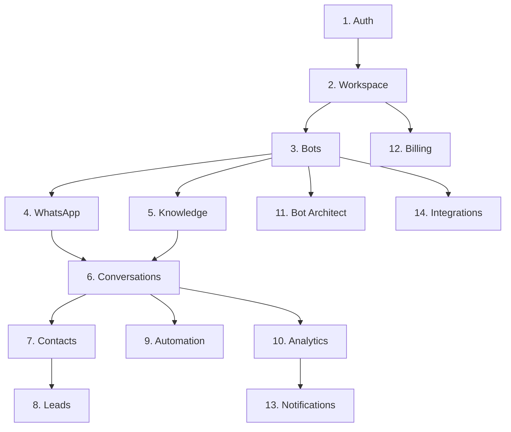

# 48 — Feature Development Order

---

## Executive Summary

This document defines the mandatory order for developing features in SoftwBot AI, ensuring dependencies are met and parallel work is minimized.

---

## Purpose

Prevent blocking dependencies and ensure efficient development flow.

---

## Dependency Graph

---

## Development Order

### Tier 1: Foundation (Weeks 1-4)

| Order | Module | Dependencies | Est. Time |
|-------|--------|--------------|-----------|
| 1 | auth | None | 3 days |
| 2 | workspace | auth | 2 days |
| 3 | shared/ui | None | 5 days |
| 4 | settings | auth, workspace | 3 days |

### Tier 2: Core (Weeks 5-8)

| Order | Module | Dependencies | Est. Time |
|-------|--------|--------------|-----------|
| 5 | bots | auth, workspace | 5 days |
| 6 | whatsapp | bots | 5 days |
| 7 | knowledge | bots | 5 days |
| 8 | shared/lib | None | 3 days |

### Tier 3: Intelligence (Weeks 9-12)

| Order | Module | Dependencies | Est. Time |
|-------|--------|--------------|-----------|
| 9 | conversations | bots, whatsapp, knowledge | 5 days |
| 10 | contacts | workspace | 3 days |
| 11 | leads | contacts, conversations | 3 days |
| 12 | automation | bots, conversations | 5 days |

### Tier 4: Growth (Weeks 13-16)

| Order | Module | Dependencies | Est. Time |
|-------|--------|--------------|-----------|
| 13 | analytics | conversations, contacts | 5 days |
| 14 | billing | workspace | 5 days |
| 15 | notifications | analytics | 3 days |
| 16 | bot-architect | bots, knowledge | 5 days |

### Tier 5: Enterprise (Weeks 17-20)

| Order | Module | Dependencies | Est. Time |
|-------|--------|--------------|-----------|
| 17 | integrations | bots | 5 days |
| 18 | broadcast | contacts, notifications | 3 days |
| 19 | team | auth, workspace | 3 days |
| 20 | api-access | auth, bots | 3 days |

---

## Parallel Development Rules

### Can Run in Parallel

| Module A | Module B | Condition |
|----------|----------|-----------|
| knowledge | whatsapp | Both depend on bots |
| contacts | automation | Both depend on conversations |
| analytics | billing | No shared dependencies |
| notifications | integrations | No shared dependencies |

### Cannot Run in Parallel

| Module A | Module B | Reason |
|----------|----------|--------|
| auth | workspace | workspace depends on auth |
| bots | conversations | conversations depends on bots |
| Any | shared/ui | shared/ui must be first |

---

## Blocking Rules

1. Never start a module before its dependencies are complete
2. Never skip a tier
3. Never start Tier 2+ before Tier 1 is complete
4. Always verify dependency status before starting

---

## Developer Notes

- Follow this order strictly
- Parallel development requires tech lead approval
- Dependency changes require order update
- Track actual vs planned time

## Future Improvements

- Automated dependency checking
- Parallel development optimization
- Critical path analysis
- Resource allocation optimization
