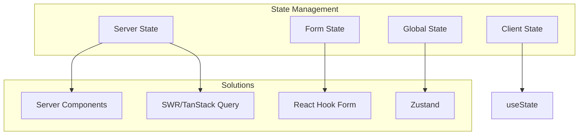

# 50 — State Management

---

## Executive Summary

This document defines the state management strategy for SoftwBot AI, covering server state, client state, form state, and global state.

---

## Purpose

Ensure predictable, maintainable, and performant state management across the application.

---

## State Types



---

## Server State

### Data fetching from Server Components

```typescript
// Server Component - Direct DB access
export default async function BotsPage() {
  const bots = await db.query.bots.findMany();
  return <BotList bots={bots} />;
}
```

### Client-side fetching with SWR

```typescript
'use client';

import useSWR from 'swr';

export function BotList() {
  const { data, error, isLoading } = useSWR('/api/v1/bots', fetcher);
  
  if (isLoading) return <Skeleton />;
  if (error) return <Error />;
  
  return data.map(bot => <BotCard key={bot.id} bot={bot} />);
}
```

### SWR Configuration

```typescript
const swrConfig = {
  revalidateOnFocus: true,
  revalidateOnReconnect: true,
  refreshInterval: 30000,  // 30 seconds
  dedupingInterval: 5000,  // 5 seconds
};
```

---

## Client State

### Local Component State

```typescript
'use client';

import { useState } from 'react';

export function BotFilter() {
  const [status, setStatus] = useState<string>('all');
  const [search, setSearch] = useState('');
  
  return (
    <div>
      <Input value={search} onChange={setSearch} />
      <Select value={status} onChange={setStatus} />
    </div>
  );
}
```

### Complex Client State

```typescript
'use client';

import { useReducer } from 'react';

interface State {
  filters: FilterState;
  sort: SortState;
  pagination: PaginationState;
}

type Action = 
  | { type: 'SET_FILTER'; payload: FilterState }
  | { type: 'SET_SORT'; payload: SortState }
  | { type: 'SET_PAGE'; payload: number };

function reducer(state: State, action: Action): State {
  switch (action.type) {
    case 'SET_FILTER':
      return { ...state, filters: action.payload };
    case 'SET_SORT':
      return { ...state, sort: action.payload };
    case 'SET_PAGE':
      return { ...state, pagination: { ...state.pagination, page: action.payload } };
  }
}
```

---

## Form State

### React Hook Form + Zod

```typescript
'use client';

import { useForm } from 'react-hook-form';
import { zodResolver } from '@hookform/resolvers/zod';
import { createBotSchema } from '@/lib/validators/bot';

export function CreateBotForm() {
  const form = useForm({
    resolver: zodResolver(createBotSchema),
    defaultValues: {
      name: '',
      description: '',
      model: 'openai/gpt-4o-mini'
    }
  });
  
  const onSubmit = form.handleSubmit(async (data) => {
    await createBot(data);
  });
  
  return (
    <form onSubmit={onSubmit}>
      <Input {...form.register('name')} />
      {form.formState.errors.name && (
        <span>{form.formState.errors.name.message}</span>
      )}
    </form>
  );
}
```

---

## Global State

### Zustand Store

```typescript
// stores/workspace-store.ts
import { create } from 'zustand';

interface WorkspaceState {
  workspace: Workspace | null;
  setWorkspace: (workspace: Workspace) => void;
  clearWorkspace: () => void;
}

export const useWorkspaceStore = create<WorkspaceState>((set) => ({
  workspace: null,
  setWorkspace: (workspace) => set({ workspace }),
  clearWorkspace: () => set({ workspace: null }),
}));
```

### UI State Store

```typescript
// stores/ui-store.ts
import { create } from 'zustand';

interface UIState {
  sidebarOpen: boolean;
  toggleSidebar: () => void;
  theme: 'light' | 'dark';
  setTheme: (theme: 'light' | 'dark') => void;
}

export const useUIStore = create<UIState>((set) => ({
  sidebarOpen: true,
  toggleSidebar: () => set((state) => ({ sidebarOpen: !state.sidebarOpen })),
  theme: 'light',
  setTheme: (theme) => set({ theme }),
}));
```

---

## State Management Rules

### When to Use What

| Scenario | Solution |
|----------|----------|
| Server data | Server Components / SWR |
| Form data | React Hook Form |
| UI toggles | useState |
| Complex client state | useReducer |
| Cross-component state | Zustand |
| Global app state | Zustand |

### Rules

1. Prefer Server Components for data
2. Use SWR for client-side data fetching
3. Use React Hook Form for all forms
4. Use Zustand sparingly (only for truly global state)
5. Never store server data in client state

---

## Real-time State

### WebSocket Updates

```typescript
'use client';

import { useEffect } from 'react';
import { useSWRConfig } from 'swr';

export function useRealtime(channel: string) {
  const { mutate } = useSWRConfig();
  
  useEffect(() => {
    const ws = new WebSocket(`${WS_URL}/${channel}`);
    
    ws.onmessage = (event) => {
      const data = JSON.parse(event.data);
      mutate(data.key);  // Revalidate SWR cache
    };
    
    return () => ws.close();
  }, [channel]);
}
```

---

## Developer Notes

- Keep state as close to where it's used as possible
- Avoid prop drilling (use context or Zustand)
- Never duplicate state
- Clean up subscriptions in useEffect

## Future Improvements

- State persistence
- State devtools
- State time-travel debugging
- State performance monitoring
