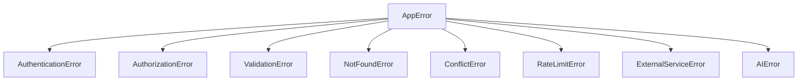

# 51 — Error Handling

---

## Executive Summary

This document defines the error handling patterns, conventions, and strategies for SoftwBot AI.

---

## Purpose

Ensure consistent, user-friendly error handling across the entire application.

---

## Error Hierarchy



---

## Error Classes

```typescript
// Base error class
class AppError extends Error {
  constructor(
    message: string,
    public code: string,
    public statusCode: number = 500,
    public metadata?: Record<string, unknown>
  ) {
    super(message);
    this.name = 'AppError';
  }
}

// Specific errors
class AuthenticationError extends AppError {
  constructor(message = 'Authentication required') {
    super(message, 'AUTHENTICATION_ERROR', 401);
  }
}

class AuthorizationError extends AppError {
  constructor(message = 'Insufficient permissions') {
    super(message, 'AUTHORIZATION_ERROR', 403);
  }
}

class ValidationError extends AppError {
  constructor(errors: ZodError) {
    super('Validation failed', 'VALIDATION_ERROR', 400, { errors });
  }
}

class NotFoundError extends AppError {
  constructor(resource: string) {
    super(`${resource} not found`, 'NOT_FOUND', 404);
  }
}

class ConflictError extends AppError {
  constructor(message: string) {
    super(message, 'CONFLICT', 409);
  }
}

class RateLimitError extends AppError {
  constructor(retryAfter: number) {
    super('Rate limit exceeded', 'RATE_LIMIT', 429, { retryAfter });
  }
}

class ExternalServiceError extends AppError {
  constructor(service: string, message: string) {
    super(`${service}: ${message}`, 'EXTERNAL_SERVICE_ERROR', 502);
  }
}

class AIError extends AppError {
  constructor(message: string, model: string) {
    super(`AI error: ${message}`, 'AI_ERROR', 500, { model });
  }
}
```

---

## API Error Handling

```typescript
// Route handler error handling
export async function POST(req: NextRequest) {
  try {
    const { userId } = await auth();
    if (!userId) throw new AuthenticationError();
    
    const body = await req.json();
    const data = createBotSchema.parse(body);  // Throws ValidationError
    
    const bot = await createBot(data);
    return NextResponse.json(bot, { status: 201 });
    
  } catch (error) {
    // Known application errors
    if (error instanceof AppError) {
      return NextResponse.json(
        { error: error.code, message: error.message },
        { status: error.statusCode }
      );
    }
    
    // Zod validation errors
    if (error instanceof z.ZodError) {
      return NextResponse.json(
        { error: 'VALIDATION_ERROR', errors: error.errors },
        { status: 400 }
      );
    }
    
    // Unexpected errors
    console.error('Unhandled error:', error);
    return NextResponse.json(
      { error: 'INTERNAL_ERROR', message: 'An unexpected error occurred' },
      { status: 500 }
    );
  }
}
```

---

## Client Error Handling

### SWR Error Handling

```typescript
'use client';

import useSWR from 'swr';

export function BotList() {
  const { data, error, isLoading } = useSWR('/api/v1/bots', fetcher);
  
  if (isLoading) return <Skeleton />;
  
  if (error) {
    if (error.status === 401) {
      return <AuthenticationRequired />;
    }
    if (error.status === 403) {
      return <AccessDenied />;
    }
    return <ErrorMessage error={error} />;
  }
  
  return <BotGrid bots={data} />;
}
```

### Form Error Handling

```typescript
'use client';

import { useForm } from 'react-hook-form';

export function CreateBotForm() {
  const form = useForm();
  const [serverError, setServerError] = useState<string | null>(null);
  
  const onSubmit = form.handleSubmit(async (data) => {
    try {
      await createBot(data);
    } catch (error) {
      if (error instanceof AppError) {
        setServerError(error.message);
      } else {
        setServerError('An unexpected error occurred');
      }
    }
  });
  
  return (
    <form onSubmit={onSubmit}>
      {serverError && <Alert variant="error">{serverError}</Alert>}
      {/* Form fields */}
    </form>
  );
}
```

---

## AI Error Handling

```typescript
async function generateResponse(
  message: string,
  bot: Bot
): Promise<AIResponse> {
  try {
    const response = await openrouter.chat({
      model: bot.model,
      messages: [...],
      temperature: bot.temperature,
    });
    
    return {
      content: response.content,
      confidence: calculateConfidence(response),
    };
    
  } catch (error) {
    // Model-specific errors
    if (error.status === 429) {
      // Rate limited - try fallback model
      return generateWithFallback(message, bot);
    }
    
    if (error.status === 503) {
      // Model unavailable - use fallback
      return generateWithFallback(message, bot);
    }
    
    // Unknown AI error
    throw new AIError(error.message, bot.model);
  }
}
```

---

## Error Logging

```typescript
interface ErrorLog {
  timestamp: Date;
  level: 'error' | 'warn' | 'info';
  code: string;
  message: string;
  metadata?: Record<string, unknown>;
  stack?: string;
  userId?: string;
  requestId?: string;
}

function logError(error: AppError, context?: Record<string, unknown>) {
  logger.error({
    timestamp: new Date(),
    level: 'error',
    code: error.code,
    message: error.message,
    metadata: error.metadata,
    stack: error.stack,
    ...context
  });
}
```

---

## User-Friendly Messages

| Error Code | User Message |
|-----------|--------------|
| AUTHENTICATION_ERROR | Please sign in to continue |
| AUTHORIZATION_ERROR | You don't have permission to do that |
| VALIDATION_ERROR | Please check your input and try again |
| NOT_FOUND | The item you're looking for doesn't exist |
| RATE_LIMIT | Too many requests. Please wait a moment. |
| EXTERNAL_SERVICE_ERROR | We're having trouble connecting. Please try again. |
| AI_ERROR | Our AI is temporarily unavailable. Please try again. |

---

## Developer Notes

- Always use typed errors
- Always log errors
- Always show user-friendly messages
- Never expose internal details
- Always provide recovery paths

## Future Improvements

- Error analytics dashboard
- Error grouping and deduplication
- Automated error recovery
- User error reporting
