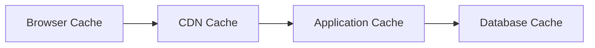

# 53 — Performance Guidelines

---

## Executive Summary

This document defines performance targets, optimization strategies, and monitoring practices for SoftwBot AI.

---

## Purpose

Ensure the application meets performance requirements and provides a fast, responsive user experience.

---

## Performance Targets

### Page Performance

| Metric | Target | Measurement |
|--------|--------|-------------|
| First Contentful Paint | < 1.5s | Lighthouse |
| Largest Contentful Paint | < 2.5s | Lighthouse |
| Time to Interactive | < 3.5s | Lighthouse |
| Total Blocking Time | < 200ms | Lighthouse |
| Cumulative Layout Shift | < 0.1 | Lighthouse |
| Lighthouse Score | > 90 | Lighthouse |

### API Performance

| Metric | Target | Measurement |
|--------|--------|-------------|
| Response time (p50) | < 100ms | APM |
| Response time (p95) | < 200ms | APM |
| Response time (p99) | < 500ms | APM |
| Error rate | < 1% | APM |
| Throughput | > 1000 rps | Load test |

### Database Performance

| Metric | Target | Measurement |
|--------|--------|-------------|
| Query time (p95) | < 50ms | pg_stat |
| Connection pool utilization | < 80% | Monitoring |
| Index hit rate | > 99% | pg_stat |

### AI Performance

| Metric | Target | Measurement |
|--------|--------|-------------|
| Response time | < 5s | Logs |
| Time to first token | < 1s | Logs |
| Token throughput | > 50 tokens/s | Logs |

---

## Optimization Strategies

### Frontend

| Strategy | Implementation |
|----------|----------------|
| Code splitting | Dynamic imports |
| Lazy loading | Next.js lazy components |
| Image optimization | Next/Image |
| Font optimization | next/font |
| Bundle analysis | @next/bundle-analyzer |

### Backend

| Strategy | Implementation |
|----------|----------------|
| Connection pooling | PgBouncer |
| Query optimization | Indexes, EXPLAIN ANALYZE |
| Caching | Redis with TTL |
| Rate limiting | Upstash Redis |
| Background jobs | BullMQ |

### Database

| Strategy | Implementation |
|----------|----------------|
| Proper indexing | B-tree, HNSW, GIN |
| Query optimization | EXPLAIN ANALYZE |
| Connection pooling | PgBouncer |
| Read replicas | Neon branching |
| Partitioning | By month for messages |

---

## Caching Strategy

### Cache Layers



### Cache TTL

| Data Type | TTL | Invalidation |
|-----------|-----|-------------|
| Static assets | 1 year | Cache busting |
| API responses | 30s | On mutation |
| Bot config | 5 min | On update |
| User session | 7 days | On logout |
| Knowledge search | 5 min | On KB update |

---

## Load Testing

### Test Scenarios

| Scenario | Users | Duration | Target |
|----------|-------|----------|--------|
| Normal load | 100 | 10 min | p95 < 200ms |
| Peak load | 500 | 5 min | p95 < 500ms |
| Stress test | 1000 | 5 min | No errors |
| Soak test | 100 | 1 hour | Stable performance |

### Load Test Tools

- k6 for API load testing
- Artillery for WebSocket testing
- Lighthouse for frontend performance

---

## Performance Budget

```json
{
  "bundleSize": {
    "total": "200KB",
    "javascript": "150KB",
    "css": "50KB"
  },
  "imageSize": {
    "total": "500KB",
    "perImage": "100KB"
  },
  "fonts": {
    "total": "100KB"
  }
}
```

---

## Performance Monitoring

### Real User Monitoring (RUM)

```typescript
// Capture performance metrics
window.addEventListener('load', () => {
  const perfData = performance.getEntriesByType('navigation')[0];
  analytics.track('page_load', {
    ttfb: perfData.responseStart,
    domComplete: perfData.domComplete,
    loadComplete: perfData.loadEventEnd,
  });
});
```

### Synthetic Monitoring

- Lighthouse CI on every PR
- Performance regression alerts
- Bundle size tracking

---

## Developer Notes

- Measure before optimizing
- Set performance budgets
- Monitor in production
- Optimize critical path first

## Future Improvements

- Edge computing
- ISR for dynamic pages
- Advanced caching strategies
- Performance AI optimization
