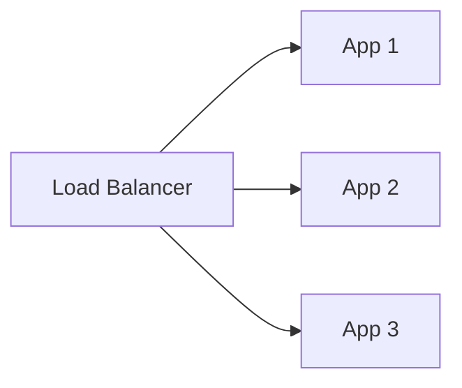
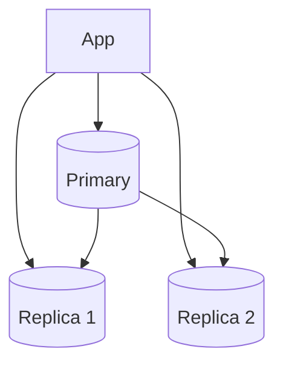
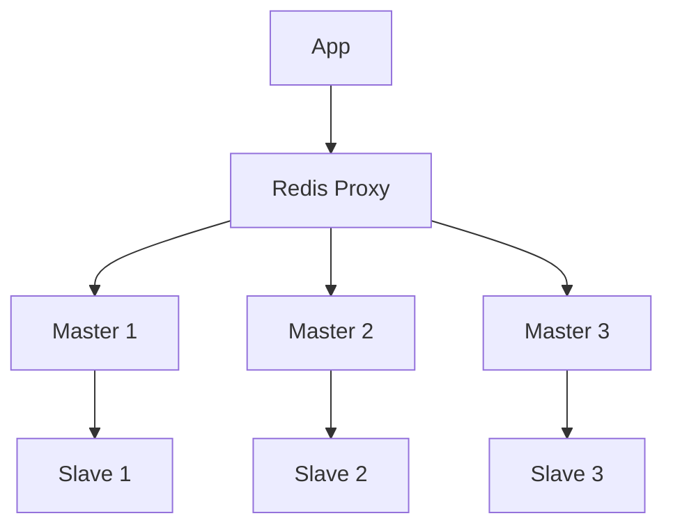
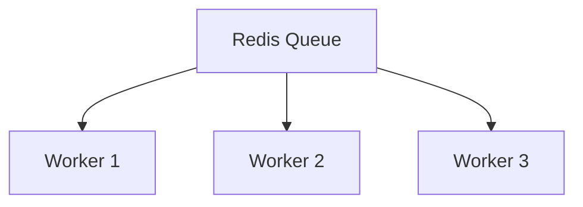

# 54 — Scaling Strategy

---

## Executive Summary

This document defines the scaling strategy for SoftwBot AI, covering horizontal scaling, database optimization, and infrastructure growth.

---

## Purpose

Ensure the system can handle growth from 100 to 100,000+ concurrent users.

---

## Scaling Phases

### Phase 1: 0-1,000 Users

| Component | Strategy | Cost |
|-----------|----------|------|
| App | Single Vercel instance | $20/mo |
| Database | Neon serverless | $20/mo |
| Redis | Upstash serverless | $10/mo |
| Storage | S3 | $5/mo |

### Phase 2: 1,000-10,000 Users

| Component | Strategy | Cost |
|-----------|----------|------|
| App | Vercel Pro + Edge | $100/mo |
| Database | Neon scale | $100/mo |
| Redis | Upstash pro | $50/mo |
| Storage | S3 | $20/mo |
| CDN | Vercel Edge | Included |

### Phase 3: 10,000-100,000 Users

| Component | Strategy | Cost |
|-----------|----------|------|
| App | Multi-region | $500/mo |
| Database | Read replicas + partitioning | $300/mo |
| Redis | Cluster | $200/mo |
| Storage | S3 + CloudFront | $100/mo |
| Monitoring | APM + logging | $200/mo |

---

## Horizontal Scaling

### Stateless Application

```typescript
// All state in Redis or Database
// No in-memory state
// Any instance can handle any request
```

### Load Balancing



### Scaling Rules

| Metric | Threshold | Action |
|--------|-----------|--------|
| CPU | > 70% | Scale up |
| Memory | > 80% | Scale up |
| Request queue | > 100 | Scale up |
| CPU | < 30% | Scale down |

---

## Database Scaling

### Read Replicas



### Connection Pooling

```typescript
// PgBouncer configuration
{
  maxConnections: 100,
  minConnections: 10,
  idleTimeout: 30000,
}
```

### Partitioning

```sql
-- Messages partitioned by month
CREATE TABLE messages_2026_07 PARTITION OF messages
    FOR VALUES FROM ('2026-07-01') TO ('2026-08-01');
```

---

## Redis Scaling

### Redis Cluster



### Cache Strategies

| Strategy | Use Case |
|----------|----------|
| Cache-aside | General caching |
| Write-through | Critical data |
| Write-behind | Analytics data |

---

## Queue Scaling

### Worker Scaling



### Queue Partitioning

```typescript
// Partition by bot ID for parallel processing
const queue = new Queue('messages', {
  connection: redis,
  prefix: `bot:${botId}`,
});
```

---

## Auto-Scaling Rules

### Vercel Auto-Scaling

- Automatic scaling on Vercel
- No configuration needed
- Scales to zero when idle

### Custom Auto-Scaling

```typescript
// AWS Auto-Scaling example
const autoScaling = new AutoScalingGroup({
  minSize: 2,
  maxSize: 10,
  targetCapacity: 50, // 50% CPU
  scaleInCooldown: 300,
  scaleOutCooldown: 60,
});
```

---

## Performance at Scale

### Optimization Checklist

- [ ] Database queries optimized
- [ ] Indexes created
- [ ] Caching implemented
- [ ] Connection pooling configured
- [ ] CDN enabled
- [ ] Images optimized
- [ ] Code splitting implemented
- [ ] Lazy loading enabled

---

## Monitoring at Scale

### Key Metrics

| Metric | Alert Threshold |
|--------|----------------|
| Request latency (p95) | > 500ms |
| Error rate | > 1% |
| Queue depth | > 1000 |
| DB connections | > 80% |
| Memory usage | > 80% |

---

## Developer Notes

- Design for scale from day 1
- Use stateless services
- Cache aggressively
- Monitor everything
- Test at scale before launch

## Future Improvements

- Multi-region deployment
- Edge computing
- Serverless optimization
- Auto-scaling automation
