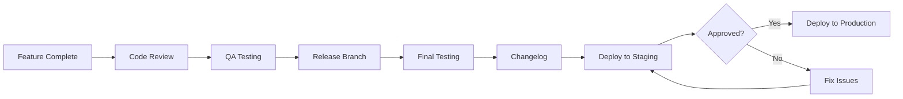
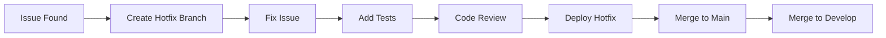

# 55 — Release Process

---

## Executive Summary

This document defines the release process, versioning strategy, and deployment procedures for SoftwBot AI.

---

## Purpose

Ensure reliable, predictable releases with minimal risk.

---

## Release Types

| Type | Frequency | Risk | Approval |
|------|-----------|------|----------|
| Patch | As needed | Low | Tech lead |
| Minor | Bi-weekly | Medium | Team lead |
| Major | Quarterly | High | Product owner |

---

## Release Process



---

## Release Branch

```bash
# Create release branch
git checkout develop
git checkout -b release/v1.2.0

# Update version
npm version 1.2.0

# Create changelog
npm run changelog

# Merge to main
git checkout main
git merge release/v1.2.0
git tag v1.2.0

# Merge back to develop
git checkout develop
git merge release/v1.2.0

# Cleanup
git branch -d release/v1.2.0
```

---

## Versioning Strategy

### Semantic Versioning

```
v<major>.<minor>.<patch>
```

| Change | Version | Example |
|--------|---------|---------|
| Breaking change | Major | v1.0.0 → v2.0.0 |
| New feature | Minor | v1.0.0 → v1.1.0 |
| Bug fix | Patch | v1.0.0 → v1.0.1 |

### Pre-release Versions

```
v1.2.0-alpha.1
v1.2.0-beta.1
v1.2.0-rc.1
```

---

## Changelog Format

```markdown
# Changelog

## [1.2.0] - 2026-07-16

### Added
- Bot Architect AI agent
- Knowledge base RAG pipeline

### Changed
- Improved AI response time by 30%

### Fixed
- Webhook delivery issue
- Memory leak in conversation handler

### Security
- Updated dependencies
```

---

## Deployment Process

### Pre-deployment

- [ ] All tests passing
- [ ] Changelog updated
- [ ] Version bumped
- [ ] Staging tested
- [ ] Documentation updated

### Deployment

1. Merge release branch to main
2. CI/CD triggers deployment
3. Verify health checks
4. Monitor error rates
5. Confirm with stakeholders

### Post-deployment

- [ ] Verify all features working
- [ ] Monitor for errors
- [ ] Check performance metrics
- [ ] Update walkthrough

---

## Rollback Process

### Automatic Rollback

```typescript
// Health check triggers rollback
if (errorRate > 5%) {
  await rollback();
  await notify('Rollback triggered due to high error rate');
}
```

### Manual Rollback

```bash
# Rollback to previous version
git checkout v1.1.0
npm run deploy

# Or use Vercel rollback
vercel rollback
```

### Rollback Criteria

| Condition | Action |
|-----------|--------|
| Error rate > 5% | Automatic rollback |
| p95 latency > 2s | Manual review |
| Data corruption | Immediate rollback |
| Security vulnerability | Immediate rollback |

---

## Hotfix Process



---

## Release Checklist

### Before Release

- [ ] All features complete
- [ ] All tests passing
- [ ] Code review complete
- [ ] Documentation updated
- [ ] Changelog updated
- [ ] Version bumped
- [ ] Staging tested

### During Release

- [ ] Deploy to production
- [ ] Verify health checks
- [ ] Monitor error rates
- [ ] Check performance

### After Release

- [ ] Verify features working
- [ ] Monitor for issues
- [ ] Notify stakeholders
- [ ] Update walkthrough

---

## Developer Notes

- Never skip release testing
- Always update changelog
- Always tag releases
- Always have rollback plan
- Always monitor after deploy

## Future Improvements

- Automated release notes
- Blue-green deployments
- Canary releases
- Feature flags
