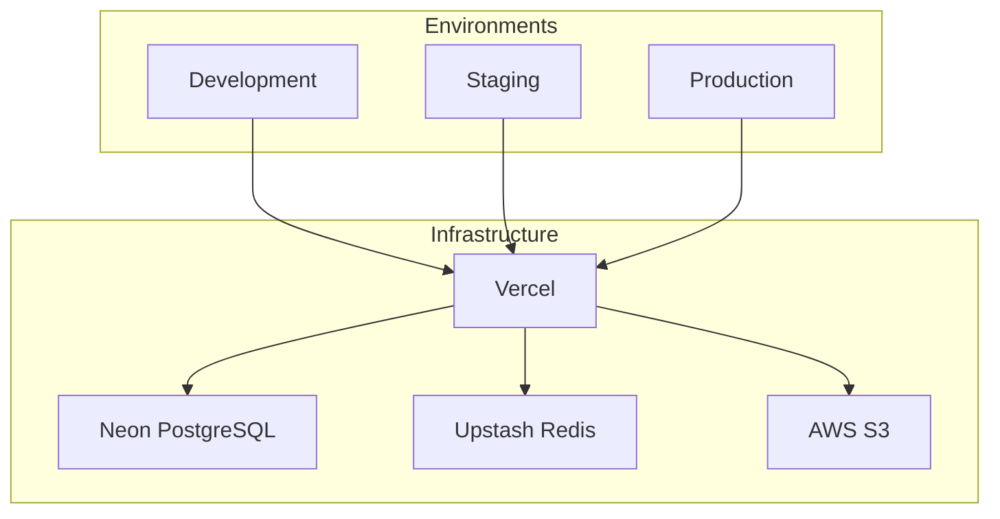
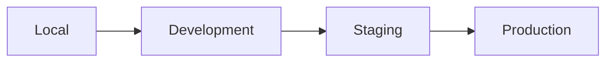
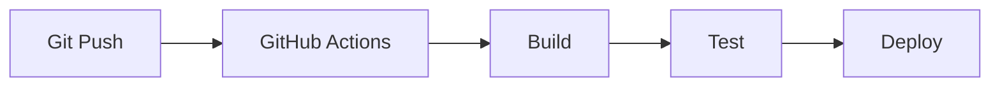
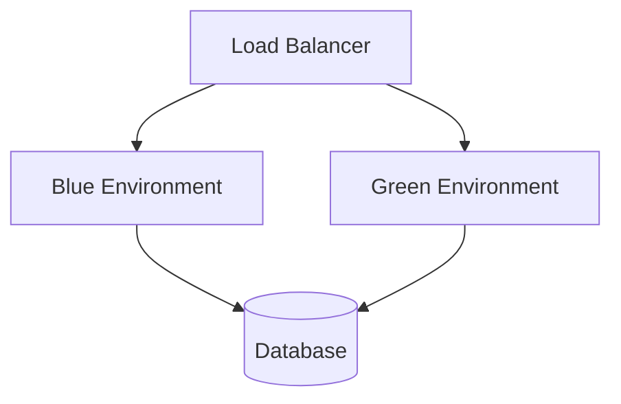
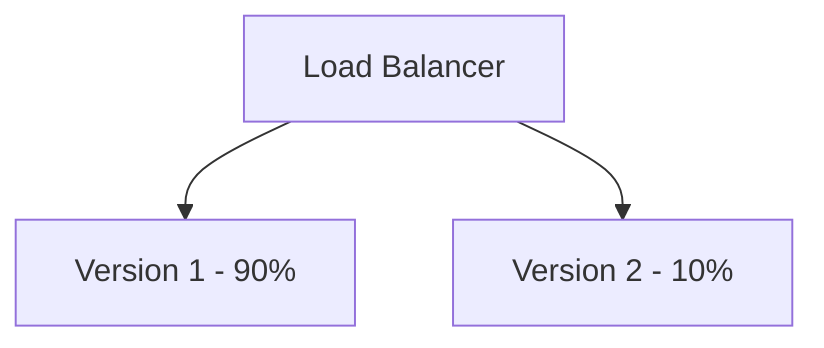

# 57 — Deployment Strategy

---

## Executive Summary

This document defines the deployment strategy, infrastructure, and procedures for SoftwBot AI.

---

## Purpose

Ensure reliable, consistent deployments across all environments.

---

## Deployment Architecture



---

## Environment Configuration

### Environment Variables

| Variable | Development | Staging | Production |
|----------|------------|---------|------------|
| DATABASE_URL | Local DB | Staging DB | Production DB |
| REDIS_URL | Local Redis | Staging Redis | Production Redis |
| STRIPE_SECRET_KEY | Test key | Test key | Live key |
| OPENROUTER_API_KEY | Test key | Test key | Live key |

### Environment Promotion



---

## Deployment Process

### Automated Deployment



### Manual Deployment

```bash
# Deploy to staging
npm run deploy:staging

# Deploy to production
npm run deploy:production

# Rollback
npm run rollback
```

---

## Deployment Checklist

### Pre-deployment

- [ ] All tests passing
- [ ] Code review complete
- [ ] Documentation updated
- [ ] Changelog updated
- [ ] Version bumped
- [ ] Environment variables configured

### Deployment

- [ ] Build successful
- [ ] Deploy to staging
- [ ] Staging tests pass
- [ ] Deploy to production
- [ ] Health checks pass
- [ ] Monitor error rates

### Post-deployment

- [ ] Verify features working
- [ ] Check performance metrics
- [ ] Monitor for issues
- [ ] Notify stakeholders
- [ ] Update walkthrough

---

## Infrastructure as Code

### Vercel Configuration

```json
{
  "version": 2,
  "builds": [
    {
      "src": "package.json",
      "use": "@vercel/next"
    }
  ],
  "routes": [
    {
      "src": "/api/(.*)",
      "dest": "/api/$1"
    }
  ]
}
```

### Database Migrations

```bash
# Generate migration
npx drizzle-kit generate

# Run migration
npx drizzle-kit migrate

# Push schema changes
npx drizzle-kit push
```

---

## Deployment Strategies

### Blue-Green Deployment



### Canary Deployment



---

## Rollback Procedures

### Automatic Rollback

```typescript
// Health check triggers rollback
if (errorRate > 5% || latency > 2000) {
  await triggerRollback();
}
```

### Manual Rollback

```bash
# Vercel rollback
vercel rollback

# Git rollback
git revert HEAD
git push
```

---

## Monitoring Post-deployment

### Key Metrics

| Metric | Alert Threshold |
|--------|----------------|
| Error rate | > 5% |
| Response time (p95) | > 1s |
| Health check | Failing |

### Monitoring Tools

- Sentry for error tracking
- Vercel Analytics for performance
- Custom health checks

---

## Developer Notes

- Never skip staging testing
- Always have rollback plan
- Always monitor after deploy
- Always document deployments

## Future Improvements

- Multi-region deployment
- Edge deployment
- Infrastructure as code
- Deployment automation
