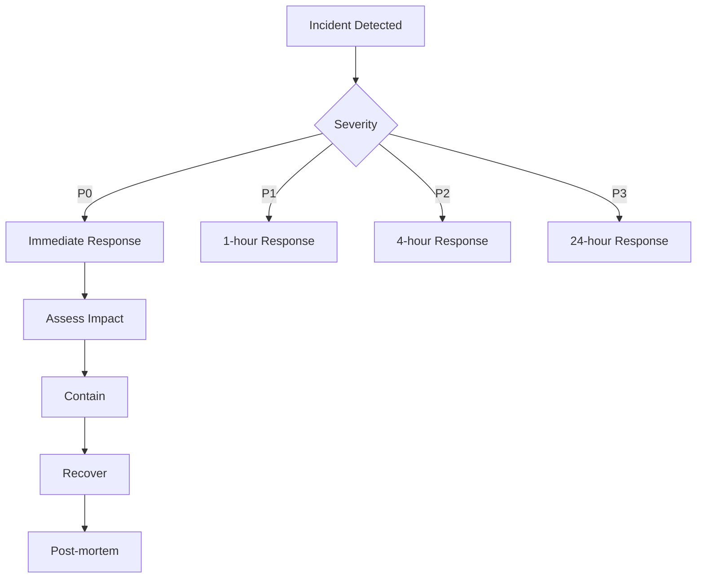
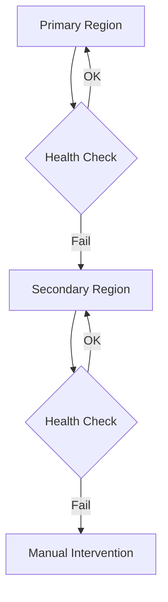

# 58 — Disaster Recovery

---

## Executive Summary

This document defines the disaster recovery plan for SoftwBot AI, covering backup, restoration, and business continuity.

---

## Purpose

Ensure the system can recover from failures with minimal data loss and downtime.

---

## Recovery Objectives

| Metric | Target | Description |
|--------|--------|-------------|
| RPO | < 1 hour | Maximum data loss |
| RTO | < 4 hours | Maximum downtime |
| MTTR | < 1 hour | Mean time to recovery |

---

## Disaster Scenarios

### Scenario 1: Database Failure

| Impact | High |
|--------|------|
| Probability | Low |
| Recovery | Restore from backup |
| RTO | 2 hours |

### Scenario 2: Application Failure

| Impact | Medium |
|--------|--------|
| Probability | Medium |
| Recovery | Redeploy |
| RTO | 30 minutes |

### Scenario 3: Data Corruption

| Impact | Critical |
|--------|----------|
| Probability | Low |
| Recovery | Point-in-time restore |
| RTO | 4 hours |

### Scenario 4: Security Breach

| Impact | Critical |
|--------|----------|
| Probability | Low |
| Recovery | Incident response |
| RTO | 24 hours |

---

## Backup Strategy

### Database Backups

| Type | Frequency | Retention |
|------|-----------|-----------|
| Automated | Daily | 30 days |
| Manual | Before migrations | Permanent |
| Point-in-time | Continuous | 7 days |

### File Backups

| Type | Frequency | Retention |
|------|-----------|-----------|
| S3 versioning | Continuous | 90 days |
| Cross-region | Daily | 30 days |

### Configuration Backups

| Type | Frequency | Retention |
|------|-----------|-----------|
| Environment vars | On change | Permanent |
| Secrets | On change | Permanent |
| Config files | On change | Permanent |

---

## Restoration Procedures

### Database Restoration

```bash
# Neon point-in-time restore
neonctl branches restore --branch-id <branch-id> --parent <parent-id>

# Or restore to specific time
neonctl branches restore --branch-id <branch-id> --parent <parent-id> --restore-to-time "2026-07-16T10:00:00Z"
```

### File Restoration

```bash
# S3 restore from version
aws s3api get-object --bucket my-bucket --key file.txt --version-id <version-id> restored-file.txt
```

### Application Restoration

```bash
# Redeploy to Vercel
vercel --prod

# Or rollback to previous version
vercel rollback
```

---

## Incident Response

### Severity Levels

| Level | Description | Response Time |
|-------|------------|---------------|
| P0 | System down | 15 minutes |
| P1 | Major feature broken | 1 hour |
| P2 | Minor feature broken | 4 hours |
| P3 | Cosmetic issue | 24 hours |

### Response Process



### Communication Plan

| Audience | Method | Frequency |
|----------|--------|-----------|
| Internal | Slack | Every 30 min |
| Customers | Status page | Every 1 hour |
| Stakeholders | Email | Every 2 hours |

---

## Business Continuity

### Critical Functions

| Function | Priority | Backup |
|----------|----------|--------|
| WhatsApp messaging | P0 | Multi-region |
| AI responses | P0 | Fallback models |
| Dashboard | P1 | Static hosting |
| Analytics | P2 | Delayed processing |

### Failover Strategy



---

## Testing Recovery

### Recovery Drills

| Drill | Frequency | Duration |
|-------|-----------|----------|
| Database restore | Monthly | 1 hour |
| Application redeploy | Monthly | 30 minutes |
| Full disaster recovery | Quarterly | 4 hours |

### Drill Checklist

- [ ] Backup integrity verified
- [ ] Restoration successful
- [ ] Application functional
- [ ] Data integrity confirmed
- [ ] Performance acceptable

---

## Developer Notes

- Test recovery procedures regularly
- Document all recovery steps
- Keep backups verified
- Monitor backup health

## Future Improvements

- Automated failover
- Multi-region deployment
- Chaos engineering
- Recovery automation
