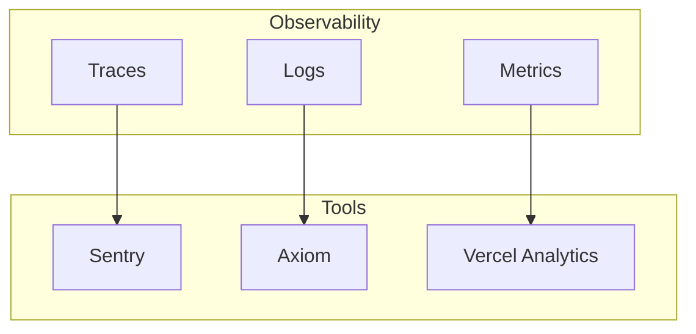

# 60 — Observability

---

## Executive Summary

This document defines the observability stack for SoftwBot AI, covering logging, metrics, tracing, and alerting.

---

## Purpose

Ensure complete visibility into application behavior and performance.

---

## Observability Pillars



---

## Logging

### Structured Logging

```typescript
interface LogEntry {
  timestamp: string;
  level: 'error' | 'warn' | 'info' | 'debug';
  message: string;
  service: string;
  requestId: string;
  userId?: string;
  metadata?: Record<string, unknown>;
}
```

### Log Destinations

| Type | Destination | Retention |
|------|------------|-----------|
| Application | Axiom | 30 days |
| Access | Vercel | 30 days |
| Error | Sentry | 90 days |
| Audit | PostgreSQL | 1 year |

---

## Metrics

### Business Metrics

| Metric | Description | Target |
|--------|-------------|--------|
| Active bots | Bots handling conversations | Growing |
| Messages/day | Total messages processed | > 10,000 |
| MRR | Monthly recurring revenue | > $50,000 |
| Churn rate | Monthly customer churn | < 5% |

### Technical Metrics

| Metric | Description | Target |
|--------|-------------|--------|
| Request latency (p95) | API response time | < 200ms |
| Error rate | Failed requests | < 1% |
| Uptime | System availability | > 99.9% |
| AI response time | Bot response latency | < 5s |

---

## Distributed Tracing

### Trace Structure

```typescript
interface Trace {
  traceId: string;
  spanId: string;
  parentSpanId?: string;
  operation: string;
  startTime: Date;
  endTime: Date;
  status: 'ok' | 'error';
  attributes: Record<string, unknown>;
}
```

### Span Types

| Span | Description |
|------|------------|
| HTTP Request | Incoming API request |
| Database Query | SQL query execution |
| AI Call | OpenRouter API call |
| WhatsApp Message | Message send/receive |
| Queue Job | Background job processing |

---

## Alerting

### Alert Rules

| Alert | Condition | Severity | Channel |
|-------|-----------|----------|---------|
| High Error Rate | > 5% for 5 min | Critical | Slack + PagerDuty |
| High Latency | p95 > 1s for 5 min | High | Slack |
| Queue Backlog | > 1000 jobs | High | Slack |
| DB Connection Pool | > 80% | Medium | Slack |
| Memory Usage | > 80% | Medium | Slack |
| Disk Usage | > 90% | High | Slack |

### Alert Channels

| Channel | Use Case |
|---------|----------|
| Slack | General alerts |
| PagerDuty | Critical incidents |
| Email | Daily summaries |
| SMS | P0 incidents |

---

## Dashboards

### Operations Dashboard

- Request rate
- Error rate
- Latency percentiles
- Active connections
- Queue depth

### Business Dashboard

- Active users
- Active bots
- Messages processed
- Revenue
- Churn

### AI Dashboard

- AI response time
- Token usage
- Model distribution
- Fallback rate
- Cost per request

---

## Dashboard Access

| Dashboard | URL | Access |
|-----------|-----|--------|
| Operations | /admin/ops | Engineering |
| Business | /admin/business | Product |
| AI | /admin/ai | AI Team |
| Security | /admin/security | Security |

---

## Developer Notes

- Always include context in logs
- Never log sensitive data
- Use structured logging
- Set meaningful alerts

## Future Improvements

- AI-powered anomaly detection
- Predictive alerting
- Automated remediation
- Observability AI assistant
