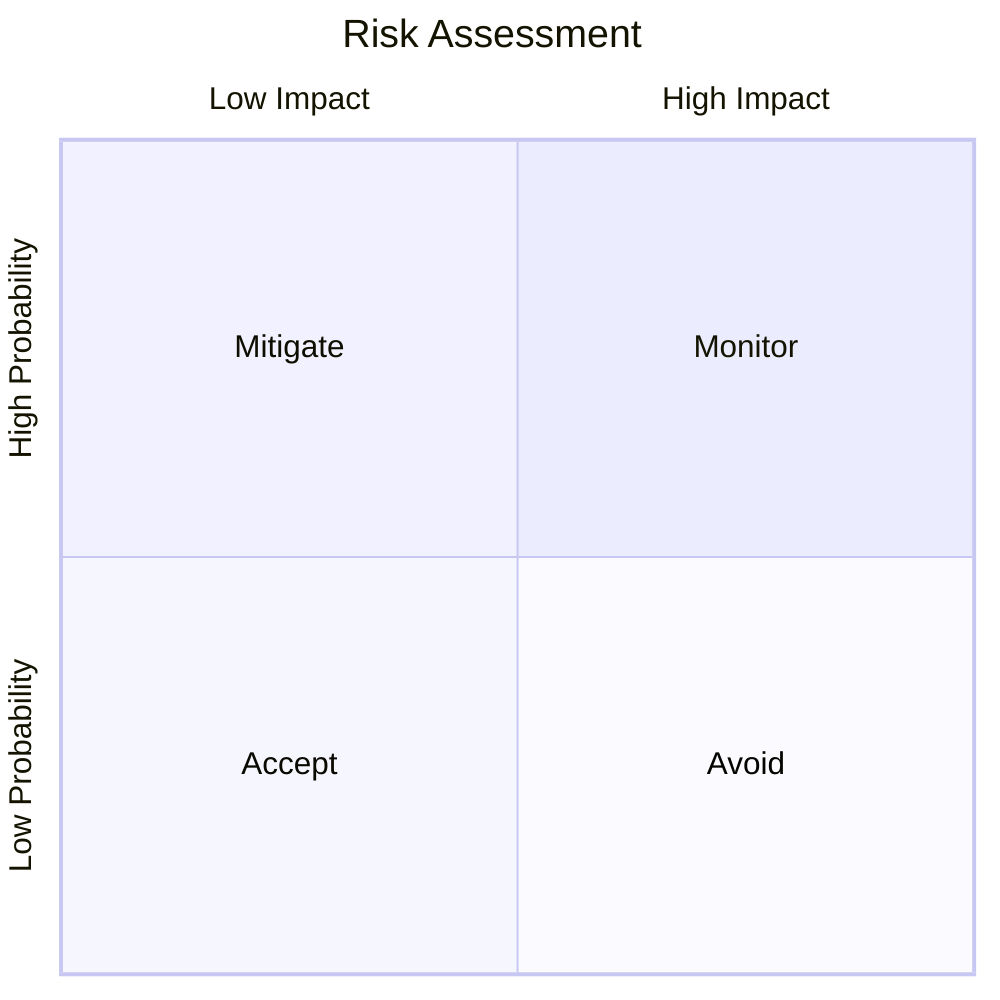

# 65 — Risk Management

---

## Executive Summary

This document defines the risk management process for SoftwBot AI, covering identification, assessment, mitigation, and monitoring.

---

## Purpose

Proactively identify and mitigate risks before they impact the project.

---

## Risk Register

### Technical Risks

| Risk | Probability | Impact | Score | Mitigation |
|------|------------|--------|-------|------------|
| WhatsApp blocks whatsapp-web.js | Medium | Critical | High | Monitor policy; prepare Official API fallback |
| AI API costs exceed revenue | Medium | High | Medium | Usage caps; model optimization; cost monitoring |
| Database scaling bottlenecks | Medium | High | Medium | Read replicas; partitioning; caching |
| AI model quality insufficient | Low | Critical | Medium | Prompt engineering; model selection; QA testing |
| Security breach | Low | Critical | Medium | Security audit; encryption; monitoring |

### Business Risks

| Risk | Probability | Impact | Score | Mitigation |
|------|------------|--------|-------|------------|
| Competitor launches similar product | High | Medium | Medium | Move fast; focus on differentiation |
| Low user adoption | Medium | High | Medium | Beta testing; user feedback; marketing |
| Pricing too high | Medium | Medium | Low | User research; competitive analysis |
| Regulatory changes | Low | High | Low | Legal review; compliance monitoring |

### Operational Risks

| Risk | Probability | Impact | Score | Mitigation |
|------|------------|--------|-------|------------|
| Key person dependency | Medium | High | Medium | Documentation; knowledge sharing |
| Infrastructure failure | Low | High | Low | DR plan; backups; monitoring |
| Third-party service outage | Medium | Medium | Low | Fallbacks; monitoring; SLAs |

---

## Risk Assessment Matrix



### Scoring

| Score | Probability × Impact | Action |
|-------|---------------------|--------|
| Critical | High × High | Avoid |
| High | High × Medium or Medium × High | Mitigate |
| Medium | Medium × Medium | Monitor |
| Low | Low × Low | Accept |

---

## Risk Response Strategies

### Avoid

- Change plan to eliminate risk
- Example: Use Official WhatsApp API instead of web.js

### Mitigate

- Reduce probability or impact
- Example: Implement rate limiting to prevent abuse

### Transfer

- Shift risk to third party
- Example: Use managed services (Neon, Upstash)

### Accept

- Acknowledge and monitor
- Example: Minor cosmetic issues

---

## Risk Monitoring

### Weekly Review

- Review risk register
- Update scores
- Check mitigation progress
- Identify new risks

### Monthly Review

- Comprehensive risk assessment
- Update mitigation plans
- Report to stakeholders

---

## Risk Log

```markdown
## Risk Log

### [Date] — [Risk Description]
- **Status:** Open/Mitigated/Closed
- **Score:** [Score]
- **Mitigation:** [Action taken]
- **Owner:** [Person]
- **Update:** [Latest status]
```

---

## Developer Notes

- Risk management is ongoing
- Everyone can identify risks
- Escalate critical risks immediately
- Document all risk decisions

## Future Improvements

- Automated risk detection
- Risk analytics dashboard
- Risk prediction models
- Risk response automation
