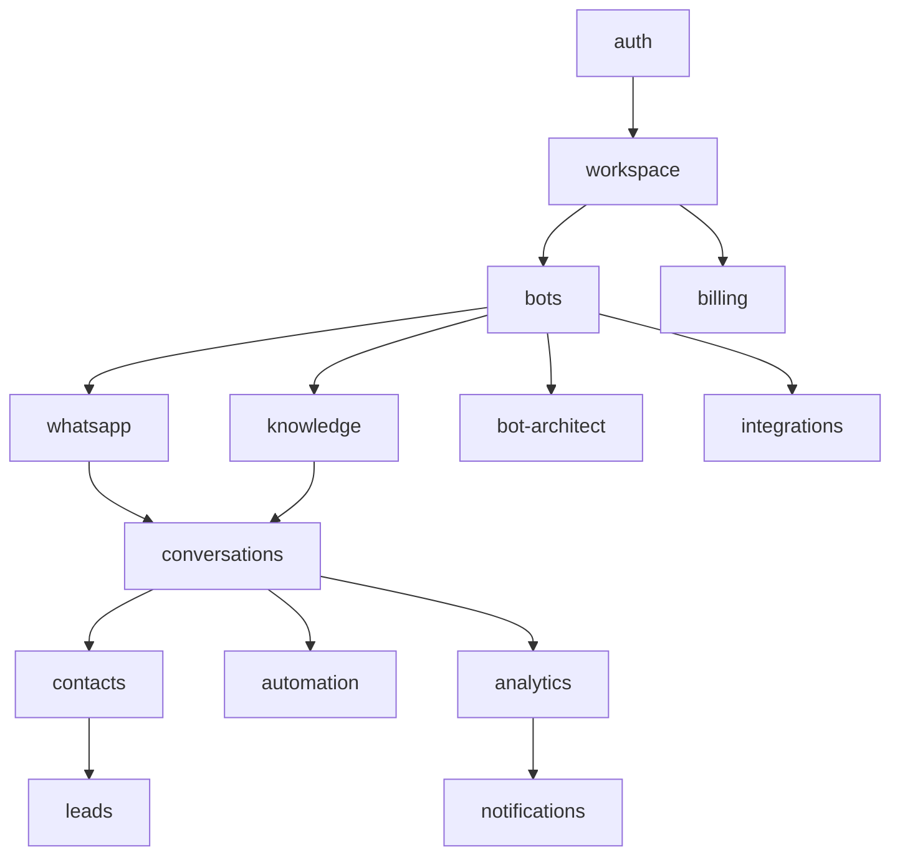

# 66 — Dependency Map

---

## Executive Summary

This document maps all external and internal dependencies for SoftwBot AI.

---

## Purpose

Track dependencies, their status, and fallback strategies.

---

## External Dependencies

### Critical (P0)

| Dependency | Purpose | Version | Risk | Fallback |
|-----------|---------|---------|------|----------|
| Next.js | Framework | 16.x | Low | Remix |
| PostgreSQL | Database | 14+ | Low | MySQL |
| Clerk | Authentication | Latest | Low | Auth0 |
| Stripe | Payments | Latest | Low | Paddle |
| OpenRouter | AI Gateway | Latest | Medium | Direct API |
| whatsapp-web.js | WhatsApp | Latest | High | Official API |

### Important (P1)

| Dependency | Purpose | Version | Risk | Fallback |
|-----------|---------|---------|------|----------|
| Redis | Cache/Queues | 7+ | Low | Memcached |
| S3 | File Storage | - | Low | GCS |
| Drizzle ORM | Database | Latest | Low | Prisma |
| Tailwind CSS | Styling | 4.x | Low | CSS Modules |
| Shadcn UI | Components | Latest | Low | Radix UI |

### Optional (P2)

| Dependency | Purpose | Version | Risk | Fallback |
|-----------|---------|---------|------|----------|
| Framer Motion | Animation | Latest | Low | CSS Animation |
| React Hook Form | Forms | Latest | Low | Formik |
| Zod | Validation | Latest | Low | Yup |
| SWR | Data Fetching | Latest | Low | TanStack Query |

---

## Internal Dependencies

### Module Dependencies



---

## Dependency Health Monitoring

### Health Checks

```typescript
interface DependencyHealth {
  name: string;
  status: 'healthy' | 'degraded' | 'unhealthy';
  latency: number;
  lastCheck: Date;
  version: string;
}
```

### Monitoring Rules

| Condition | Action |
|-----------|--------|
| Unhealthy | Alert immediately |
| Degraded | Alert after 5 min |
| Version outdated | Log for review |

---

## Version Management

### Update Strategy

| Type | Frequency | Process |
|------|-----------|---------|
| Security patch | Immediate | Automated |
| Minor update | Monthly | Review + test |
| Major update | Quarterly | Planning + test |

### Update Process

1. Check changelog for breaking changes
2. Test in development
3. Test in staging
4. Deploy to production
5. Monitor for issues

---

## License Compliance

| Dependency | License | Commercial Use |
|-----------|---------|----------------|
| Next.js | MIT | ✅ |
| React | MIT | ✅ |
| Drizzle | Apache 2.0 | ✅ |
| Tailwind | MIT | ✅ |
| Shadcn | MIT | ✅ |

---

## Developer Notes

- Review dependencies quarterly
- Monitor for security vulnerabilities
- Document all dependency changes
- Have fallback plans for critical deps

## Future Improvements

- Automated dependency updates
- Dependency analytics
- License compliance automation
- Supply chain security
