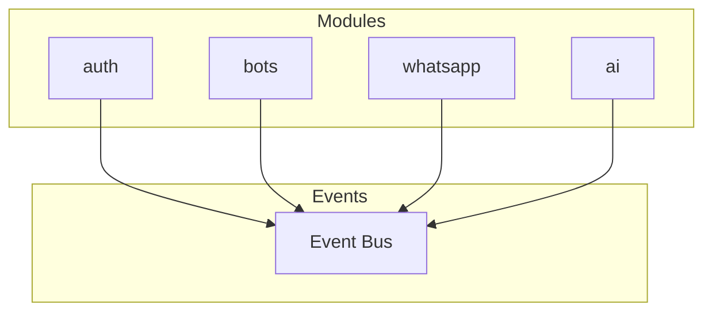
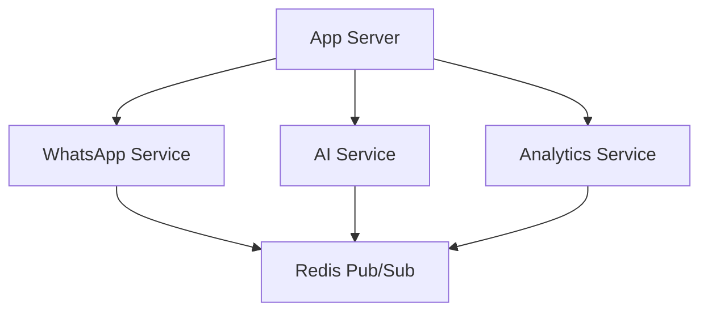
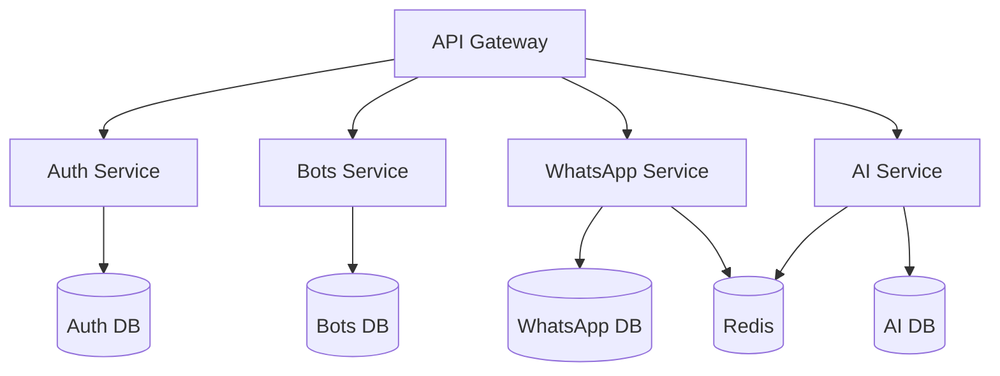

# 73 — Future Architecture

---

## Executive Summary

This document outlines the planned architectural evolution for SoftwBot AI.

---

## Purpose

Provide a roadmap for scaling and evolving the architecture.

---

## Current Architecture

### Monolith

- Next.js App Router
- PostgreSQL + pgvector
- Redis (Upstash)
- whatsapp-web.js
- OpenRouter (AI)

---

## Phase 2: Modular Monolith

### Changes

- Feature-based modules
- Shared AI core
- Event-driven communication
- Improved caching

---

## Phase 3: Service Extraction

### Candidates

| Service | Reason | Priority |
|---------|--------|----------|
| WhatsApp Engine | Resource-intensive | High |
| AI Processing | Independent scaling | High |
| Analytics | Read-heavy workload | Medium |
| Notifications | Background processing | Medium |

### Communication

---

## Phase 4: Microservices

### Architecture

---

## Technology Evolution

### Current → Future

| Component | Current | Future |
|-----------|---------|--------|
| Framework | Next.js | Next.js + Edge |
| Database | PostgreSQL | PostgreSQL + Aurora |
| Cache | Redis | Redis Cluster |
| AI | OpenRouter | Multi-provider |
| WhatsApp | whatsapp-web.js | Official API |
| Queue | BullMQ | SQS/Kafka |
| Storage | S3 | S3 + CDN |

---

## Scalability Targets

| Metric | Current | Phase 2 | Phase 3 | Phase 4 |
|--------|---------|---------|---------|---------|
| Users | 1K | 10K | 100K | 1M |
| Bots | 500 | 5K | 50K | 500K |
| Messages/day | 10K | 100K | 1M | 10M |
| Concurrent | 100 | 1K | 10K | 100K |

---

## Migration Strategy

### Principles

1. Strangler Fig pattern
2. Feature flags for rollout
3. Backward compatibility
4. Rollback capability
5. Monitoring at each step

### Process

1. Extract service
2. Run in parallel
3. Validate behavior
4. Switch traffic
5. Remove old code

---

## Developer Notes

- Architecture evolves incrementally
- No big bang rewrites
- Measure before optimizing
- Document architectural decisions

## Future Improvements

- Event sourcing
- CQRS pattern
- Domain-driven design
- GraphQL federation
