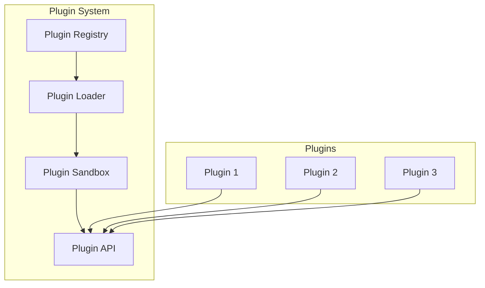
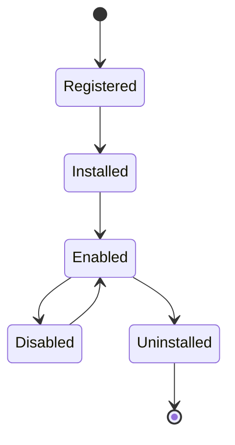

# 74 — Plugin System

---

## Executive Summary

This document defines the plugin system architecture for SoftwBot AI.

---

## Purpose

Enable extensibility through third-party and custom plugins.

---

## Plugin Architecture



---

## Plugin Interface

```typescript
interface Plugin {
  id: string;
  name: string;
  version: string;
  description: string;
  author: string;
  
  // Lifecycle
  onInstall?: () => Promise<void>;
  onUninstall?: () => Promise<void>;
  onEnable?: () => Promise<void>;
  onDisable?: () => Promise<void>;
  
  // Hooks
  hooks: {
    'message:before'?: (message: Message) => Promise<Message>;
    'message:after'?: (response: Response) => Promise<Response>;
    'conversation:start'?: (conversation: Conversation) => Promise<void>;
    'conversation:end'?: (conversation: Conversation) => Promise<void>;
  };
  
  // API extensions
  api?: Record<string, (...args: unknown[]) => unknown>;
  
  // UI extensions
  ui?: {
    dashboard?: Component[];
    settings?: Component[];
  };
}
```

---

## Plugin Types

### Conversation Plugins

- Modify AI responses
- Add custom actions
- Integrate external services

### Analytics Plugins

- Custom metrics
- External reporting
- Data export

### Integration Plugins

- CRM integration
- Payment processing
- Communication channels

### UI Plugins

- Custom dashboard widgets
- Settings panels
- Notification channels

---

## Plugin Lifecycle



---

## Plugin API

### Available Methods

```typescript
interface PluginAPI {
  // Data access
  getBot(id: string): Promise<Bot>;
  getConversation(id: string): Promise<Conversation>;
  getContact(id: string): Promise<Contact>;
  
  // Actions
  sendMessage(conversationId: string, content: string): Promise<void>;
  updateContact(id: string, data: Partial<Contact>): Promise<void>;
  
  // Events
  emit(event: string, data: unknown): void;
  on(event: string, handler: EventHandler): void;
  
  // Storage
  storage: {
    get(key: string): Promise<unknown>;
    set(key: string, value: unknown): Promise<void>;
  };
  
  // UI
  ui: {
    showToast(message: string, type: 'success' | 'error'): void;
    showDialog(config: DialogConfig): Promise<unknown>;
  };
}
```

---

## Plugin Security

### Sandboxing

- Plugins run in isolated context
- No direct database access
- No access to other plugins
- Limited API access

### Permissions

```typescript
interface PluginPermissions {
  read: string[];    // Read access
  write: string[];   // Write access
  api: string[];     // API access
  ui: string[];      // UI access
}
```

### Approval Process

1. Developer submits plugin
2. Automated security scan
3. Manual review
4. Approval/rejection
5. Published to marketplace

---

## Plugin Configuration

```json
{
  "id": "my-plugin",
  "name": "My Plugin",
  "version": "1.0.0",
  "config": {
    "apiKey": "",
    "enabled": true
  },
  "permissions": {
    "read": ["conversations"],
    "write": ["contacts"]
  }
}
```

---

## Plugin Development

### Project Structure

```
my-plugin/
├── src/
│   ├── index.ts         # Plugin entry
│   ├── hooks/           # Hook implementations
│   ├── api/             # API extensions
│   └── ui/              # UI components
├── package.json
├── plugin.json          # Plugin manifest
└── README.md
```

### Manifest

```json
{
  "id": "my-plugin",
  "name": "My Plugin",
  "version": "1.0.0",
  "description": "Description",
  "author": "Author",
  "hooks": ["message:before", "message:after"],
  "permissions": ["read:conversations"]
}
```

---

## Developer Notes

- Plugins must be sandboxed
- Plugins must be versioned
- Plugins must be tested
- Plugins must be documented

## Future Improvements

- Plugin marketplace
- Plugin analytics
- Plugin monetization
- Plugin templates
