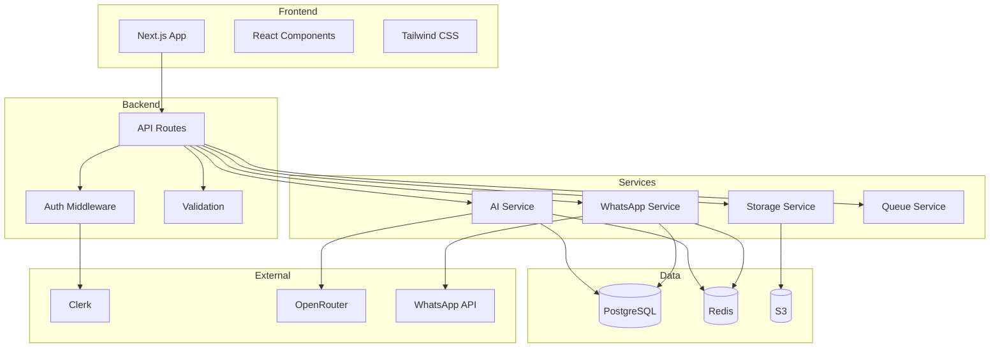
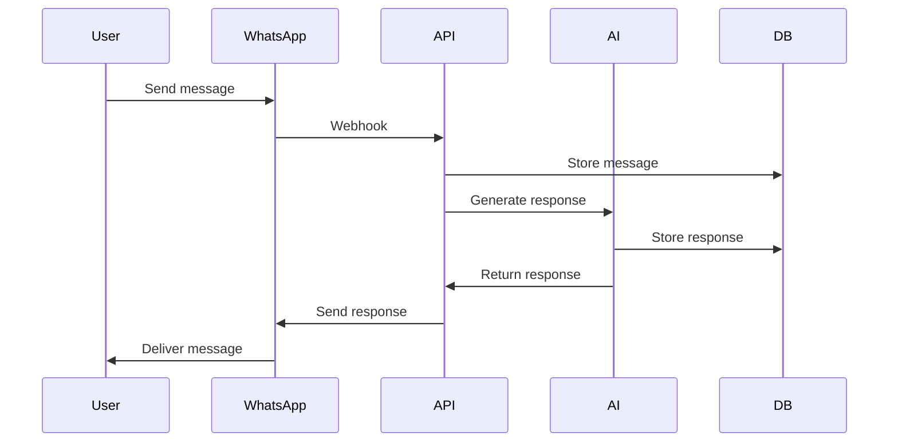
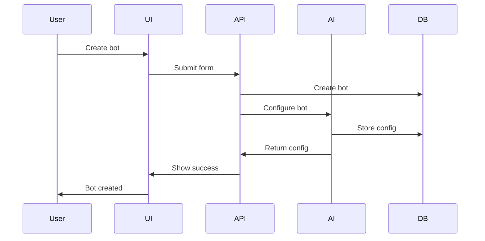

# Architecture Summary

---

## Executive Summary

This document provides a high-level architecture summary.

---

## Purpose

Quick reference for understanding the system architecture.

---

## System Overview

---

## Key Components

### Frontend

| Component | Technology | Purpose |
|-----------|-----------|---------|
| Framework | Next.js 16 | App router, SSR |
| UI | Shadcn UI | Components |
| Styling | Tailwind CSS | Design system |
| State | Zustand | Client state |
| Animation | Framer Motion | Transitions |

### Backend

| Component | Technology | Purpose |
|-----------|-----------|---------|
| API | Next.js API Routes | Endpoints |
| Auth | Clerk | Authentication |
| Validation | Zod | Input validation |
| ORM | Drizzle | Database access |
| Cache | ioredis | Redis client |

### Services

| Component | Technology | Purpose |
|-----------|-----------|---------|
| AI | OpenRouter | LLM gateway |
| WhatsApp | whatsapp-web.js | Messaging |
| Storage | AWS S3 | File storage |
| Queue | BullMQ | Job processing |

---

## Data Flow

### Message Flow

### Bot Creation Flow

---

## Security Layers

| Layer | Technology | Purpose |
|-------|-----------|---------|
| Authentication | Clerk | User identity |
| Authorization | RBAC | Access control |
| Validation | Zod | Input sanitization |
| Encryption | AES-256 | Data protection |
| Rate Limiting | Redis | Abuse prevention |

---

## Scalability

### Current Capacity

| Metric | Capacity |
|--------|----------|
| Users | 1,000 |
| Bots | 500 |
| Messages/day | 10,000 |
| Storage | 100GB |

### Scaling Strategy

| Component | Strategy |
|-----------|----------|
| Frontend | CDN, edge functions |
| Backend | Serverless functions |
| Database | Read replicas |
| Cache | Cluster mode |
| Storage | CDN, lifecycle |

---

## Developer Notes

- This is a quick reference
- See detailed docs for specifics
- Keep this updated
- Review architecture regularly

## Future Improvements

- Interactive architecture diagrams
- Architecture decision records
- Performance benchmarks
- Cost analysis
