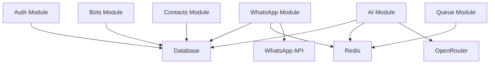

# Dependency Analysis

---

## Executive Summary

This document analyzes all project dependencies.

---

## Purpose

Ensure proper dependency management and planning.

---

## External Dependencies

### Infrastructure

| Dependency | Version | Purpose | Critical |
|-----------|---------|---------|----------|
| Node.js | 18+ | Runtime | Yes |
| PostgreSQL | 15+ | Database | Yes |
| Redis | 7+ | Cache | Yes |
| Docker | 24+ | Containerization | No |

### Services

| Dependency | Purpose | Critical | Fallback |
|-----------|---------|----------|----------|
| Clerk | Authentication | Yes | Custom auth |
| Neon | Database hosting | Yes | Supabase |
| Upstash | Redis hosting | Yes | Redis Labs |
| OpenRouter | AI gateway | Yes | Direct APIs |
| AWS S3 | File storage | Yes | Cloudflare R2 |
| Green API | WhatsApp | Yes | WPPConnect |
| Vercel | Hosting | Yes | AWS |
| Sentry | Monitoring | No | LogRocket |
| Resend | Emails | No | SendGrid |

### Libraries

| Dependency | Version | Purpose | Critical |
|-----------|---------|---------|----------|
| Next.js | 16+ | Framework | Yes |
| React | 19+ | UI library | Yes |
| TypeScript | 5+ | Type safety | Yes |
| Drizzle ORM | 0.39+ | Database ORM | Yes |
| Tailwind CSS | 4+ | Styling | Yes |
| Shadcn UI | Latest | Components | Yes |
| Framer Motion | 12+ | Animations | No |
| Zod | 3+ | Validation | Yes |
| OpenAI | 5+ | AI SDK | Yes |
| whatsapp-web.js | 1.26+ | WhatsApp | Yes |
| BullMQ | 5+ | Job queue | Yes |
| ioredis | 5+ | Redis client | Yes |

---

## Internal Dependencies

### Module Dependencies

### Feature Dependencies

| Feature | Depends On |
|---------|------------|
| Bot creation | Auth, Database |
| WhatsApp messaging | Auth, Database, Redis |
| AI responses | AI module, OpenRouter |
| Contact management | Auth, Database |
| Analytics | Database, Redis |
| Workspaces | Auth, Database |
| RBAC | Auth, Workspaces |

---

## Dependency Versions

### Lock Files

- `package-lock.json` - NPM dependencies
- `yarn.lock` - Yarn dependencies
- `pnpm-lock.yaml` - PNPM dependencies

### Update Strategy

| Type | Frequency | Process |
|------|-----------|---------|
| Security | Immediately | Automated PR |
| Patch | Weekly | Automated PR |
| Minor | Monthly | Manual review |
| Major | Quarterly | Manual review |

---

## Dependency Risks

### High Risk Dependencies

| Dependency | Risk | Mitigation |
|-----------|------|------------|
| WhatsApp providers | API changes | Multiple providers |
| OpenRouter | Model changes | Model abstraction |
| Clerk | Pricing changes | Alternative ready |

### Medium Risk Dependencies

| Dependency | Risk | Mitigation |
|-----------|------|------------|
| Next.js | Breaking changes | Version pinning |
| Drizzle | Schema changes | Migration testing |
| Tailwind | Style changes | Component isolation |

---

## Dependency Management Tools

### Automated

- Dependabot - Dependency updates
- Snyk - Security scanning
- npm audit - Vulnerability check

### Manual

- Code review
- Testing
- Documentation

---

## Developer Notes

- Review dependencies monthly
- Update security patches immediately
- Test updates thoroughly
- Document changes

## Future Improvements

- Automated dependency analysis
- License compliance checking
- Dependency health monitoring
- Cost optimization
