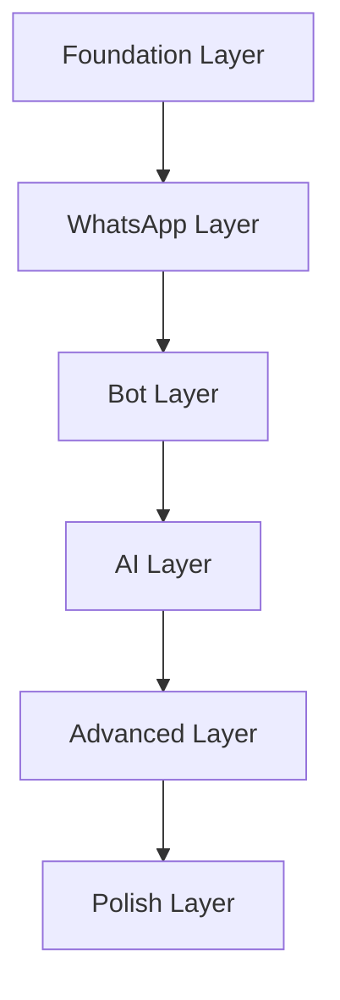

# Development Order

---

## Executive Summary

This document defines the order in which features should be developed.

---

## Purpose

Ensure logical progression and dependencies are respected.

---

## Development Order

### 1. Foundation Layer

| Priority | Feature | Reason |
|----------|---------|--------|
| 1.1 | Project setup | Everything depends on this |
| 1.2 | Database schema | Data layer foundation |
| 1.3 | Authentication | Security foundation |
| 1.4 | API structure | Communication foundation |
| 1.5 | Shared AI core | AI foundation |

### 2. WhatsApp Layer

| Priority | Feature | Reason |
|----------|---------|--------|
| 2.1 | WhatsApp connection | Core communication |
| 2.2 | Message handling | Basic messaging |
| 2.3 | Conversation management | Chat organization |
| 2.4 | Contact management | User management |
| 2.5 | Media handling | Rich messaging |

### 3. Bot Layer

| Priority | Feature | Reason |
|----------|---------|--------|
| 3.1 | Bot creation | Core feature |
| 3.2 | Knowledge base | Bot intelligence |
| 3.3 | Prompt configuration | Bot behavior |
| 3.4 | Bot deployment | Bot activation |
| 3.5 | Bot management | Bot lifecycle |

### 4. AI Layer

| Priority | Feature | Reason |
|----------|---------|--------|
| 4.1 | Conversation AI | Auto-response |
| 4.2 | Bot Architect | Bot creation AI |
| 4.3 | Auto-learning | Improvement |
| 4.4 | Analytics | Insights |
| 4.5 | Optimization | Performance |

### 5. Advanced Layer

| Priority | Feature | Reason |
|----------|---------|--------|
| 5.1 | Contact profiles | CRM |
| 5.2 | Workspaces | Multi-team |
| 5.3 | RBAC | Security |
| 5.4 | Integrations | Extensibility |
| 5.5 | Custom fields | Flexibility |

### 6. Polish Layer

| Priority | Feature | Reason |
|----------|---------|--------|
| 6.1 | Dashboard | User experience |
| 6.2 | UI polish | Visual quality |
| 6.3 | Testing | Quality assurance |
| 6.4 | Documentation | User support |
| 6.5 | Deployment | Launch |

---

## Dependency Graph

---

## Parallel Development

### Can Run in Parallel

| Track 1 | Track 2 | Track 3 |
|---------|---------|---------|
| Database schema | Authentication | API structure |
| WhatsApp connection | Bot creation | Knowledge base |
| Conversation AI | Bot Architect | Analytics |

### Must Be Sequential

| From | To | Reason |
|------|-----|--------|
| Foundation | WhatsApp | Depends on setup |
| WhatsApp | Bot | Depends on messaging |
| Bot | AI | Depends on bots |
| AI | Advanced | Depends on AI |

---

## Developer Notes

- Follow development order
- Respect dependencies
- Communicate blockers
- Review progress regularly

## Future Improvements

- Automated dependency tracking
- Parallel development optimization
- Critical path analysis
- Resource allocation
