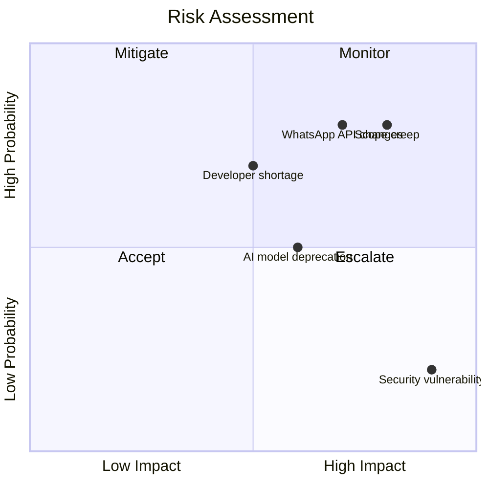

# Risk Analysis

---

## Executive Summary

This document identifies and analyzes risks for SoftwBot AI.

---

## Purpose

Proactively manage risks to ensure project success.

---

## Risk Categories

### 1. Technical Risks

| Risk | Probability | Impact | Mitigation |
|------|------------|--------|------------|
| WhatsApp API changes | High | High | Multiple providers |
| AI model deprecation | Medium | High | Model abstraction |
| Database performance | Medium | Medium | Optimization, scaling |
| Security vulnerability | Low | Critical | Regular audits |

### 2. Resource Risks

| Risk | Probability | Impact | Mitigation |
|------|------------|--------|------------|
| Developer shortage | Medium | High | Cross-training |
| Budget overrun | Medium | Medium | Cost monitoring |
| Infrastructure failure | Low | High | Redundancy |
| Third-party outage | Medium | Medium | Fallbacks |

### 3. Project Risks

| Risk | Probability | Impact | Mitigation |
|------|------------|--------|------------|
| Scope creep | High | High | Clear requirements |
| Timeline delays | Medium | High | Buffer time |
| Communication gaps | Medium | Medium | Regular meetings |
| Requirements changes | High | Medium | Flexible design |

### 4. Business Risks

| Risk | Probability | Impact | Mitigation |
|------|------------|--------|------------|
| Low adoption | Medium | High | User research |
| Competitor features | High | Medium | Innovation |
| Compliance issues | Low | Critical | Legal review |
| Pricing pressure | Medium | Medium | Value demonstration |

---

## Risk Assessment Matrix

---

## Risk Response Plans

### High Probability + High Impact

1. **WhatsApp API changes**
   - Monitor API updates
   - Maintain multiple providers
   - Abstract WhatsApp layer
   - Test with new versions

2. **Scope creep**
   - Clear requirements
   - Change control process
   - Regular reviews
   - Prioritize features

### High Probability + Low Impact

1. **Communication gaps**
   - Daily standups
   - Weekly meetings
   - Documentation
   - Slack channels

### Low Probability + High Impact

1. **Security breach**
   - Security audits
   - Penetration testing
   - Incident response plan
   - Backup procedures

---

## Risk Monitoring

### Metrics

| Metric | Frequency | Target |
|--------|-----------|--------|
| Risk events | Weekly | 0 |
| Mitigation actions | Weekly | 100% |
| Risk score | Monthly | < 10 |
| Risk review | Monthly | 100% |

### Tools

- Risk register
- Risk dashboard
- Alert system
- Reporting

---

## Developer Notes

- Review risks weekly
- Update risk register
- Communicate changes
- Document learnings

## Future Improvements

- Automated risk detection
- Risk prediction
- Risk visualization
- Risk optimization
